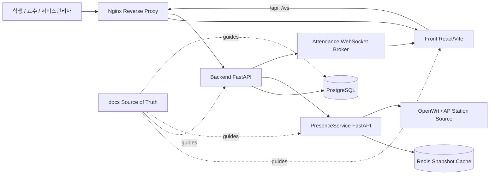
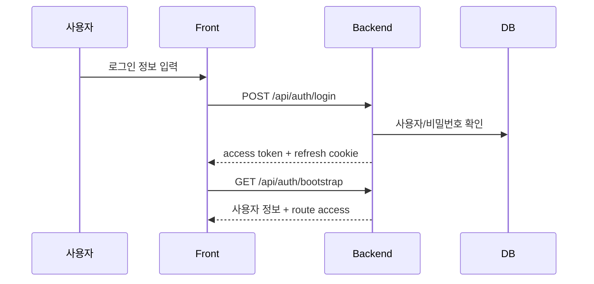
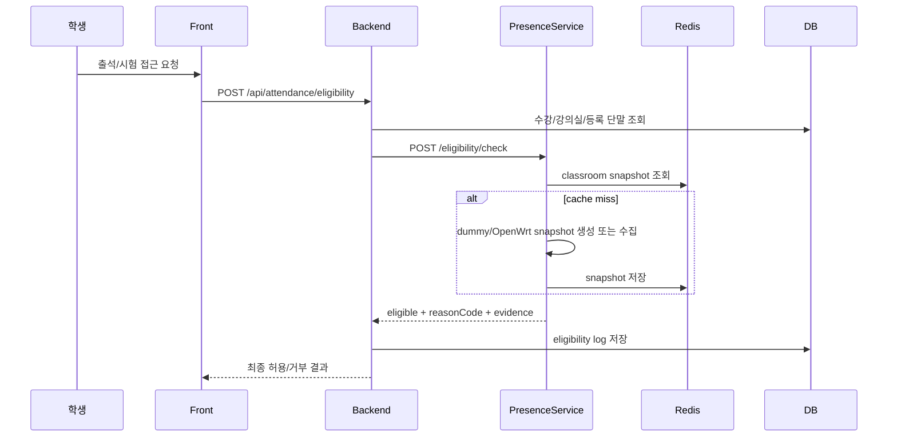
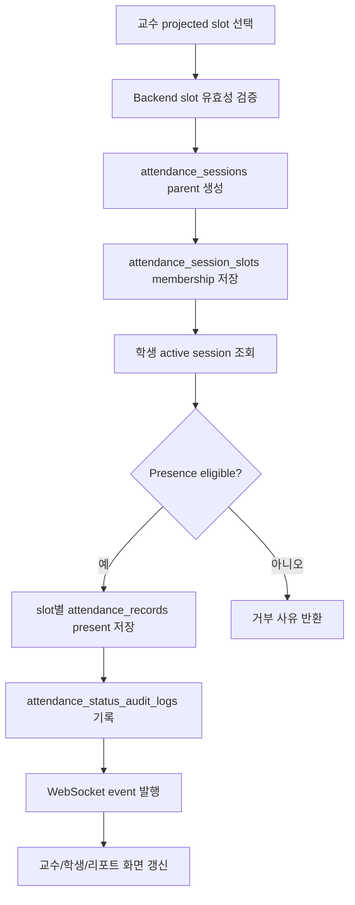

# 6. 전체 시스템 설계

# 6.1 논리 아키텍처

# 6.2 서비스별 책임

| 서비스 | 책임 | 외부 노출 |
|---|---|---|
| Front | 역할별 화면, 입력 검증, API 호출, WebSocket 구독 | Nginx `/` |
| Backend | 인증, 권한, LMS API, 출석/시험 최종 판단 | Nginx `/api`, `/ws`, `/health` |
| PresenceService | 재실성 근거, snapshot cache, overlay/demo control | Docker 내부, Backend 의존 경로 |
| PostgreSQL | 영속 데이터 저장 | Docker 내부 |
| Redis | Presence snapshot/overlay/cache | Docker 내부 |
| Nginx | 단일 origin reverse proxy | 호스트 포트 3100 |

# 6.3 핵심 데이터 흐름

## 로그인/세션 복구

## 출석 eligibility

## 출석 세션 운영

# 6.4 구현 상태와 계획

| 영역 | 현재 상태 | 계획 |
|---|---|---|
| 로그인/세션 | JWT access + refresh cookie 기반 구현 | 운영 환경 secret/만료 정책 강화 |
| LMS 기본 조회 | 강의/공지/서비스관리자 조회 구현 | 과제/성적/질문 확장 |
| 출석 | eligibility + attendance session API/모델 구현 | 실 장비 수집, 운영 정책 강화 |
| 시험 | 객관식/진위형 MVP 계약/구현 | 수동 채점, 성적 공개, 문제 유형 확장 |
| 인프라 | Docker Compose + Nginx | CI/CD, staging/prod 분리 |
