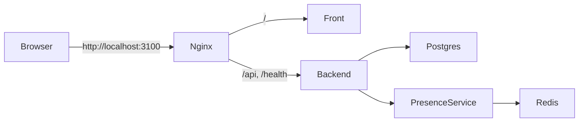

# 7. 서비스 인프라

# 7.1 로컬 실행 구조

현재 로컬 개발 환경의 공식 runtime entrypoint 는 `Service` repository 이다.
`Service/compose.local.yml` 은 sibling repository 를 build context 로 참조하고, `Service/compose.image.yml` 은 GHCR 에 게시된 사전 빌드 이미지를 사용한다.
`CodexKit` 은 bootstrap/governance kit 로 남고 runtime compose/nginx 원본은 `Service` 로 위임되었다.

| 컨테이너 | 기술 | 기본 포트 | 역할 |
|---|---|---:|---|
| nginx | nginx:alpine | 3100 -> 80 | 단일 진입점, Front/Backend 라우팅 |
| front | React + Vite | 3000 | 웹 UI |
| backend | FastAPI | 8000 | LMS API, 인증, 출석/시험 판정 |
| presence-service | FastAPI | 8001 | 재실성 판정 보조 |
| postgres | PostgreSQL | 5432 | 영속 데이터 |
| redis | Redis | 6379 | snapshot cache / overlay |

# 7.2 Nginx 라우팅

Nginx 는 외부 사용자가 하나의 origin 으로 접근하도록 한다.

- `/`: Front 로 전달
- `/api/`: Backend 로 전달
- `/health`: Backend health 로 전달
- `/api/internal`: 외부에서 접근하지 못하도록 404 처리

이 구조는 브라우저 CORS 복잡도를 줄이고, 내부 서비스인 PresenceService 를 외부에 노출하지 않는 장점이 있다.

# 7.3 내부 서비스 통신

Backend 는 Docker 네트워크 내부에서 PresenceService 를 호출한다.
PresenceService 는 Redis 를 사용해 classroom snapshot 을 캐시한다.
PostgreSQL 은 Backend 가 직접 사용하는 영속 저장소다.

# 7.4 OpenWrt 테스트베드

OpenWrt 기반 테스트베드는 강의실 네트워크 관측을 위한 실험 환경이다.
문서 기준 운영 전제는 다음과 같다.

- 상단 공유기가 IP 를 관리한다.
- OpenWrt 는 AP/bridge 역할을 한다.
- 같은 서브넷 AP/bridge 운영 시 OpenWrt LAN DHCP 는 비활성화한다.
- OpenWrt 는 static IP 를 가진다.
- PresenceService 또는 수집 경로는 `iw dev`, `ubus`, `iwinfo`, `station dump` 계열 정보를 활용한다.

# 7.5 운영 확장 시 고려사항

- 개발용 source build, image 기반 실행, demo 배포 compose 를 분리해 유지해야 한다.
- PresenceService 는 외부 공개 API 가 아니라 내부 판정 보조 서비스로 유지해야 한다.
- 라우터 credential/token 은 환경변수 하드코딩이 아니라 Backend/DB 와 동기화되는 구조가 필요하다.
- Redis 장애 시 fail-open 이 아니라 fail-closed 정책을 기본으로 검토해야 한다.
- 학교별 네트워크 장비와 인증 방식에 따라 OpenWrt collector 또는 adapter 구현이 달라질 수 있다.

# 7.6 이미지 기반 실행 및 공개 이미지 검증

`Service` 는 로컬 소스 빌드 없이도 Backend, Front, PresenceService, DB 의 GHCR 이미지를 pull 해서 실행할 수 있는 image mode 를 제공한다.
Service release manifest 는 component image, tag, digest, release evidence, DB reset 필요 여부를 기록한다.

2026-05-03 기준 로그인 없는 `docker manifest inspect` 로 다음 공개 이미지 접근이 확인되었다.

| Component | Public ref | Anonymous manifest inspect |
|---|---|---|
| Backend | `ghcr.io/chosununiv2026capstone/backend:v0.2.0` | 통과 |
| Front | `ghcr.io/chosununiv2026capstone/front:v0.2.1` | 통과 |
| PresenceService | `ghcr.io/chosununiv2026capstone/presence-service:v0.2.0` | 통과 |
| DB | `ghcr.io/chosununiv2026capstone/db:v0.2.0` | 통과 |

기존 `Service/manifests/releases/v0.1.0.yml` 의 digest 포함 image ref 도 동일하게 anonymous manifest inspect 가 통과했다.
따라서 GHCR public pull 자체는 더 이상 배포 차단 요인이 아니며, 남은 증거는 실제 demo deploy workflow 와 서버 healthcheck provenance 이다.
