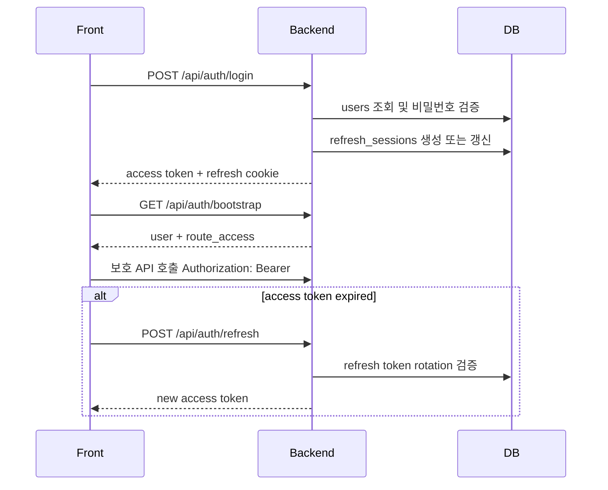
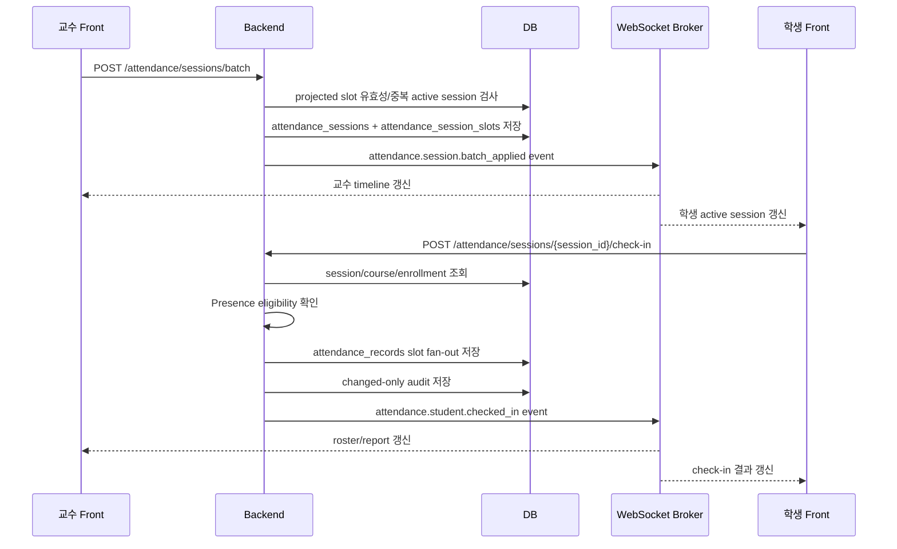
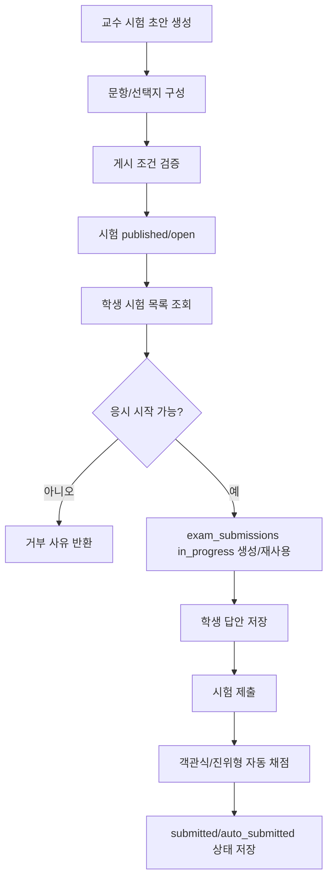

# 11. Backend API 및 흐름

# 11.1 Backend 책임

Backend 는 LMS 도메인의 중심 서비스다.
인증, 권한 검사, 강의/공지/단말/시험/출석 API, 출석과 시험 접근의 최종 판단을 담당한다.
PresenceService 는 재실성 근거를 제공하지만, 최종 허용 여부는 Backend 가 수강 정보, 시간표, 강의실, 세션 상태와 함께 판단한다.

# 11.2 API 그룹

| 그룹 | Endpoint 예시 | 설명 |
|---|---|---|
| Health | `GET /health` | 서비스 상태 확인 |
| Auth | `/api/auth/login`, `/refresh`, `/bootstrap`, `/logout` | 로그인, 토큰 갱신, 세션 복구, 로그아웃 |
| Course | `/api/students/{id}/courses`, `/api/professors/{id}/courses` | 학생/교수 강의 목록 |
| Notice | `/api/notices/{login_id}`, `/api/professors/{id}/notices` | 공지 조회/작성 |
| Device | `/api/students/{id}/devices` | 학생 등록 단말 관리 |
| Admin | `/api/admin/users`, `/classrooms`, `/classroom-networks` | 운영 데이터 조회/수정 |
| Presence admin | `/api/admin/presence/classrooms/{code}/snapshot`, `/dummy-controls` | 관리자 재실성 snapshot/demo 제어 |
| Attendance eligibility | `POST /api/attendance/eligibility` | 출석/시험 eligibility 판정 |
| Attendance session | `/attendance/timeline`, `/sessions/batch`, `/roster`, `/check-in` | 교수/학생 출석 세션 운영 |
| Exam | `/courses/{course_code}/exams` | 학생 시험 응시, 교수 시험 운영 |
| Realtime | `WEBSOCKET /ws/attendance` | 출석 bootstrap/incremental event |

# 11.3 인증 흐름

# 11.4 출석 세션 흐름

# 11.5 시험 흐름

# 11.6 주요 API 상세 초안

## 인증

| Method | Path | Request | Response | 권한 |
|---|---|---|---|---|
| POST | `/api/auth/login` | login_id, password | access token, user, refresh cookie | public |
| POST | `/api/auth/refresh` | refresh cookie | new access token | refresh session |
| GET | `/api/auth/bootstrap` | access 또는 refresh | user, route_access | authenticated |
| POST | `/api/auth/logout` | refresh cookie | success | authenticated |

## 출석

| Method | Path | 설명 |
|---|---|---|
| GET | `/api/professors/{professor_id}/courses/{course_code}/attendance/timeline` | 교수 출석 timeline/bootstrap |
| POST | `/api/professors/{professor_id}/courses/{course_code}/attendance/sessions/batch` | projected slot 묶음 출석 세션 열기 |
| POST | `/api/professors/{professor_id}/attendance/sessions/{session_id}/close` | 출석 세션 닫기 |
| GET | `/api/professors/{professor_id}/attendance/sessions/{session_id}/roster` | roster 조회 |
| PATCH | `/api/professors/{professor_id}/attendance/sessions/{session_id}/students/{student_id}` | 학생 출석 상태 수정 |
| GET | `/api/students/{student_id}/courses/{course_code}/attendance/active-sessions` | 학생 active 출석 세션 조회 |
| POST | `/api/students/{student_id}/attendance/sessions/{session_id}/check-in` | 학생 self check-in |

## 시험

| Method | Path | 설명 |
|---|---|---|
| GET | `/api/students/{student_id}/courses/{course_code}/exams` | 학생 시험 목록 |
| GET | `/api/students/{student_id}/courses/{course_code}/exams/{exam_id}` | 학생 시험 상세 |
| POST | `/api/students/{student_id}/courses/{course_code}/exams/{exam_id}/start` | 응시 시작 |
| PUT | `/api/students/{student_id}/courses/{course_code}/exams/{exam_id}/submissions/{submission_id}/answers/{question_id}` | 답안 저장 |
| POST | `/api/students/{student_id}/courses/{course_code}/exams/{exam_id}/submit` | 시험 제출 |
| POST | `/api/professors/{professor_id}/courses/{course_code}/exams` | 교수 시험 생성 |
| POST | `/api/professors/{professor_id}/courses/{course_code}/exams/{exam_id}/publish` | 시험 게시 |
| POST | `/api/professors/{professor_id}/courses/{course_code}/exams/{exam_id}/close` | 시험 종료 |

# 11.7 Backend 설계 특징

- API path 에 학생/교수 식별자가 포함되더라도 Backend 는 토큰 주체와 일치하는지 검증한다.
- 출석 session lifecycle 은 active, closed, expired, canceled 를 구분한다.
- 교수 수동 수정은 사유를 요구하고 audit log 를 남긴다.
- WebSocket 은 bootstrap 이후 incremental event 를 발행해 화면 간 상태를 맞춘다.
- 시험 응시 시작은 exam 상태, 시간 창, attempt 제한, 등록 단말 조건을 함께 확인한다.
