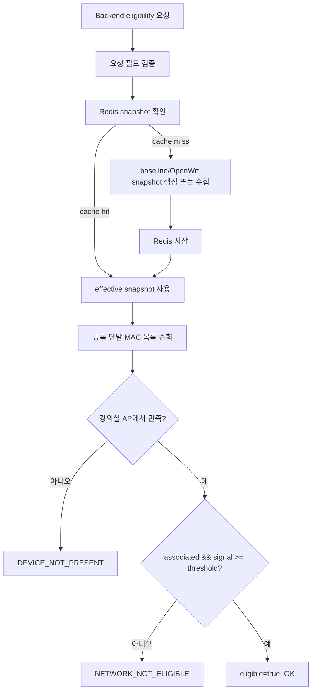
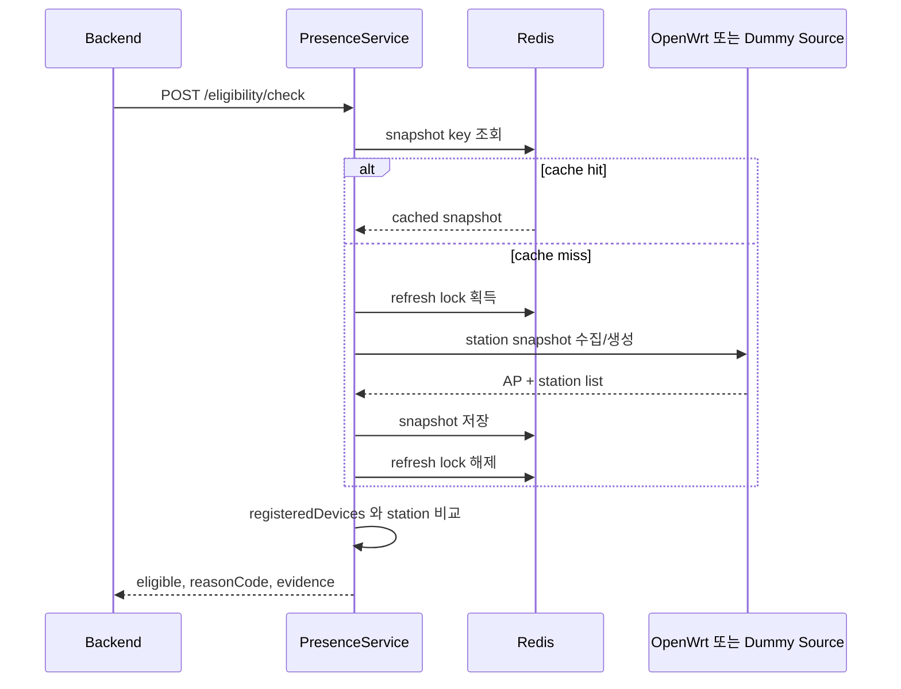
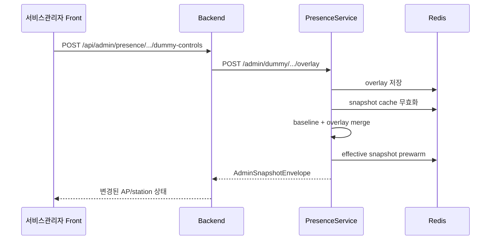

# 12. PresenceService API 및 흐름

# 12.1 PresenceService 책임

PresenceService 는 출석/시험 허용 여부를 단독으로 결정하지 않는다.
이 서비스는 강의실 네트워크에서 관측된 단말 정보와 학생 등록 단말을 비교해 재실성 근거를 제공한다.
Backend 는 이 근거를 수강 정보, 시간표, 출석 세션 상태와 결합해 최종 판단한다.

# 12.2 API 목록

| Method | Path | 설명 |
|---|---|---|
| GET | `/health` | 서비스 상태 확인 |
| GET | `/snapshots/classrooms/{classroom_id}` | 강의실 snapshot 조회 |
| POST | `/eligibility/check` | 등록 단말/강의실 네트워크 기준 eligibility 검사 |
| GET | `/admin/dummy/classrooms/{classroom_id}/snapshot` | 서비스관리자 데모 snapshot 조회 |
| POST | `/admin/dummy/classrooms/{classroom_id}/overlay` | 더미 overlay 적용 |
| POST | `/admin/dummy/classrooms/{classroom_id}/overlay/reset` | 더미 overlay 초기화 |

# 12.3 Eligibility 판정 플로우

# 12.4 Sequence diagram

# 12.5 Demo overlay 흐름

# 12.6 Reason code

| 코드 | 의미 |
|---|---|
| `OK` | 등록 단말이 강의실 AP에서 기준 이상으로 관측됨 |
| `CLASSROOM_NOT_MAPPED` | 강의실 네트워크 매핑 없음 |
| `SNAPSHOT_UNAVAILABLE` | snapshot 생성/조회 실패 |
| `SNAPSHOT_STALE` | snapshot 이 허용 시간보다 오래됨 |
| `DEVICE_NOT_REGISTERED` | 학생 등록 단말 없음 |
| `DEVICE_NOT_PRESENT` | 등록 단말이 관측되지 않음 |
| `NETWORK_NOT_ELIGIBLE` | 관측은 되었지만 AP/신호/상태 조건 불충족 |

# 12.7 향후 실 장비 수집 계획

현재 main 기준 PresenceService 는 dummy snapshot 과 overlay 중심 구조를 가진다.
향후 실 OpenWrt 연동에서는 다음 방향을 적용한다.

- root SSH 는 bootstrap 또는 실험 단계로 제한한다.
- steady-state 는 OpenWrt collector 가 PresenceService 로 push 하는 구조를 우선 검토한다.
- Backend 는 PresenceService API 를 계속 호출하고 Redis 를 직접 읽지 않는다.
- router credential 은 환경변수 고정보다 Backend/DB 기반 동기화가 적합하다.
- stale snapshot 은 grace window 이후 fail-closed 로 처리한다.
