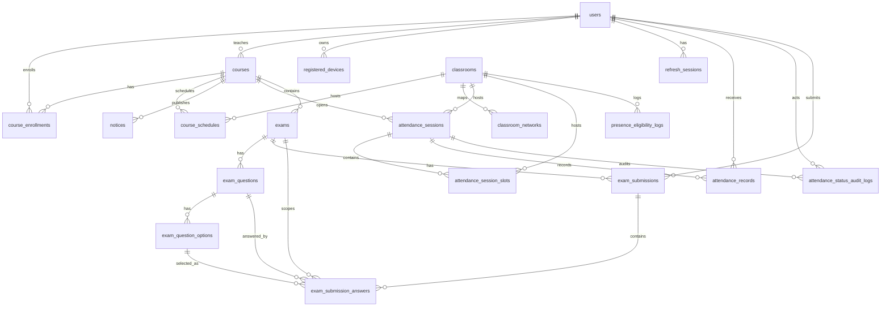

# 13. Database 설계

# 13.1 데이터 모델 개요

DB 는 PostgreSQL 기반이며, 사용자/강의/강의실/단말/출석/시험/인증 세션 데이터를 저장한다.
Redis snapshot 은 영속 DB 가 아니라 PresenceService 의 성능 최적화 계층으로 본다.

# 13.2 주요 테이블

| 그룹 | 테이블 | 설명 |
|---|---|---|
| 사용자 | `users` | 학생/교수/서비스관리자 계정 |
| 강의 | `courses`, `course_enrollments`, `course_schedules` | 강의, 수강, 시간표 |
| 공간/네트워크 | `classrooms`, `classroom_networks` | 강의실과 AP/SSID/gateway/threshold |
| 단말 | `registered_devices` | 학생 등록 단말 MAC |
| 인증 | `refresh_sessions` | refresh token rotation/replay/revoke 상태 |
| Presence | `presence_eligibility_logs` | 재실성 판정 요청 로그 |
| 출석 | `attendance_sessions`, `attendance_session_slots`, `attendance_records`, `attendance_status_audit_logs` | bundle session, slot membership, 학생별 상태, 감사 로그 |
| 시험 | `exams`, `exam_questions`, `exam_question_options`, `exam_submissions`, `exam_submission_answers` | 시험 마스터, 문항, 선택지, 응시, 답안 |
| 공지 | `notices` | 강의 공지 |

# 13.3 ERD

# 13.4 출석 모델 상세

출석 모델은 projected slot 과 bundle parent session 을 분리한다.
교수는 여러 projected slot 을 선택해 하나의 parent session 을 열 수 있고, 각 slot 은 `attendance_session_slots` 로 parent 아래에 저장된다.
학생 출석 결과는 slot 단위 `attendance_records` 로 저장하므로 리포트와 통계는 bundle metadata 가 아니라 slot별 final state 를 기준으로 계산한다.

중요 제약:

- `attendance_records` 는 `(attendance_session_id, projection_key, student_user_id)` 기준으로 유일하다.
- `attendance_status_audit_logs` 는 append-only 변경 이력이다.
- self check-in 재시도는 idempotent 해야 한다.
- 교수 수동 수정은 reason 을 요구한다.
- `canceled` 는 학생 출석 상태가 아니라 session lifecycle 또는 mode 로 취급한다.

# 13.5 시험 모델 상세

시험 MVP 는 객관식/진위형 중심이다.
시험은 강의에 속하고, 문제와 선택지를 가진다.
학생이 시험을 시작하면 `exam_submissions` row 가 생성되거나 진행 중 row 를 재사용한다.
답안은 `exam_submission_answers` 에 저장되고, 제출 시 객관식/진위형은 자동 채점할 수 있다.

# 13.6 데이터 무결성 원칙

- 사용자 role 은 학생/교수/서비스관리자 권한 분기의 근거다.
- 단말 MAC 은 전역 유일하게 관리한다.
- refresh session 은 replay detection 과 logout revocation 을 지원해야 한다.
- exam answer 는 같은 exam 에 속한 submission/question/option 만 참조해야 한다.
- 출석 audit 은 덮어쓰지 않고 누적한다.
