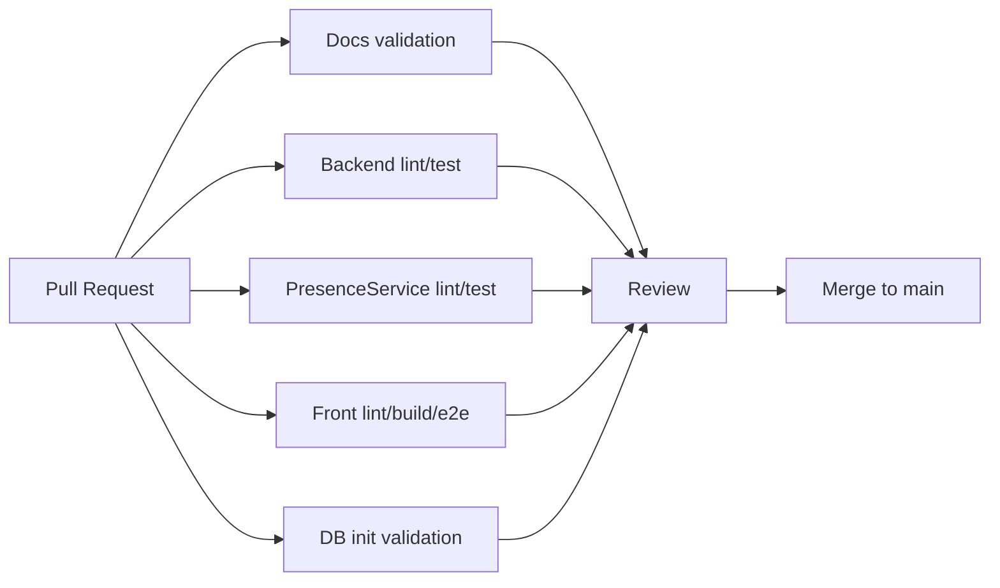

# 17. CI/CD 설계

# 17.1 현재 상태

현재 프로젝트는 `Service` repository 를 기준으로 local source mode, GHCR image mode, demo deployment mode 를 분리한다.
CI/CD 는 초기 계획 단계에서 벗어나 component image publish, Release Please 설정, Service release manifest 검증, self-hosted runner 기반 demo deploy workflow 까지 구현되었다.
다만 운영 배포 완료로 주장하지는 않는다. 실제 운영 provenance, 장기 healthcheck, secret rotation 절차는 후속 운영 검증 범위다.

# 17.2 목표 CI 파이프라인

# 17.3 Repository별 CI 설계

| Repo | CI 작업 | 성공 기준 |
|---|---|---|
| docs | markdown frontmatter, wiki link, diff check | 깨진 링크/문법 없음 |
| Front | npm install, lint, build, Playwright e2e | lint/build/e2e 통과 |
| Backend | Python compile, pytest | 전체 테스트 통과 |
| PresenceService | Python compile, pytest | 전체 테스트 통과 |
| DB | PostgreSQL container init, schema/seed smoke | init script 성공, 핵심 row count 확인 |
| Service | compose config validation, manifest validation, nginx config test | local/image/demo 설정 유효 |
| CodexKit | bootstrap/governance helper test | runtime source of truth 를 Service 로 위임 |

# 17.4 CD 구현 상태

초기 CD 는 운영 배포보다 시연 환경 재현성을 우선한다.
구현된 흐름은 다음과 같다.

1. component repo main/release 에서 Docker image build 및 GHCR publish
2. Release Please 로 component version, changelog, release tag 관리
3. Service release manifest 로 Backend/Front/PresenceService/DB image ref 와 digest 고정
4. image mode 에서 local build context 없이 공개 GHCR 이미지로 실행
5. demo deploy script 에서 manifest render, DB reset guard, healthcheck 수행
6. self-hosted runner 또는 SSH 기반 demo workflow 에서 원격 host 로 manifest 와 env 를 전달

2026-05-03 기준 Backend `v0.2.0`, Front `v0.2.1`, PresenceService `v0.2.0`, DB `v0.2.0` public image 는 로그인 없는 `docker manifest inspect` 가 통과했다.
기존 Service `v0.1.0` manifest 의 digest 포함 image ref 도 anonymous manifest inspect 가 통과했다.
Service 의 현재 실행 모드는 다음처럼 분리한다.

| 모드 | 구성 파일/스크립트 | 목적 |
|---|---|---|
| local source mode | `compose.yml`, `compose.local.yml`, `scripts/up-local.sh` | sibling repo source 를 build context 로 사용해 로컬 통합 실행 |
| GHCR image mode | `compose.yml`, `compose.image.yml`, `scripts/up-image.sh` | release/image ref 로 로컬 build 없이 실행 |
| demo deployment mode | `compose.demo.yml`, `scripts/deploy-demo.sh`, `.github/workflows/deploy-demo.yml` | manifest pinning, DB reset guard, health summary 를 포함한 시연 배포 |

# 17.5 보안 고려사항

- GitHub Secrets 로 DB password, JWT secret, sync token 관리
- PresenceService 는 public ingress 로 노출하지 않음
- `/api/internal` 은 Nginx 에서 외부 차단
- refresh token 은 HttpOnly cookie 사용
- OpenWrt token 은 UI 노출 시 prompt 방식 기본, inline reveal 은 명시적 동작으로 제한

# 17.6 향후 완료 기준

- 모든 PR 에서 repo별 CI 가 자동 실행된다.
- DB schema 변경은 container init smoke 를 통과해야 한다.
- Front e2e 는 로그인/권한/출석/시험 핵심 경로를 포함한다.
- 최종보고서에는 CI 실행 결과 캡처, workflow run 링크, Service demo deploy summary, public healthcheck 결과를 첨부한다.
