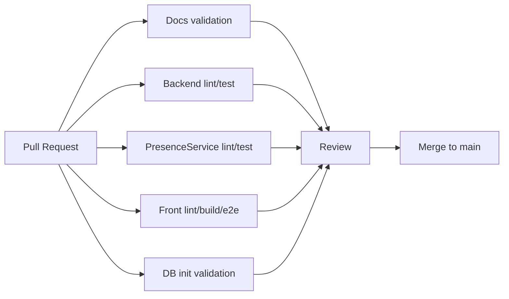

# 17. CI/CD 설계

# 17.1 현재 상태

현재 프로젝트는 로컬 Docker Compose 로 여러 서비스를 통합 실행하는 구조를 갖추고 있다.
CI/CD 는 최종 운영 수준으로 완성된 상태는 아니며, 보고서 기준으로는 **설계/계획 항목**으로 분류한다.
다만 각 repository 에 `.github` 영역이 존재하므로 GitHub Actions 기반 자동화로 확장하기 적합하다.

# 17.2 목표 CI 파이프라인

# 17.3 Repository별 CI 설계

| Repo | CI 작업 | 성공 기준 |
|---|---|---|
| docs | markdown frontmatter, wiki link, diff check | 깨진 링크/문법 없음 |
| Front | npm install, lint, build, Playwright e2e | lint/build/e2e 통과 |
| Backend | Python compile, pytest | 전체 테스트 통과 |
| PresenceService | Python compile, pytest | 전체 테스트 통과 |
| DB | PostgreSQL container init, schema/seed smoke | init script 성공, 핵심 row count 확인 |
| CodexKit | compose config validation, nginx config test | compose/nginx 설정 유효 |

# 17.4 CD 계획

초기 CD 는 운영 배포보다 시연 환경 재현성을 우선한다.

1. main merge 후 Docker image build
2. 이미지 태그는 repo/commit SHA 기준으로 생성
3. staging compose 또는 서버에 배포
4. DB migration/init script 적용 전 backup
5. health check 통과 후 Front/Nginx 공개
6. 실패 시 이전 이미지와 DB snapshot 으로 rollback

# 17.5 보안 고려사항

- GitHub Secrets 로 DB password, JWT secret, sync token 관리
- PresenceService 는 public ingress 로 노출하지 않음
- `/api/internal` 은 Nginx 에서 외부 차단
- refresh token 은 HttpOnly cookie 사용
- OpenWrt token 은 UI 노출 시 prompt 방식 기본, inline reveal 은 명시적 동작으로 제한

# 17.6 향후 완료 기준

- 모든 PR 에서 repo별 CI 가 자동 실행된다.
- DB schema 변경은 container init smoke 를 통과해야 한다.
- Front e2e 는 로그인/권한/출석/시험 핵심 경로를 포함한다.
- 최종보고서에는 CI 실행 결과 캡처 또는 workflow run 링크를 첨부한다.
