# 캡스톤 통합 보고서 초안

> 이 파일은 `08-reports/10-body` 본문과 `08-reports/90-appendix` 부록의 섹션별 내용을 한 파일로 모은 제출/검토용 통합본이다. 섹션별 파일을 수정한 뒤에는 이 파일도 동일하게 갱신해야 한다.

# 1. 개요

본 프로젝트는 조선대학교 기존 사이버캠퍼스의 핵심 기능을 현대적인 웹 서비스 구조로 재구성하고, Wi-Fi 기반 재실성 판별과 등록 단말 인증을 결합한 출석/시험 접근 제어 기능을 제공하는 차세대 사이버캠퍼스 프로토타입이다.

기존 LMS는 강의자료, 공지, 과제, 시험, 출석, 성적과 같은 기본 기능을 제공하지만, 출석과 시험의 신뢰성은 여전히 사용자 입력이나 단순 로그인 여부에 많이 의존한다.
본 프로젝트는 강의실 네트워크에 실제로 접속한 학생 단말을 관측하고, 학생이 사전에 등록한 단말 정보와 비교하여 출석 및 시험 접근 가능 여부를 판단한다.

# 보고서 목적

이 보고서는 캡스톤 중간/최종 평가와 매주 제출되는 진행 보고를 위해 작성한다.
단순 구현 목록이 아니라 다음 내용을 함께 설명한다.

- 프로젝트 목표와 필요성
- 학생, 교수, 서비스관리자 관점의 기능 요구
- 조선대학교 및 타 학교 도입 가능성
- Front / Backend / PresenceService / DB 서비스 설계
- API, 데이터 모델, 화면, 주요 코드, 테스트, 인프라, CI/CD 계획
- 중간 산출물과 최종 산출물
- 일정, WBS, 목표 대비 달성치

# 현재 작성 기준

이 초안은 2026-04-12 기준 로컬 워크스페이스와 `docs` source of truth 를 바탕으로 작성했다.
구현 완료 항목과 설계/계획 항목은 문서 안에서 구분한다.

- 구현/검증된 축: 로그인, 역할별 강의 조회, 공지 조회/작성, 학생 단말 관리, 재실성 eligibility, 출석 세션 설계/일부 구현, 시험 MVP 계약/일부 구현, Docker 기반 로컬 실행
- 설계/계획 축: 과제, 성적, 질문/문의, 정식 CI/CD, 운영용 배포, 타 학교 도입 패키징

# 서비스 구성 요약

| 서비스 | 역할 |
|---|---|
| Front | 학생/교수/서비스관리자 웹 UI, 역할별 화면, 출석/시험/공지/단말 관리 화면 |
| Backend | 인증, LMS 도메인 API, 출석/시험 최종 판정, 권한 검사, 실시간 이벤트 |
| PresenceService | 강의실 네트워크 snapshot, 등록 단말 매칭, 재실성 eligibility 근거 제공 |
| DB | 사용자, 강의, 강의실, 단말, 출석, 시험, 인증 세션 데이터 저장 |
| CodexKit | 로컬 Docker Compose, Nginx reverse proxy, 개발 실행 환경 |
| docs | 요구사항, ADR, 아키텍처, 상태, 보고서 source of truth |

# 보고서 구성

본문은 평가자가 프로젝트의 목적, 구조, 구현 상세, 검증 근거를 순서대로 따라갈 수 있도록 구성한다.
부록은 본문을 보조하는 API 목록, 캡처 체크리스트, 다이어그램 목록, 출처 맵을 제공한다.


# 2. 목표

# 2.1 전체 목표

차세대 사이버캠퍼스 프로토타입의 전체 목표는 다음과 같다.

1. 학생, 교수, 서비스관리자가 사용할 수 있는 웹 기반 LMS 프로토타입을 구현한다.
2. Wi-Fi 및 등록 단말 정보를 활용해 출석과 시험 접근의 신뢰성을 높인다.
3. 강의실 네트워크, 수강 정보, 수업 시간표, 단말 등록 정보를 결합하는 판정 구조를 설계한다.
4. 조선대학교 테스트베드에서 시연 가능한 형태로 구현하고, 타 학교에도 적용 가능한 확장 구조를 제안한다.
5. 기능별 산출물, 검증 결과, 한계와 향후 계획을 문서화한다.

# 2.2 세부 목표

| 구분 | 목표 | 현재 상태 |
|---|---|---|
| 인증 | 학생/교수/서비스관리자 로그인과 세션 유지 | 구현됨 |
| 학생 기능 | 강의 목록, 공지, 단말 관리, 출석/시험 접근 | 일부 구현 + 확장 계획 |
| 교수 기능 | 담당 강의, 공지 작성, 시험 운영, 출석 운영 | 일부 구현 + 확장 계획 |
| 서비스관리자 기능 | 사용자/강의실/AP 조회, 재실성 데모 제어 | 일부 구현 |
| 출석 | projected slot 기반 bundle attendance session | 설계/일부 구현 |
| 시험 | 객관식/진위형 중심 MVP 시험 플로우 | 설계/일부 구현 |
| 재실성 판별 | OpenWrt/더미 snapshot + Redis cache + 등록 단말 매칭 | 더미/로컬 구현, 실 장비 확장 계획 |
| DB | LMS + 출석 + 시험 스키마 | 구현됨 |
| 인프라 | Docker Compose 로컬 실행 | 구현됨 |
| CI/CD | 테스트/빌드 자동화 설계 | 계획 |

# 2.3 중간보고 목표

중간보고 단계에서는 “계획 대비 무엇을 달성했는가”를 명확히 보여준다.
따라서 다음 항목을 중심으로 정리한다.

- 기능 요구사항과 사용자 분류가 정리되었는가
- 서비스 경계와 데이터 모델이 정의되었는가
- 핵심 vertical slice 가 동작하는가
- 출석/시험 신뢰성 강화를 위한 기술적 근거가 마련되었는가
- 남은 기능과 위험 요소가 명확히 식별되었는가

# 2.4 최종보고 목표

최종보고 단계에서는 같은 양식을 사용하되, 각 항목을 완료 상태로 정리한다.

- 최종 기능 목록과 실제 화면 캡처
- 최종 API/DB/인프라 구조
- 최종 Mermaid 다이어그램
- 최종 테스트 결과
- 학교 도입 가능성 및 운영 전제
- 한계와 후속 발전 방향


# 3. 필요성 및 배경

# 3.1 기존 LMS 개선 필요성

대학 LMS는 강의 공지, 학습자료, 과제, 시험, 출석, 성적 확인을 담당하는 핵심 학사 플랫폼이다.
그러나 기존 시스템은 기능이 분산되어 있거나 UI 흐름이 복잡하고, 출석과 시험 접근 제어가 실제 수업 참여 여부와 충분히 연결되지 않는 문제가 있다.

본 프로젝트는 기존 사이버캠퍼스의 핵심 기능을 웹 기반 프로토타입으로 재구성하면서, 출석과 시험의 신뢰성을 높이는 기술 요소를 함께 설계한다.

# 3.2 출석 신뢰성 문제

일반적인 온라인 출석 방식은 다음 한계를 가진다.

- 사용자가 로그인만 하면 실제 강의실에 있는지 확인하기 어렵다.
- 버튼 클릭 방식은 대리 출석이나 원격 출석 시도를 막기 어렵다.
- 교수자는 수업 중 출석 상태를 실시간으로 확인하거나 수정하기 어렵다.
- 사후 이의 제기 시 어떤 근거로 출석이 인정되었는지 추적하기 어렵다.

따라서 출석 판정에는 최소한 다음 정보가 함께 필요하다.

- 학생이 해당 강의를 수강 중인지
- 현재 시간이 출석 가능한 수업 시간인지
- 학생의 등록 단말이 강의실 네트워크에서 관측되는지
- 관측된 신호 세기와 AP 정보가 강의실 조건에 부합하는지
- 출석 세션이 교수에 의해 열려 있는지

# 3.3 이론적 배경

## 위치 기반 인증

위치 기반 인증은 사용자의 위치 또는 네트워크 접속 상태를 인증 조건으로 활용한다.
GPS는 실내 정확도와 개인정보 이슈가 크기 때문에, 강의실 단위 검증에는 Wi-Fi AP 관측 정보가 더 현실적일 수 있다.
본 프로젝트는 “학생 단말이 특정 강의실 AP에 연결되어 있는가”를 재실성 판단의 주요 근거로 사용한다.

## 단말 기반 인증

사용자 계정만으로는 대리 출석을 충분히 방지하기 어렵다.
학생이 사전에 등록한 단말 MAC 주소와 강의실 네트워크에서 관측된 station 정보를 비교하면, 계정 소유자와 물리 단말의 연결성을 추가로 확인할 수 있다.
다만 랜덤 MAC 사용, 개인정보 저장, 단말 변경 정책은 운영상 중요한 제약이므로 별도 안내와 정책이 필요하다.

## 캐시 기반 판정

출석 요청마다 OpenWrt 장비에 직접 접속해 station list 를 조회하면 지연과 장비 부하가 커진다.
PresenceService 는 Redis snapshot cache 를 사용해 일정 시간 동안 강의실 네트워크 관측 결과를 재사용한다.
현재 문서 기준 캐시 TTL 은 60초이고, 만료 또는 수집 실패 시 보수적인 거부 정책을 둔다.

## 도메인 판정 분리

네트워크 관측만으로 출석을 확정하면 수강 정보, 수업 시간표, 교수 출석 세션 상태를 반영할 수 없다.
따라서 PresenceService 는 네트워크/단말 근거를 제공하고, Backend 가 수강/시간표/세션/권한 정보를 결합해 최종 판정한다.

# 3.4 기대되는 개선 효과

- 대리 출석 가능성 감소
- 교수자의 출석 운영 편의성 향상
- 출석 이력과 변경 이력의 감사 가능성 확보
- 시험 접근 제어에 등록 단말 조건을 적용할 수 있는 기반 마련
- 학교별 강의실/AP 구조에 맞춘 확장 가능성 확보


# 4. 사용 대상 및 도입 가능성

# 4.1 사용자 분류

본 프로젝트의 기본 사용자는 “하나의 학교”를 기준으로 다음 세 가지로 분류한다.

| 사용자 | 설명 | 주요 관심사 |
|---|---|---|
| 학생 | 수강 중인 강의의 학습 활동을 수행하는 사용자 | 강의 조회, 공지 확인, 자료/영상 접근, 과제/시험, 출석 확인, 단말 관리 |
| 교수 | 자신이 담당하는 강의를 운영하는 사용자 | 공지 작성, 자료/영상/과제/시험 운영, 출석 세션 열기/닫기, 학생 출석 상태 확인/수정 |
| 서비스관리자 | 학교 또는 학과 단위 서비스 운영자 | 사용자/강의/강의실/AP 관리, 네트워크 매핑 관리, 장애 대응, 정책 설정 |

# 4.2 학생 관점

학생은 LMS 안에서 자신의 수강 강의를 확인하고, 공지/자료/시험/출석 기능을 사용한다.
재실성 기반 출석에서는 학생이 직접 출석 버튼을 누르더라도 다음 조건을 만족해야 한다.

- 학생 계정으로 로그인되어 있어야 한다.
- 해당 강의를 수강 중이어야 한다.
- 교수가 출석 세션을 열어 둔 상태여야 한다.
- 등록 단말이 강의실 네트워크에서 관측되어야 한다.
- 신호 세기 등 강의실 AP 조건을 만족해야 한다.

학생 입장에서는 “왜 출석이 허용/거부되었는지”가 중요하다.
따라서 UI는 단순 성공/실패뿐 아니라 등록 단말 없음, 네트워크 불일치, 스냅샷 부재, 세션 미오픈 등 이유를 표시해야 한다.

# 4.3 교수 관점

교수는 강의 운영자다.
주요 기능은 공지 작성, 시험 생성/게시/종료, 출석 세션 운영, 학생별 출석 상태 수정이다.
출석 기능에서 교수는 projected slot 을 선택해 bundle attendance session 을 열고, 학생 self check-in 결과를 실시간으로 확인한다.
필요한 경우 결석/출석/지각/공결/병결 상태를 수동으로 수정하고 사유를 남긴다.

# 4.4 서비스관리자 관점

서비스관리자는 학교 단위 운영자다.
서비스관리자는 다음 항목을 관리하거나 점검한다.

- 사용자 목록
- 강의실 목록
- 강의실별 AP/Wi-Fi 매핑
- AP별 신호 기준값
- 재실성 판정 테스트 또는 데모용 overlay
- 향후 OpenWrt 장비 등록, 토큰 발급, 장비 상태 확인

서비스관리자 기능은 학사 도메인 운영과 네트워크 인프라 운영 사이의 연결점이다.
따라서 관리 화면은 강의실, AP, 라우터, threshold, 관측 단말 상태를 추적 가능하게 제공해야 한다.

# 4.5 조선대학교 도입 가능성

조선대학교 도입 시 우선 적용 범위는 특정 강의실 또는 학과 테스트베드가 적합하다.
초기 도입은 다음 순서가 현실적이다.

1. 특정 강의실에 OpenWrt 기반 AP/게이트웨이 테스트베드를 구성한다.
2. 해당 강의실 수업 일부를 대상으로 등록 단말 기반 출석을 시범 운영한다.
3. 교수자와 학생에게 랜덤 MAC 해제, 단말 등록, 출석 실패 시 대응 방법을 안내한다.
4. 서비스관리자가 강의실/AP 매핑과 threshold 를 조정한다.
5. 수집 안정성, 오탐/미탐, 운영 부담을 검토한 뒤 확장 여부를 결정한다.

# 4.6 타 학교 도입 가능성

타 학교 도입은 가능하지만, 다음 조건을 확인해야 한다.

- 강의실별 네트워크/AP 정보에 접근할 수 있는지
- OpenWrt 또는 유사 장비를 설치하거나 기존 네트워크 장비와 연계할 수 있는지
- 학생 단말 식별자 저장에 대한 개인정보/보안 정책이 허용되는지
- 기존 LMS 또는 학사 시스템과 사용자/수강/강의실 데이터를 연동할 수 있는지
- 학내 Wi-Fi 정책에서 랜덤 MAC, captive portal, 802.1X, AP roaming 이 어떻게 동작하는지

타 학교 적용 시 핵심은 서비스 코드를 그대로 복사하는 것이 아니라, 학교별 네트워크와 학사 데이터 구조를 어댑터로 연결하는 것이다.


# 5. 설계 철학

# 5.1 문서 우선 설계

프로젝트는 `docs` repository 를 source of truth 로 사용한다.
요구사항, ADR, 규약, 아키텍처, 상태 문서를 먼저 정리하고, 코드 저장소는 해당 문서를 기준으로 구현한다.
이 방식은 Front, Backend, PresenceService, DB 처럼 저장소가 분리된 구조에서 서비스 경계가 섞이는 문제를 줄인다.

# 5.2 서비스 책임 분리

프로젝트는 기능을 하나의 서버에 모두 넣지 않고 다음 책임으로 나눈다.

- Front: 화면과 사용자 상호작용
- Backend: 도메인 규칙, 권한, 최종 판정
- PresenceService: 네트워크/단말 관측 근거
- DB: 영속 데이터와 데이터 무결성
- CodexKit/Nginx: 로컬 실행 및 reverse proxy

이 분리는 특히 출석 판정에서 중요하다.
PresenceService 가 네트워크 근거만 담당하고, Backend 가 수강 정보와 시간표를 결합해 최종 판단해야 도메인 규칙을 일관되게 유지할 수 있다.

# 5.3 근거 기반 출석 판정

출석은 단순 버튼 클릭이 아니라 다음 근거를 결합해 결정한다.

1. 로그인 사용자 본인 여부
2. 수강 여부
3. 강의 시간표와 강의실 정보
4. 교수자가 연 출석 세션 상태
5. 등록 단말 목록
6. 강의실 네트워크 관측 snapshot
7. AP별 signal threshold
8. 출석 이력과 감사 로그

# 5.4 데모 가능성과 운영 가능성의 분리

캡스톤 프로젝트는 시연 가능해야 하지만, 데모 편의를 위해 운영 구조를 왜곡하면 안 된다.
따라서 더미 재실 제어는 demo mode overlay 로 분리하고, 운영 도입 시에는 OpenWrt/네트워크 장비 수집 경로로 교체할 수 있도록 설계한다.

# 5.5 점진적 확장

처음부터 모든 LMS 기능을 완성하기보다 vertical slice 를 확보하고 확장한다.

1. 로그인, 강의 조회, 공지, 단말 등록
2. 재실성 eligibility
3. 출석 세션 운영
4. 시험 MVP
5. 과제, 성적, 질문/문의, 운영 자동화

이 순서는 캡스톤 시연 가치와 기술 위험을 동시에 고려한 것이다.


# 6. 전체 시스템 설계

# 6.1 논리 아키텍처

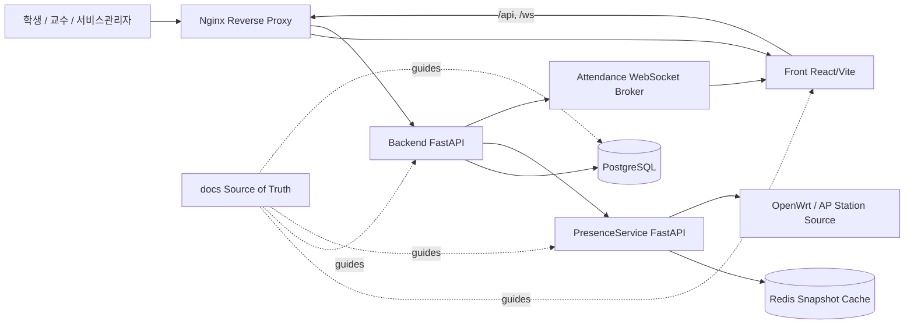

# 6.2 서비스별 책임

| 서비스 | 책임 | 외부 노출 |
|---|---|---|
| Front | 역할별 화면, 입력 검증, API 호출, WebSocket 구독 | Nginx `/` |
| Backend | 인증, 권한, LMS API, 출석/시험 최종 판단 | Nginx `/api`, `/ws`, `/health` |
| PresenceService | 재실성 근거, snapshot cache, overlay/demo control | Docker 내부, Backend 의존 경로 |
| PostgreSQL | 영속 데이터 저장 | Docker 내부 |
| Redis | Presence snapshot/overlay/cache | Docker 내부 |
| Nginx | 단일 origin reverse proxy | 호스트 포트 3100 |

# 6.3 핵심 데이터 흐름

## 로그인/세션 복구

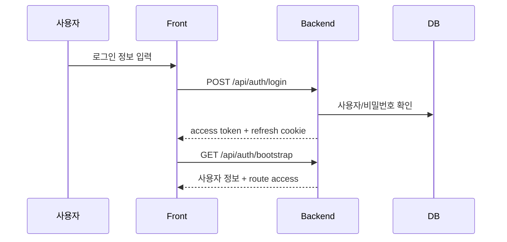

## 출석 eligibility

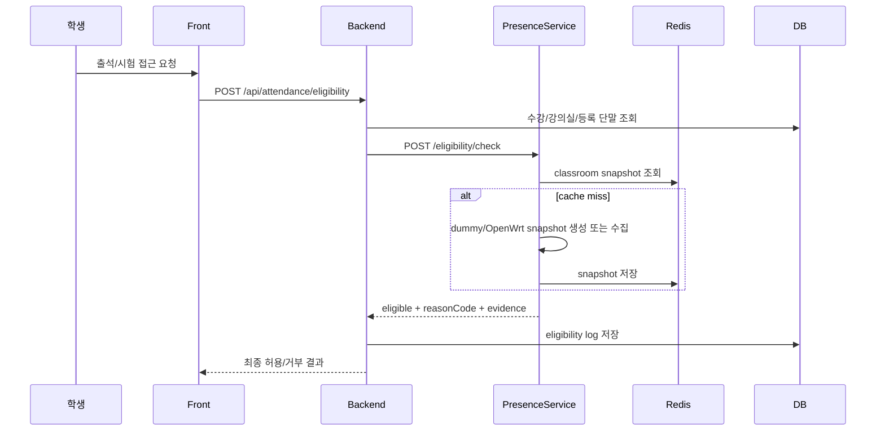

## 출석 세션 운영

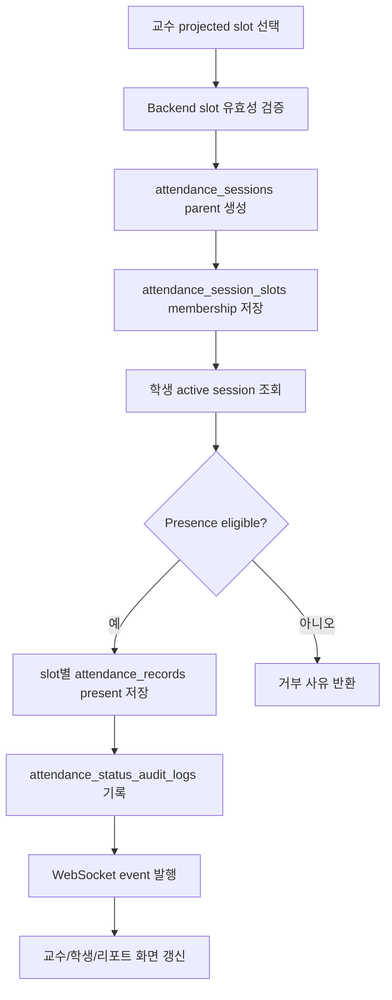

# 6.4 구현 상태와 계획

| 영역 | 현재 상태 | 계획 |
|---|---|---|
| 로그인/세션 | JWT access + refresh cookie 기반 구현 | 운영 환경 secret/만료 정책 강화 |
| LMS 기본 조회 | 강의/공지/서비스관리자 조회 구현 | 과제/성적/질문 확장 |
| 출석 | eligibility + attendance session API/모델 구현 | 실 장비 수집, 운영 정책 강화 |
| 시험 | 객관식/진위형 MVP 계약/구현 | 수동 채점, 성적 공개, 문제 유형 확장 |
| 인프라 | Docker Compose + Nginx | CI/CD, staging/prod 분리 |


# 7. 서비스 인프라

# 7.1 로컬 실행 구조

현재 로컬 개발 환경은 `CodexKit/docker-compose.yml` 이 sibling repository 를 build context 로 참조하는 구조다.

| 컨테이너 | 기술 | 기본 포트 | 역할 |
|---|---|---:|---|
| nginx | nginx:alpine | 3100 -> 80 | 단일 진입점, Front/Backend 라우팅 |
| front | React + Vite | 3000 | 웹 UI |
| backend | FastAPI | 8000 | LMS API, 인증, 출석/시험 판정 |
| presence-service | FastAPI | 8001 | 재실성 판정 보조 |
| postgres | PostgreSQL | 5432 | 영속 데이터 |
| redis | Redis | 6379 | snapshot cache / overlay |

# 7.2 Nginx 라우팅

Nginx 는 외부 사용자가 하나의 origin 으로 접근하도록 한다.

- `/`: Front 로 전달
- `/api/`: Backend 로 전달
- `/health`: Backend health 로 전달
- `/api/internal`: 외부에서 접근하지 못하도록 404 처리

이 구조는 브라우저 CORS 복잡도를 줄이고, 내부 서비스인 PresenceService 를 외부에 노출하지 않는 장점이 있다.

# 7.3 내부 서비스 통신

Backend 는 Docker 네트워크 내부에서 PresenceService 를 호출한다.
PresenceService 는 Redis 를 사용해 classroom snapshot 을 캐시한다.
PostgreSQL 은 Backend 가 직접 사용하는 영속 저장소다.

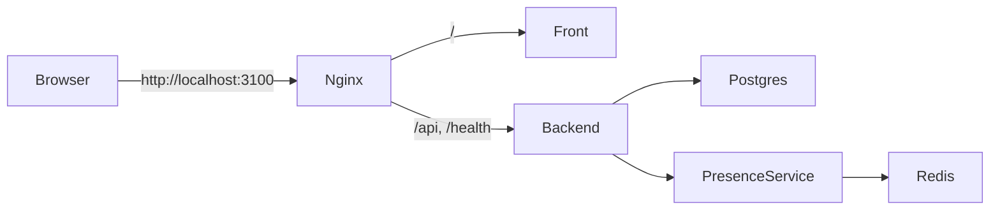

# 7.4 OpenWrt 테스트베드

OpenWrt 기반 테스트베드는 강의실 네트워크 관측을 위한 실험 환경이다.
문서 기준 운영 전제는 다음과 같다.

- 상단 공유기가 IP 를 관리한다.
- OpenWrt 는 AP/bridge 역할을 한다.
- 같은 서브넷 AP/bridge 운영 시 OpenWrt LAN DHCP 는 비활성화한다.
- OpenWrt 는 static IP 를 가진다.
- PresenceService 또는 수집 경로는 `iw dev`, `ubus`, `iwinfo`, `station dump` 계열 정보를 활용한다.

# 7.5 운영 확장 시 고려사항

- 개발용 Docker Compose 와 운영 배포는 분리해야 한다.
- PresenceService 는 외부 공개 API 가 아니라 내부 판정 보조 서비스로 유지해야 한다.
- 라우터 credential/token 은 환경변수 하드코딩이 아니라 Backend/DB 와 동기화되는 구조가 필요하다.
- Redis 장애 시 fail-open 이 아니라 fail-closed 정책을 기본으로 검토해야 한다.
- 학교별 네트워크 장비와 인증 방식에 따라 OpenWrt collector 또는 adapter 구현이 달라질 수 있다.


# 8. 사용자 분류 및 권한 구성

# 8.1 기본 사용자 분류

프로젝트는 학교 하나를 기준으로 사용자를 세 가지로 나눈다.

1. 학생
2. 교수
3. 서비스관리자

이 분류는 기능 설계, 권한 검사, 화면 구성, 보고서 목차의 기본 축이다.

# 8.2 권한 원칙

- 사용자는 로그인해야 보호된 API 를 사용할 수 있다.
- Front route 접근은 Backend bootstrap 이 반환하는 권한 정보를 기준으로 제한한다.
- Backend 는 path parameter 의 `student_id`, `professor_id` 가 로그인 주체와 일치하는지 검사해야 한다.
- 학생은 자신의 수강 강의에 대해서만 조회/응시/출석할 수 있다.
- 교수는 자신이 담당하는 강의에 대해서만 공지/시험/출석을 운영할 수 있다.
- 서비스관리자는 사용자, 강의실, AP, 재실성 데모 제어 같은 운영 기능을 담당한다.

# 8.3 역할별 기능 권한표

| 기능 | 학생 | 교수 | 서비스관리자 |
|---|---:|---:|---:|
| 로그인/세션 복구 | O | O | O |
| 내 강의 목록 조회 | O | O | - |
| 공지 목록/상세 조회 | O | O | 계획 |
| 공지 작성 | - | O | 계획 |
| 단말 등록/삭제 | O | - | 계획/운영 |
| 출석 세션 열기/닫기 | - | O | - |
| 출석 self check-in | O | - | - |
| 출석 roster/status 수정 | - | O | - |
| 출석 리포트 조회 | O(본인) | O(담당 강의) | 계획 |
| 시험 목록/응시 | O | - | - |
| 시험 생성/수정/게시/종료 | - | O | - |
| 사용자 목록 조회 | - | - | O |
| 강의실/AP 매핑 조회/수정 | - | - | O |
| 재실성 데모 overlay 제어 | - | - | O |
| 서비스 인프라/CI 상태 확인 | - | - | 계획 |

# 8.4 인증 구조

현재 Backend 는 다음 인증 흐름을 제공한다.

- `POST /api/auth/login`: 로그인
- `POST /api/auth/refresh`: access token 갱신
- `GET /api/auth/bootstrap`: 세션 복구 + route access 반환
- `GET /api/auth/me`: bootstrap alias
- `POST /api/auth/logout`: refresh session revoke

Access token 은 API 요청의 `Authorization: Bearer` 헤더로 사용하고, refresh token 은 HttpOnly cookie 로 운영하는 설계다.

# 8.5 권한 실패 처리

권한 실패는 사용자 경험과 보안 측면 모두에서 명확해야 한다.

- 인증 없음: 로그인 화면으로 이동
- 자기 리소스가 아님: 접근 금지
- 수강/담당 강의가 아님: 강의 리소스 접근 거부
- 출석/시험 조건 불충족: 거부 사유 코드와 설명 표시
- 만료된 세션: refresh 시도 후 실패 시 로그아웃 처리


# 9. 기능 상세 목록

# 9.1 기능 상태 범례

| 상태 | 의미 |
|---|---|
| 구현 | 현재 로컬 코드에서 동작하는 기능 |
| 일부 구현 | 주요 흐름은 있으나 운영 완성도 또는 일부 세부 기능이 남은 기능 |
| 설계 | 문서/데이터 계약이 있으나 구현이 완료되지 않은 기능 |
| 계획 | 요구사항에는 있으나 후속 단계로 남은 기능 |

# 9.2 학생 기능

| 기능 | 설명 | 상태 |
|---|---|---|
| 로그인 | 학생 계정으로 로그인하고 세션을 유지한다. | 구현 |
| 강의 목록 조회 | 수강 중인 강의 목록을 조회한다. | 구현 |
| 공지 목록/상세 조회 | 강의 또는 사용자 기준 공지 목록과 상세를 확인한다. | 구현 |
| 단말 등록/삭제 | 출석/시험 인증에 사용할 단말 MAC 을 등록/삭제한다. | 구현 |
| 재실성 eligibility 확인 | 강의실 네트워크와 등록 단말 기준으로 출석/시험 가능 여부를 확인한다. | 구현 |
| 출석 self check-in | 열린 출석 세션에 학생이 직접 출석 요청한다. | 일부 구현/설계 |
| 출석 학기 매트릭스 | 학기 전체 출석 상태를 차시별로 확인한다. | 일부 구현/설계 |
| 시험 목록/상세 | 강의별 시험 목록과 상세를 확인한다. | 일부 구현 |
| 시험 응시/답안 저장/제출 | 시험을 시작하고 답안을 저장/제출한다. | 일부 구현 |
| 강의자료/동영상 | 강의자료와 동영상 목록/열람 UI | 임시 Front 스캐폴드 |
| 과제/성적/질문 | 과제 제출, 성적 확인, 질문/문의 | 계획 |

# 9.3 교수 기능

| 기능 | 설명 | 상태 |
|---|---|---|
| 로그인 | 교수 계정으로 로그인한다. | 구현 |
| 담당 강의 조회 | 담당 강의 목록을 확인한다. | 구현 |
| 공지 작성/조회 | 담당 강의 공지를 작성하고 상세를 확인한다. | 구현 |
| 시험 초안 생성 | 객관식/진위형 중심 시험 초안을 만든다. | 일부 구현 |
| 시험 게시/종료 | 시험을 학생에게 공개하거나 종료한다. | 일부 구현 |
| 출석 projected slot 조회 | 날짜/강의/강의실 기준 출석 가능 차시를 확인한다. | 설계/일부 구현 |
| bundle 출석 세션 운영 | 여러 projected slot 을 하나의 parent session 으로 연다. | 설계/일부 구현 |
| roster/status 수정 | 학생별 출석 상태를 수정하고 사유를 기록한다. | 설계/일부 구현 |
| 출석 리포트 | slot aggregate, 학생별 통계, 이력 조회 | 설계/일부 구현 |
| 자료/영상/과제/성적 | 학습 콘텐츠와 평가 전체 운영 | 계획 |

# 9.4 서비스관리자 기능

| 기능 | 설명 | 상태 |
|---|---|---|
| 로그인 | 서비스관리자 계정으로 로그인한다. | 구현 |
| 사용자 목록 | 학생/교수/서비스관리자 목록을 조회한다. | 구현 |
| 강의실 목록 | 강의실 정보를 조회한다. | 구현 |
| classroom network 조회/수정 | AP, SSID, gateway, threshold 정보를 조회/수정한다. | 구현 |
| 재실성 snapshot 조회 | 강의실별 관측 단말 상태를 확인한다. | 구현 |
| demo overlay 제어 | 더미 재실성 입력값을 변경해 시연한다. | 구현 |
| OpenWrt 장비 등록/토큰 | 실제 장비 등록과 push token 관리 | 설계/계획 |
| 운영 모니터링 | 서비스 상태, 수집 지연, 장애 상태 확인 | 계획 |

# 9.5 공통 기능

- 문서 기반 개발 프로세스
- Docker 기반 로컬 실행
- Nginx 기반 단일 origin 라우팅
- Redis 캐시 기반 snapshot 재사용
- PostgreSQL 기반 영속 데이터 관리
- API/테스트/문서 동기화


# 10. Front End 화면 설계 및 캡처 계획

# 10.1 Front End 구조

Front End 는 React + Vite 기반 단일 앱이다.
`src/App.tsx` 가 주요 화면 상태와 역할별 UI 흐름을 관리하고, `src/api.ts` 가 Backend API client 와 타입을 담당한다.
`src/router.ts` 는 로그인 이후 course detail, attendance, exam take route 를 path 기반으로 해석한다.

# 10.2 공통 화면

| 화면 | 설명 | 캡처 파일 |
|---|---|---|
| 로그인 | 학생/교수/서비스관리자 계정 로그인 | `assets/screenshots/01-login.png` |
| 세션 복구 | 새로고침 후 bootstrap 으로 사용자/권한 복구 | 역할별 대시보드 캡처에 포함 (`assets/screenshots/student-01-dashboard.png`, `assets/screenshots/professor-01-dashboard.png`) |
| 대시보드 | 로그인 사용자 역할별 첫 화면 | `assets/screenshots/student-01-dashboard.png`, `assets/screenshots/professor-01-dashboard.png`, `assets/screenshots/admin-01-users.png` |
| 프로필 | 계정 정보와 학생 단말 관리 진입 | `assets/screenshots/student-02-profile-devices.png`, `assets/screenshots/professor-02-profile.png` |

# 10.3 학생 화면

| 화면 | 주요 기능 | 캡처 파일 |
|---|---|---|
| 학생 강의 목록 | 수강 강의 조회 | `assets/screenshots/student-01-dashboard.png` |
| 강의 상세/공지 | 공지 목록 및 상세 | `assets/screenshots/student-03-course-home.png`, `assets/screenshots/student-05-notices.png`, `assets/screenshots/student-06-notice-detail.png` |
| 단말 관리 | 단말 MAC 등록/삭제/목록 | `assets/screenshots/student-02-profile-devices.png` |
| eligibility 확인 | 출석/시험 접근 가능 여부와 사유 확인 | `assets/screenshots/student-08-eligibility-result.png` |
| 출석 active sessions | 열린 출석 세션 목록 | `assets/screenshots/student-07-attendance-before-check.png` |
| 출석 self check-in | bundle session 출석 요청 결과 | `assets/screenshots/student-09-check-in-result.png` |
| 출석 학기 매트릭스 | 차시별 최종 출석 상태 | `assets/screenshots/student-07-attendance-before-check.png` |
| 시험 목록 | 강의별 시험 목록 | `assets/screenshots/student-10-exam-list.png` |
| 시험 응시 | 문항 풀이, 답안 저장, 제출 | `assets/screenshots/student-11-exam-taking.png`, `assets/screenshots/student-12-exam-answer-selected.png` |
| 자료/동영상 스캐폴드 | 임시 강의자료/영상 UI | `assets/screenshots/student-04-learning-content.png` |

# 10.4 교수 화면

| 화면 | 주요 기능 | 캡처 파일 |
|---|---|---|
| 교수 강의 목록 | 담당 강의 조회 | `assets/screenshots/professor-01-dashboard.png` |
| 공지 작성 | 담당 강의 공지 작성 | `assets/screenshots/professor-06-course-manage-notice-form.png` |
| 시험 관리 | 시험 목록, 초안 생성/수정 | `assets/screenshots/professor-07-exam-manage.png`, `assets/screenshots/professor-08-exam-detail.png` |
| 시험 게시/종료 | 시험 상태 변경 | 최종보고 전 추가 권장 |
| 출석 타임라인 | projected slot / bundle session 타임라인 | `assets/screenshots/professor-09-attendance-timeline.png` |
| 출석 열기 모달 | manual/smart/canceled mode 선택 | 스마트 세션 생성 결과는 `assets/screenshots/professor-11-attendance-timer.png` 로 확인, 모달 자체는 최종보고 전 추가 권장 |
| 출석 타이머 | active smart session timer | `assets/screenshots/professor-11-attendance-timer.png` |
| 출석 roster | 학생별 상태 수정/사유 입력 | `assets/screenshots/professor-12-attendance-roster.png`, `assets/screenshots/professor-13-attendance-slot-roster.png` |
| 학생별 이력 | 학생 차시별 변경 이력 | 최종보고 전 추가 권장 |
| 출석 리포트 | aggregate / student stats | `assets/screenshots/professor-10-attendance-student-stats.png` |

# 10.5 서비스관리자 화면

| 화면 | 주요 기능 | 캡처 파일 |
|---|---|---|
| 사용자 목록 | 학생/교수/서비스관리자 조회 | `assets/screenshots/admin-01-users.png` |
| 강의실 목록 | 강의실 정보 조회 | `assets/screenshots/admin-02-classrooms-networks.png` |
| AP 매핑 | classroom_networks 조회/threshold 수정 | `assets/screenshots/admin-02-classrooms-networks.png` |
| 재실성 snapshot | 강의실별 AP/station 상태 확인 | `assets/screenshots/admin-02-classrooms-networks.png` |
| demo overlay | 더미 재실성 입력값 조작 | `assets/screenshots/admin-03-presence-demo-control.png`, `assets/screenshots/admin-04-presence-demo-applied.png` |
| OpenWrt 장비 관리 | 장비 등록/토큰/상태 확인 | 현재 main 기준 화면 없음, 구현 후 촬영 |

# 10.6 화면 설계 원칙

- 학생은 “내가 무엇을 해야 하는지”와 “왜 실패했는지”를 즉시 이해해야 한다.
- 교수는 출석 세션 열기, 확인, 수정, 리포트 조회를 수업 중 빠르게 수행할 수 있어야 한다.
- 서비스관리자는 네트워크/AP/단말 관측 상태를 운영 데이터 관점에서 확인할 수 있어야 한다.
- 데모용 overlay 는 운영 기능처럼 보이지 않도록 demo mode 라벨과 설명을 둔다.

# 10.7 초안 상태

이 문서는 모든 기능 캡처가 들어갈 위치를 먼저 정의한다.
실제 이미지 파일은 2026-04-12 Playwright 캡처 결과로 `08-reports/assets/screenshots/` 아래에 추가되었으며, 아직 남은 일부 실패/완료 상태 화면은 체크리스트에 후속 촬영 항목으로 유지한다.

# 10.8 실제 Playwright 캡처 산출물

아래 이미지는 2026-04-12 에 기존 Docker 컨테이너를 모두 내린 뒤, 현재 워크스페이스 기준 `CodexKit/docker-compose.yml` 스택을 새로 빌드/기동하고 Playwright 로 촬영한 화면이다.
기준 URL 은 `http://127.0.0.1:3100` 이다.

## 공통 화면

| 화면 | 파일 | 미리보기 |
|---|---|---|
| 로그인 | `assets/screenshots/01-login.png` |  |
| 로그인 실패 | `assets/screenshots/common-02-login-failure.png` |  |
| 권한 거부 | `assets/screenshots/common-03-authorization-denied.png` |  |

## 학생 화면

| 화면 | 파일 | 미리보기 |
|---|---|---|
| 학생 대시보드 | `assets/screenshots/student-01-dashboard.png` |  |
| 프로필/단말 관리 | `assets/screenshots/student-02-profile-devices.png` |  |
| 강의 홈 | `assets/screenshots/student-03-course-home.png` |  |
| 자료·영상 | `assets/screenshots/student-04-learning-content.png` |  |
| 공지 목록 | `assets/screenshots/student-05-notices.png` |  |
| 공지 상세 | `assets/screenshots/student-06-notice-detail.png` |  |
| 출석 확인 전 | `assets/screenshots/student-07-attendance-before-check.png` |  |
| 재실 가능 여부 결과 | `assets/screenshots/student-08-eligibility-result.png` |  |
| 스마트 출석 처리 결과 | `assets/screenshots/student-09-check-in-result.png` |  |
| 시험 목록 | `assets/screenshots/student-10-exam-list.png` |  |
| 시험 응시 | `assets/screenshots/student-11-exam-taking.png` |  |
| 시험 답안 선택 | `assets/screenshots/student-12-exam-answer-selected.png` |  |
| 시험 제출 결과 | `assets/screenshots/student-13-exam-submit-result.png` |  |

## 교수 화면

| 화면 | 파일 | 미리보기 |
|---|---|---|
| 교수 대시보드 | `assets/screenshots/professor-01-dashboard.png` |  |
| 교수 프로필 | `assets/screenshots/professor-02-profile.png` |  |
| 강의 홈 | `assets/screenshots/professor-03-course-home.png` |  |
| 자료·영상 관리 | `assets/screenshots/professor-04-learning-content-manage.png` |  |
| 공지 목록 | `assets/screenshots/professor-05-notices.png` |  |
| 강의 운영/공지 작성 | `assets/screenshots/professor-06-course-manage-notice-form.png` |  |
| 시험 관리 | `assets/screenshots/professor-07-exam-manage.png` |  |
| 시험 상세 | `assets/screenshots/professor-08-exam-detail.png` |  |
| 출석 타임라인 | `assets/screenshots/professor-09-attendance-timeline.png` |  |
| 학생별 출석 누계 | `assets/screenshots/professor-10-attendance-student-stats.png` |  |
| 스마트 출석 타이머 | `assets/screenshots/professor-11-attendance-timer.png` |  |
| 출석 roster | `assets/screenshots/professor-12-attendance-roster.png` |  |
| 차시 예외 roster | `assets/screenshots/professor-13-attendance-slot-roster.png` |  |
| 출석 상태 수정 저장 결과 | `assets/screenshots/professor-14-attendance-edit-save-result.png` |  |
| 시험 종료 결과 | `assets/screenshots/professor-15-exam-close-result.png` |  |
| 시험 게시 결과 | `assets/screenshots/professor-16-exam-publish-result.png` |  |

## 서비스관리자 화면

| 화면 | 파일 | 미리보기 |
|---|---|---|
| 사용자 현황 | `assets/screenshots/admin-01-users.png` |  |
| 강의실 및 네트워크 현황 | `assets/screenshots/admin-02-classrooms-networks.png` |  |
| 재실 시연 제어 | `assets/screenshots/admin-03-presence-demo-control.png` |  |
| 재실 시연 적용 결과 | `assets/screenshots/admin-04-presence-demo-applied.png` |  |
| 재실 시연 초기화 결과 | `assets/screenshots/admin-05-presence-demo-reset-result.png` |  |


# 11. Backend API 및 흐름

# 11.1 Backend 책임

Backend 는 LMS 도메인의 중심 서비스다.
인증, 권한 검사, 강의/공지/단말/시험/출석 API, 출석과 시험 접근의 최종 판단을 담당한다.
PresenceService 는 재실성 근거를 제공하지만, 최종 허용 여부는 Backend 가 수강 정보, 시간표, 강의실, 세션 상태와 함께 판단한다.

# 11.2 API 그룹

| 그룹 | Endpoint 예시 | 설명 |
|---|---|---|
| Health | `GET /health` | 서비스 상태 확인 |
| Auth | `/api/auth/login`, `/refresh`, `/bootstrap`, `/logout` | 로그인, 토큰 갱신, 세션 복구, 로그아웃 |
| Course | `/api/students/{id}/courses`, `/api/professors/{id}/courses` | 학생/교수 강의 목록 |
| Notice | `/api/notices/{login_id}`, `/api/professors/{id}/notices` | 공지 조회/작성 |
| Device | `/api/students/{id}/devices` | 학생 등록 단말 관리 |
| Admin | `/api/admin/users`, `/classrooms`, `/classroom-networks` | 운영 데이터 조회/수정 |
| Presence admin | `/api/admin/presence/classrooms/{code}/snapshot`, `/dummy-controls` | 관리자 재실성 snapshot/demo 제어 |
| Attendance eligibility | `POST /api/attendance/eligibility` | 출석/시험 eligibility 판정 |
| Attendance session | `/attendance/timeline`, `/sessions/batch`, `/roster`, `/check-in` | 교수/학생 출석 세션 운영 |
| Exam | `/courses/{course_code}/exams` | 학생 시험 응시, 교수 시험 운영 |
| Realtime | `WEBSOCKET /ws/attendance` | 출석 bootstrap/incremental event |

# 11.3 인증 흐름

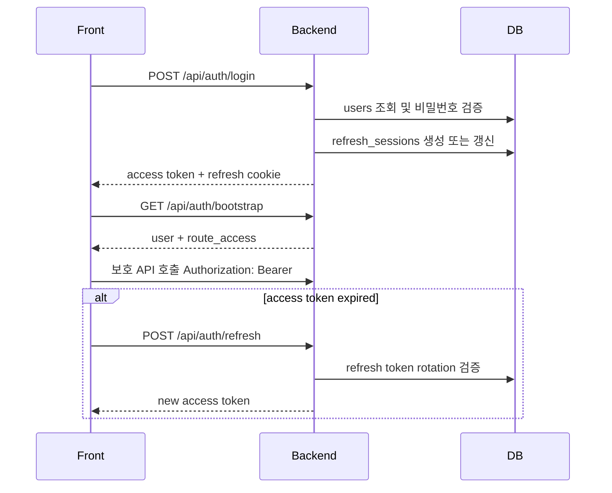

# 11.4 출석 세션 흐름

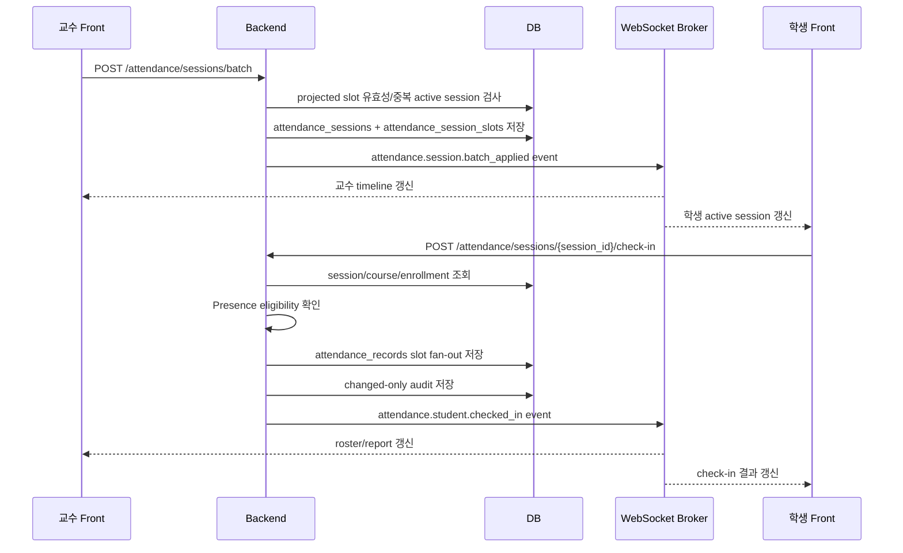

# 11.5 시험 흐름

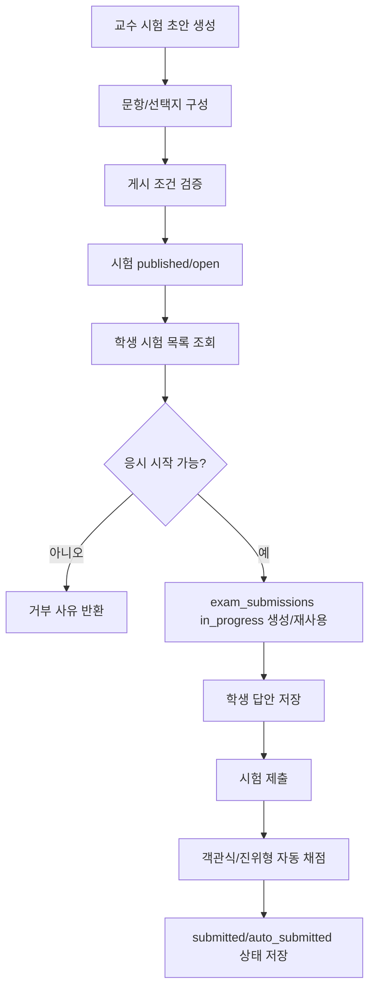

# 11.6 주요 API 상세 초안

## 인증

| Method | Path | Request | Response | 권한 |
|---|---|---|---|---|
| POST | `/api/auth/login` | login_id, password | access token, user, refresh cookie | public |
| POST | `/api/auth/refresh` | refresh cookie | new access token | refresh session |
| GET | `/api/auth/bootstrap` | access 또는 refresh | user, route_access | authenticated |
| POST | `/api/auth/logout` | refresh cookie | success | authenticated |

## 출석

| Method | Path | 설명 |
|---|---|---|
| GET | `/api/professors/{professor_id}/courses/{course_code}/attendance/timeline` | 교수 출석 timeline/bootstrap |
| POST | `/api/professors/{professor_id}/courses/{course_code}/attendance/sessions/batch` | projected slot 묶음 출석 세션 열기 |
| POST | `/api/professors/{professor_id}/attendance/sessions/{session_id}/close` | 출석 세션 닫기 |
| GET | `/api/professors/{professor_id}/attendance/sessions/{session_id}/roster` | roster 조회 |
| PATCH | `/api/professors/{professor_id}/attendance/sessions/{session_id}/students/{student_id}` | 학생 출석 상태 수정 |
| GET | `/api/students/{student_id}/courses/{course_code}/attendance/active-sessions` | 학생 active 출석 세션 조회 |
| POST | `/api/students/{student_id}/attendance/sessions/{session_id}/check-in` | 학생 self check-in |

## 시험

| Method | Path | 설명 |
|---|---|---|
| GET | `/api/students/{student_id}/courses/{course_code}/exams` | 학생 시험 목록 |
| GET | `/api/students/{student_id}/courses/{course_code}/exams/{exam_id}` | 학생 시험 상세 |
| POST | `/api/students/{student_id}/courses/{course_code}/exams/{exam_id}/start` | 응시 시작 |
| PUT | `/api/students/{student_id}/courses/{course_code}/exams/{exam_id}/submissions/{submission_id}/answers/{question_id}` | 답안 저장 |
| POST | `/api/students/{student_id}/courses/{course_code}/exams/{exam_id}/submit` | 시험 제출 |
| POST | `/api/professors/{professor_id}/courses/{course_code}/exams` | 교수 시험 생성 |
| POST | `/api/professors/{professor_id}/courses/{course_code}/exams/{exam_id}/publish` | 시험 게시 |
| POST | `/api/professors/{professor_id}/courses/{course_code}/exams/{exam_id}/close` | 시험 종료 |

# 11.7 Backend 설계 특징

- API path 에 학생/교수 식별자가 포함되더라도 Backend 는 토큰 주체와 일치하는지 검증한다.
- 출석 session lifecycle 은 active, closed, expired, canceled 를 구분한다.
- 교수 수동 수정은 사유를 요구하고 audit log 를 남긴다.
- WebSocket 은 bootstrap 이후 incremental event 를 발행해 화면 간 상태를 맞춘다.
- 시험 응시 시작은 exam 상태, 시간 창, attempt 제한, 등록 단말 조건을 함께 확인한다.


# 12. PresenceService API 및 흐름

# 12.1 PresenceService 책임

PresenceService 는 출석/시험 허용 여부를 단독으로 결정하지 않는다.
이 서비스는 강의실 네트워크에서 관측된 단말 정보와 학생 등록 단말을 비교해 재실성 근거를 제공한다.
Backend 는 이 근거를 수강 정보, 시간표, 출석 세션 상태와 결합해 최종 판단한다.

# 12.2 API 목록

| Method | Path | 설명 |
|---|---|---|
| GET | `/health` | 서비스 상태 확인 |
| GET | `/snapshots/classrooms/{classroom_id}` | 강의실 snapshot 조회 |
| POST | `/eligibility/check` | 등록 단말/강의실 네트워크 기준 eligibility 검사 |
| GET | `/admin/dummy/classrooms/{classroom_id}/snapshot` | 서비스관리자 데모 snapshot 조회 |
| POST | `/admin/dummy/classrooms/{classroom_id}/overlay` | 더미 overlay 적용 |
| POST | `/admin/dummy/classrooms/{classroom_id}/overlay/reset` | 더미 overlay 초기화 |

# 12.3 Eligibility 판정 플로우

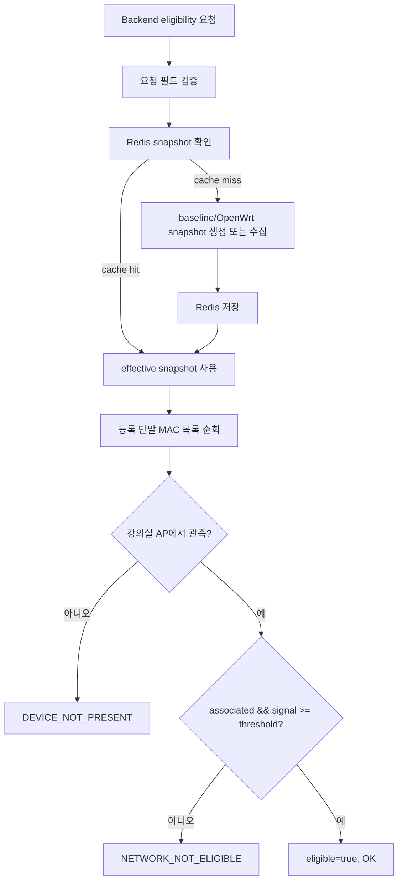

# 12.4 Sequence diagram

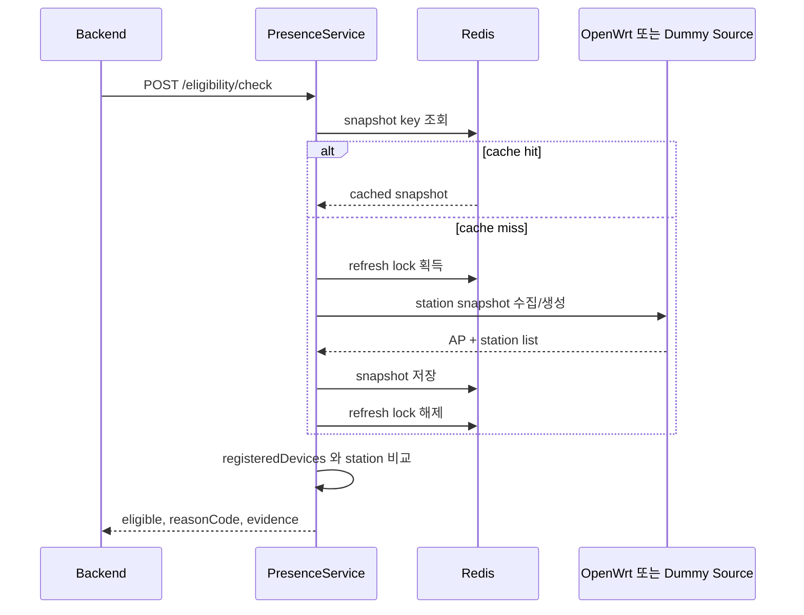

# 12.5 Demo overlay 흐름

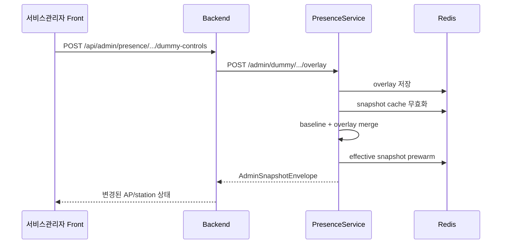

# 12.6 Reason code

| 코드 | 의미 |
|---|---|
| `OK` | 등록 단말이 강의실 AP에서 기준 이상으로 관측됨 |
| `CLASSROOM_NOT_MAPPED` | 강의실 네트워크 매핑 없음 |
| `SNAPSHOT_UNAVAILABLE` | snapshot 생성/조회 실패 |
| `SNAPSHOT_STALE` | snapshot 이 허용 시간보다 오래됨 |
| `DEVICE_NOT_REGISTERED` | 학생 등록 단말 없음 |
| `DEVICE_NOT_PRESENT` | 등록 단말이 관측되지 않음 |
| `NETWORK_NOT_ELIGIBLE` | 관측은 되었지만 AP/신호/상태 조건 불충족 |

# 12.7 향후 실 장비 수집 계획

현재 main 기준 PresenceService 는 dummy snapshot 과 overlay 중심 구조를 가진다.
향후 실 OpenWrt 연동에서는 다음 방향을 적용한다.

- root SSH 는 bootstrap 또는 실험 단계로 제한한다.
- steady-state 는 OpenWrt collector 가 PresenceService 로 push 하는 구조를 우선 검토한다.
- Backend 는 PresenceService API 를 계속 호출하고 Redis 를 직접 읽지 않는다.
- router credential 은 환경변수 고정보다 Backend/DB 기반 동기화가 적합하다.
- stale snapshot 은 grace window 이후 fail-closed 로 처리한다.


# 13. Database 설계

# 13.1 데이터 모델 개요

DB 는 PostgreSQL 기반이며, 사용자/강의/강의실/단말/출석/시험/인증 세션 데이터를 저장한다.
Redis snapshot 은 영속 DB 가 아니라 PresenceService 의 성능 최적화 계층으로 본다.

# 13.2 주요 테이블

| 그룹 | 테이블 | 설명 |
|---|---|---|
| 사용자 | `users` | 학생/교수/서비스관리자 계정 |
| 강의 | `courses`, `course_enrollments`, `course_schedules` | 강의, 수강, 시간표 |
| 공간/네트워크 | `classrooms`, `classroom_networks` | 강의실과 AP/SSID/gateway/threshold |
| 단말 | `registered_devices` | 학생 등록 단말 MAC |
| 인증 | `refresh_sessions` | refresh token rotation/replay/revoke 상태 |
| Presence | `presence_eligibility_logs` | 재실성 판정 요청 로그 |
| 출석 | `attendance_sessions`, `attendance_session_slots`, `attendance_records`, `attendance_status_audit_logs` | bundle session, slot membership, 학생별 상태, 감사 로그 |
| 시험 | `exams`, `exam_questions`, `exam_question_options`, `exam_submissions`, `exam_submission_answers` | 시험 마스터, 문항, 선택지, 응시, 답안 |
| 공지 | `notices` | 강의 공지 |

# 13.3 ERD

```mermaid
---
title: Smart Class Database ERD
---
erDiagram
    USERS ||--o{ COURSES : teaches
    USERS ||--o{ COURSE_ENROLLMENTS : enrolls
    USERS ||--o{ NOTICES : writes
    USERS ||--o{ REGISTERED_DEVICES : owns
    USERS ||--o{ REFRESH_SESSIONS : authenticates
    USERS ||--o{ PRESENCE_ELIGIBILITY_LOGS : requested_for
    USERS ||--o{ ATTENDANCE_SESSIONS : opens
    USERS ||--o{ ATTENDANCE_RECORDS : receives
    USERS |o--o{ ATTENDANCE_RECORDS : finalizes
    USERS ||--o{ ATTENDANCE_STATUS_AUDIT_LOGS : target_student
    USERS ||--o{ ATTENDANCE_STATUS_AUDIT_LOGS : acts
    USERS ||--o{ EXAM_SUBMISSIONS : submits

    COURSES ||--o{ COURSE_ENROLLMENTS : has
    COURSES ||--o{ COURSE_SCHEDULES : scheduled_as
    COURSES ||--o{ NOTICES : publishes
    COURSES ||--o{ PRESENCE_ELIGIBILITY_LOGS : checks_for
    COURSES ||--o{ ATTENDANCE_SESSIONS : opens
    COURSES ||--o{ EXAMS : contains

    CLASSROOMS ||--o{ COURSE_SCHEDULES : hosts
    CLASSROOMS ||--o{ CLASSROOM_NETWORKS : maps_network
    CLASSROOMS ||--o{ PRESENCE_ELIGIBILITY_LOGS : observed_in
    CLASSROOMS ||--o{ ATTENDANCE_SESSIONS : hosts
    CLASSROOMS ||--o{ ATTENDANCE_SESSION_SLOTS : hosts_slot

    ATTENDANCE_SESSIONS ||--o{ ATTENDANCE_SESSION_SLOTS : contains
    ATTENDANCE_SESSIONS ||--o{ ATTENDANCE_RECORDS : records
    ATTENDANCE_SESSIONS ||--o{ ATTENDANCE_STATUS_AUDIT_LOGS : audits

    EXAMS ||--o{ EXAM_QUESTIONS : has
    EXAMS ||--o{ EXAM_SUBMISSIONS : receives
    EXAMS ||--o{ EXAM_SUBMISSION_ANSWERS : scopes
    EXAM_QUESTIONS ||--o{ EXAM_QUESTION_OPTIONS : offers
    EXAM_QUESTIONS ||--o{ EXAM_SUBMISSION_ANSWERS : answered_by
    EXAM_SUBMISSIONS ||--o{ EXAM_SUBMISSION_ANSWERS : contains
    EXAM_QUESTION_OPTIONS |o--o{ EXAM_SUBMISSION_ANSWERS : selected_as

    USERS {
        bigint id PK "user id"
        string student_id UK "student login id"
        string professor_id UK "professor login id"
        string admin_id UK "admin login id"
        string name "display name"
        string role "student professor admin"
        string password "password hash"
        timestamp created_at "created time"
        timestamp updated_at "updated time"
    }

    CLASSROOMS {
        bigint id PK "classroom id"
        string classroom_code UK "room code"
        string name "classroom name"
        string building "building"
        string floor_label "floor"
        timestamp created_at "created time"
        timestamp updated_at "updated time"
    }

    COURSES {
        bigint id PK "course id"
        string course_code UK "course code"
        string title "course title"
        bigint professor_user_id FK "professor user id"
        timestamp created_at "created time"
        timestamp updated_at "updated time"
    }

    COURSE_ENROLLMENTS {
        bigint id PK "enrollment id"
        bigint course_id FK "course id"
        bigint student_user_id FK "student user id"
        string status "active etc"
        timestamp created_at "created time"
    }

    COURSE_SCHEDULES {
        bigint id PK "schedule id"
        bigint course_id FK "course id"
        bigint classroom_id FK "classroom id"
        int day_of_week "0 to 6"
        time starts_at "slot start"
        time ends_at "slot end"
        timestamp created_at "created time"
    }

    NOTICES {
        bigint id PK "notice id"
        bigint course_id FK "course id"
        bigint author_user_id FK "author user id"
        string title "notice title"
        string body "notice body"
        timestamp created_at "created time"
    }

    CLASSROOM_NETWORKS {
        bigint id PK "network id"
        bigint classroom_id FK "classroom id"
        string ap_id "access point id"
        string ssid "wifi ssid"
        string gateway_host "router host"
        int signal_threshold_dbm "minimum signal"
        string collection_mode "openwrt ssh etc"
        timestamp created_at "created time"
    }

    REGISTERED_DEVICES {
        bigint id PK "device id"
        bigint user_id FK "student user id"
        string label "device label"
        string mac_address UK "device mac"
        string status "active etc"
        timestamp created_at "created time"
        timestamp updated_at "updated time"
    }

    PRESENCE_ELIGIBILITY_LOGS {
        bigint id PK "presence log id"
        bigint student_user_id FK "student user id"
        bigint course_id FK "course id"
        bigint classroom_id FK "classroom id"
        string purpose "attendance exam etc"
        boolean eligible "presence decision"
        string reason_code "decision reason"
        string matched_device_mac "matched mac"
        json evidence "raw evidence"
        timestamp observed_at "observed time"
        int snapshot_age_seconds "snapshot age"
        timestamp created_at "created time"
    }

    REFRESH_SESSIONS {
        bigint id PK "refresh session id"
        string session_key UK "session key"
        bigint user_id FK "user id"
        string current_token_hash "refresh token hash"
        timestamp expires_at "expiry time"
        timestamp revoked_at "revoked time"
        timestamp replay_detected_at "replay detected time"
        timestamp last_rotated_at "last rotation time"
        timestamp created_at "created time"
        timestamp updated_at "updated time"
    }

    ATTENDANCE_SESSIONS {
        bigint id PK "attendance session id"
        string projection_key "bundle or slot key"
        bigint course_id FK "course id"
        bigint classroom_id FK "classroom id"
        date session_date "class date"
        time slot_start_at "representative start"
        time slot_end_at "representative end"
        string mode "manual smart canceled"
        string status "active closed expired canceled"
        bigint opened_by_user_id FK "professor user id"
        timestamp opened_at "opened time"
        timestamp closed_at "closed time"
        timestamp expires_at "expiry time"
        int latest_version "audit version"
        timestamp created_at "created time"
        timestamp updated_at "updated time"
    }

    ATTENDANCE_SESSION_SLOTS {
        bigint id PK "attendance slot id"
        bigint attendance_session_id FK "parent session id"
        string projection_key "slot projection key"
        bigint classroom_id FK "classroom id"
        date session_date "class date"
        time slot_start_at "slot start"
        time slot_end_at "slot end"
        int slot_order "bundle order"
        timestamp created_at "created time"
    }

    ATTENDANCE_RECORDS {
        bigint id PK "attendance record id"
        bigint attendance_session_id FK "session id"
        string projection_key "slot projection key"
        bigint student_user_id FK "student user id"
        string final_status "present absent late official sick"
        string attendance_reason "manual reason"
        bigint finalized_by_user_id FK "finalizer user id"
        timestamp finalized_at "finalized time"
        timestamp created_at "created time"
        timestamp updated_at "updated time"
    }

    ATTENDANCE_STATUS_AUDIT_LOGS {
        bigint id PK "attendance audit id"
        bigint attendance_session_id FK "session id"
        string projection_key "slot projection key"
        bigint student_user_id FK "student user id"
        bigint actor_user_id FK "actor user id"
        string actor_role "actor role"
        string change_source "manual smart system"
        string previous_status "before status"
        string new_status "after status"
        string reason "change reason"
        timestamp changed_at "changed time"
        int version "session version"
    }

    EXAMS {
        bigint id PK "exam id"
        bigint course_id FK "course id"
        string title "exam title"
        string description "exam description"
        string exam_type "quiz midterm final practice custom"
        string status "draft published open closed archived"
        timestamp starts_at "exam starts"
        timestamp ends_at "exam ends"
        int duration_minutes "time limit minutes"
        boolean requires_presence "presence required"
        boolean late_entry_allowed "late entry allowed"
        boolean auto_submit_enabled "auto submit enabled"
        boolean shuffle_questions "shuffle questions"
        boolean shuffle_options "shuffle options"
        int max_attempts "max attempts"
        timestamp created_at "created time"
        timestamp updated_at "updated time"
    }

    EXAM_QUESTIONS {
        bigint id PK "question id"
        bigint exam_id FK "exam id"
        int question_order "display order"
        string question_type "multiple choice true false"
        string prompt "question prompt"
        decimal points "question points"
        string correct_answer_text "canonical answer"
        string explanation "answer explanation"
        boolean is_required "required flag"
        timestamp created_at "created time"
        timestamp updated_at "updated time"
    }

    EXAM_QUESTION_OPTIONS {
        bigint id PK "option id"
        bigint question_id FK "question id"
        int option_order "display order"
        string option_text "option text"
        boolean is_correct "correct option flag"
        timestamp created_at "created time"
    }

    EXAM_SUBMISSIONS {
        bigint id PK "submission id"
        bigint exam_id FK "exam id"
        bigint student_user_id FK "student user id"
        int attempt_no "attempt number"
        string status "in progress submitted graded etc"
        timestamp started_at "started time"
        timestamp submitted_at "submitted time"
        timestamp expires_at "personal deadline"
        int time_limit_snapshot_minutes "snapshotted duration"
        decimal score "total score"
        timestamp created_at "created time"
        timestamp updated_at "updated time"
    }

    EXAM_SUBMISSION_ANSWERS {
        bigint id PK "answer id"
        bigint exam_id FK "exam id consistency key"
        bigint submission_id FK "submission id"
        bigint question_id FK "question id"
        bigint selected_option_id FK "selected option id"
        string answer_text "free text answer"
        boolean is_correct "grading result"
        decimal awarded_score "awarded score"
        timestamp answered_at "answered time"
        timestamp created_at "created time"
        timestamp updated_at "updated time"
    }
```


# 13.4 출석 모델 상세

출석 모델은 projected slot 과 bundle parent session 을 분리한다.
교수는 여러 projected slot 을 선택해 하나의 parent session 을 열 수 있고, 각 slot 은 `attendance_session_slots` 로 parent 아래에 저장된다.
학생 출석 결과는 slot 단위 `attendance_records` 로 저장하므로 리포트와 통계는 bundle metadata 가 아니라 slot별 final state 를 기준으로 계산한다.

중요 제약:

- `attendance_records` 는 `(attendance_session_id, projection_key, student_user_id)` 기준으로 유일하다.
- `attendance_status_audit_logs` 는 append-only 변경 이력이다.
- self check-in 재시도는 idempotent 해야 한다.
- 교수 수동 수정은 reason 을 요구한다.
- `canceled` 는 학생 출석 상태가 아니라 session lifecycle 또는 mode 로 취급한다.

# 13.5 시험 모델 상세

시험 MVP 는 객관식/진위형 중심이다.
시험은 강의에 속하고, 문제와 선택지를 가진다.
학생이 시험을 시작하면 `exam_submissions` row 가 생성되거나 진행 중 row 를 재사용한다.
답안은 `exam_submission_answers` 에 저장되고, 제출 시 객관식/진위형은 자동 채점할 수 있다.

# 13.6 데이터 무결성 원칙

- 사용자 role 은 학생/교수/서비스관리자 권한 분기의 근거다.
- 단말 MAC 은 전역 유일하게 관리한다.
- refresh session 은 replay detection 과 logout revocation 을 지원해야 한다.
- exam answer 는 같은 exam 에 속한 submission/question/option 만 참조해야 한다.
- 출석 audit 은 덮어쓰지 않고 누적한다.


# 14. 주요 코드 설명

이 장은 전체 소스코드를 그대로 붙여넣는 대신, 평가자가 설계 의도를 이해하는 데 필요한 핵심 코드 단위를 설명한다.
최종보고서에서는 각 코드 설명에 실제 line reference 또는 짧은 핵심 snippet 을 추가한다.

# 14.1 Front

## `Front/src/api.ts`

역할:

- Backend API request wrapper
- 인증 실패 시 refresh 재시도
- 학생/교수/서비스관리자 기능별 API client 함수 제공
- Attendance, Exam, Device, Notice, Admin Presence 타입 정의

핵심 설계:

- API response shape 를 TypeScript type 으로 고정한다.
- access token 만료 시 refresh path 를 재시도한다.
- UI 컴포넌트는 raw `fetch` 대신 `api.*` 함수를 사용한다.

## `Front/src/router.ts`

역할:

- path 기반 route parsing/building
- course detail, attendance, exam take route 해석
- 새로고침/뒤로가기/앞으로가기에서 화면 상태 복구

핵심 설계:

- route state 를 브라우저 URL 과 동기화한다.
- attendance route 는 timeline/timer/roster 같은 하위 page 를 표현한다.
- exam take route 는 `/courses/{courseCode}/exams/{examId}/take` 형태를 사용한다.

## `Front/src/App.tsx`

역할:

- 로그인/세션 bootstrap
- 역할별 hydration
- 학생/교수/서비스관리자 화면 렌더링
- 출석/시험/공지/단말/서비스관리자 상태 관리

핵심 설계:

- 학생, 교수, 서비스관리자 역할별로 필요한 데이터를 따로 hydrate 한다.
- 출석과 시험은 course detail 안에서 독립 섹션으로 동작한다.
- 관리자 demo overlay 는 PresenceService 를 직접 호출하지 않고 Backend API 를 통해 조작한다.

# 14.2 Backend

## `Backend/app/main.py`

역할:

- FastAPI app 생성
- 인증/강의/공지/단말/서비스관리자/출석/시험 endpoint 정의
- WebSocket broker 관리
- PresenceService client 와 도메인 service 연결

핵심 설계:

- route 마다 현재 사용자와 path resource owner 를 검증한다.
- 출석 관련 route 는 stale attendance session expire 를 먼저 처리한 뒤 timeline/report 를 반환한다.
- WebSocket 은 course/view 기준으로 권한 검사를 거친 연결만 허용한다.

## `Backend/app/attendance.py`

역할:

- 출석 timeline/report/student-stats 생성
- attendance session open/close/check-in/update 처리
- audit event payload 구성

핵심 설계:

- projected slot 을 기반으로 출석 가능 차시를 계산한다.
- bundle parent session 과 slot membership 을 분리한다.
- record final state 와 audit history 를 구분한다.

## `Backend/app/services.py`

역할:

- 사용자/강의/공지/단말/시험 등 LMS 도메인 query/update
- 시험 생성/게시/응시/답안 저장/제출 정책 처리

핵심 설계:

- 교수 소유권은 course professor 관계에서 파생한다.
- 학생 시험 시작은 상태/시간/attempt/device 조건을 확인한다.
- 공지/강의/단말 기능은 role guard 를 통해 접근 범위를 제한한다.

# 14.3 PresenceService

## `PresenceService/app/service.py`

역할:

- classroom snapshot 조회/생성
- Redis cache/refresh lock 사용
- demo overlay 적용/초기화
- registered device 와 station observation 비교
- eligibility reasonCode 생성

핵심 설계:

- snapshot cache hit 를 우선 사용한다.
- overlay 는 baseline snapshot 위에 merge 된다.
- 단말이 관측되어도 AP threshold 를 만족하지 못하면 eligible 이 아니다.
- PresenceService 는 network/device 근거만 반환하고 LMS 최종 판단은 하지 않는다.

# 14.4 DB

## `DB/postgres/init/001_schema.sql`

역할:

- 사용자, 강의, 강의실, 공지, 단말, 인증 세션, 출석 스키마 정의

핵심 설계:

- `registered_devices.mac_address` 는 unique 다.
- `attendance_session_slots` 는 bundle parent 아래 slot membership 을 저장한다.
- `attendance_records` 는 slot-aware unique key 를 가진다.
- `attendance_status_audit_logs` 는 변경 이력을 append-only 로 남긴다.

## `DB/postgres/init/013_exam_schema.sql`

역할:

- 시험, 문항, 선택지, 응시, 답안 스키마 정의

핵심 설계:

- 시험은 course 에 속한다.
- answer 는 submission/question/option 의 같은 exam 소속성을 제약한다.
- 진행 중 submission 은 학생/시험 기준 하나만 유지한다.


# 15. 산출물

# 15.1 중간 산출물

| 산출물 | 설명 | 상태 |
|---|---|---|
| 요구사항 문서 | 학생/교수/서비스관리자, 출석, 단말, 시험 요구사항 | 작성됨 |
| ADR | 서비스 경계, OpenWrt, 출석 판정, Redis cache, attendance bundle 등 결정 기록 | 작성됨 |
| 아키텍처 문서 | 서비스 맵, 로컬 토폴로지, 데이터 모델, 출석/시험 API 계약 | 작성됨 |
| Front 프로토타입 | 로그인, 역할별 화면, 공지/단말/출석/시험 일부 UI | 구현/확장 중 |
| Backend API | 인증, 강의, 공지, 단말, 서비스관리자, 출석, 시험 API | 구현/확장 중 |
| PresenceService | snapshot cache, dummy overlay, eligibility | 구현/실 장비 확장 계획 |
| DB 스키마/seed | 사용자/강의/단말/출석/시험 schema 및 seed | 구현됨 |
| Docker 환경 | Nginx, Front, Backend, PresenceService, PostgreSQL, Redis | 구현됨 |
| 테스트 | Backend pytest, PresenceService pytest, Front lint/build/e2e | 일부 구현 |

# 15.2 최종 산출물

최종 산출물은 다음을 목표로 한다.

- 통합 실행 가능한 차세대 사이버캠퍼스 프로토타입
- 학생/교수/서비스관리자 전체 기능 화면 캡처
- 출석/시험 신뢰성 강화 시나리오 시연
- API/DB/인프라/CI/CD 설계 문서
- Mermaid 기반 sequence/flowchart/ERD
- 테스트 결과와 한계 분석
- 조선대학교 및 타 학교 도입 가능성 정리
- 최종보고서와 발표자료

# 15.3 산출물 평가 기준

| 기준 | 설명 |
|---|---|
| 기능성 | 요구된 역할별 기능이 실제 화면/API로 제공되는가 |
| 신뢰성 | 출석/시험 접근 제어가 단순 클릭이 아니라 근거 기반인가 |
| 추적성 | 출석 상태 변경, 시험 응시, eligibility 판단 근거가 남는가 |
| 확장성 | 학교별 네트워크/학사 데이터에 맞게 확장 가능한가 |
| 문서성 | 요구사항, 설계, 구현, 검증, 한계가 연결되어 있는가 |


# 16. 일정 및 WBS

# 16.1 단계별 일정 초안

| Phase | 기간 | 목표 | 주요 산출물 | 상태 |
|---|---|---|---|---|
| 1. Foundation | 3월 | 로그인, 기본 데이터, Docker 실행 | 기본 앱, seed, compose | 완료/보강 |
| 2. Academic Read Model | 3월~4월 | 강의/공지/서비스관리자 조회 | 강의/공지/서비스관리자 UI/API | 일부 완료 |
| 3. Presence & Attendance | 4월 | 재실성 판정, 출석 세션 | eligibility, attendance session, audit | 구현/검증 중 |
| 4. Exam MVP | 4월 | 시험 생성/응시/제출 | exam API/UI/DB | 구현/검증 중 |
| 5. Full LMS Expansion | 4월~5월 | 자료/영상/과제/성적/문의 | 추가 기능 | 계획 |
| 6. Infrastructure & CI/CD | 5월 | 자동 빌드/테스트/배포 | CI workflow, staging plan | 계획 |
| 7. Final Report & Demo | 5월~6월 | 최종 보고/시연 | 최종보고서, 캡처, 시연 영상 | 계획 |

# 16.2 WBS

| WBS | 작업 | 세부 작업 | 담당 | 산출물 | 상태 |
|---|---|---|---|---|---|
| 1.0 | 요구사항 정리 | 사용자/기능/권한 요구 정리 | team | req 문서 | 진행 |
| 1.1 | 학생 요구 | 강의, 공지, 단말, 출석, 시험 | frontend/backend | req-student | 진행 |
| 1.2 | 교수 요구 | 공지, 시험, 출석 운영 | frontend/backend | req-professor | 진행 |
| 1.3 | 서비스관리자 요구 | 사용자, 강의실, AP, 재실성 운영 | frontend/backend/presence | req-admin | 진행 |
| 2.0 | 아키텍처 | 서비스 경계, 로컬 토폴로지 | team | service-map, topology | 진행 |
| 2.1 | 데이터 모델 | 사용자/강의/출석/시험 schema | db-owner | schema, ERD | 진행 |
| 2.2 | API 계약 | Backend/Presence API | backend/presence | API docs | 진행 |
| 3.0 | Front 구현 | 역할별 화면 | frontend | React app | 진행 |
| 3.1 | 학생 UI | 강의/공지/단말/출석/시험 | frontend | 화면 캡처 | 진행 |
| 3.2 | 교수 UI | 공지/시험/출석 운영 | frontend | 화면 캡처 | 진행 |
| 3.3 | 서비스관리자 UI | 사용자/강의실/AP/overlay | frontend | 화면 캡처 | 진행 |
| 4.0 | Backend 구현 | 인증/LMS/출석/시험 API | backend | FastAPI app | 진행 |
| 5.0 | Presence 구현 | snapshot/eligibility/overlay/OpenWrt | presence | service + tests | 진행 |
| 6.0 | DB 구현 | schema/seed/검증 | db-owner | SQL init/seed | 진행 |
| 7.0 | 테스트 | unit/e2e/docker smoke | team | 테스트 결과 | 진행 |
| 8.0 | CI/CD | lint/test/build 자동화 | team | workflow 설계/구현 | 계획 |
| 9.0 | 보고서 | 주간/중간/최종 보고서 | team | 08-reports | 진행 |

# 16.3 목표 대비 달성치 작성 방식

매주/중간 보고서에서는 아래 표를 기준으로 업데이트한다.

| 목표 | 계획 | 실제 달성 | 달성률 | 근거 | 다음 조치 |
|---|---|---|---:|---|---|
| 재실성 eligibility 구현 | 등록 단말 + snapshot 비교 | Backend/PresenceService dummy path 구현 | 70% | API/tests/docs | 실 OpenWrt collector 확장 |
| 출석 세션 운영 | 교수 open + 학생 check-in | bundle session 설계/일부 구현 | 60% | schema/API/UI | 실시간/캡처 보강 |
| 시험 MVP | 객관식 시험 생성/응시 | schema/API/UI 일부 구현 | 60% | exam docs/tests | 화면/검증 보강 |
| 보고서 체계 | 본문+부록+통합본 | 08-reports 초안 작성 | 40% | 본 문서 | 피드백 반영 |


# 17. CI/CD 설계

# 17.1 현재 상태

현재 프로젝트는 로컬 Docker Compose 로 여러 서비스를 통합 실행하는 구조를 갖추고 있다.
CI/CD 는 최종 운영 수준으로 완성된 상태는 아니며, 보고서 기준으로는 **설계/계획 항목**으로 분류한다.
다만 각 repository 에 `.github` 영역이 존재하므로 GitHub Actions 기반 자동화로 확장하기 적합하다.

# 17.2 목표 CI 파이프라인

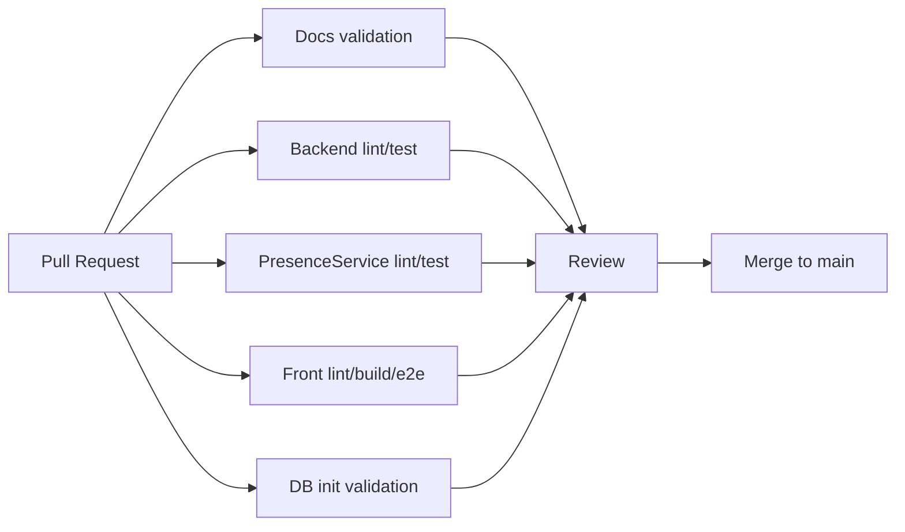

# 17.3 Repository별 CI 설계

| Repo | CI 작업 | 성공 기준 |
|---|---|---|
| docs | markdown frontmatter, wiki link, diff check | 깨진 링크/문법 없음 |
| Front | npm install, lint, build, Playwright e2e | lint/build/e2e 통과 |
| Backend | Python compile, pytest | 전체 테스트 통과 |
| PresenceService | Python compile, pytest | 전체 테스트 통과 |
| DB | PostgreSQL container init, schema/seed smoke | init script 성공, 핵심 row count 확인 |
| CodexKit | compose config validation, nginx config test | compose/nginx 설정 유효 |

# 17.4 CD 계획

초기 CD 는 운영 배포보다 시연 환경 재현성을 우선한다.

1. main merge 후 Docker image build
2. 이미지 태그는 repo/commit SHA 기준으로 생성
3. staging compose 또는 서버에 배포
4. DB migration/init script 적용 전 backup
5. health check 통과 후 Front/Nginx 공개
6. 실패 시 이전 이미지와 DB snapshot 으로 rollback

# 17.5 보안 고려사항

- GitHub Secrets 로 DB password, JWT secret, sync token 관리
- PresenceService 는 public ingress 로 노출하지 않음
- `/api/internal` 은 Nginx 에서 외부 차단
- refresh token 은 HttpOnly cookie 사용
- OpenWrt token 은 UI 노출 시 prompt 방식 기본, inline reveal 은 명시적 동작으로 제한

# 17.6 향후 완료 기준

- 모든 PR 에서 repo별 CI 가 자동 실행된다.
- DB schema 변경은 container init smoke 를 통과해야 한다.
- Front e2e 는 로그인/권한/출석/시험 핵심 경로를 포함한다.
- 최종보고서에는 CI 실행 결과 캡처 또는 workflow run 링크를 첨부한다.


# 18. 검증 및 테스트

# 18.1 검증 전략

프로젝트 검증은 서비스별 단위 검증과 통합 시나리오 검증을 함께 사용한다.
출석/시험 기능은 Front 화면, Backend API, PresenceService eligibility, DB audit/state 가 연결되므로 단일 계층 테스트만으로 충분하지 않다.

# 18.2 Backend 테스트

Backend 테스트는 다음 범위를 포함한다.

- 인증/세션/권한 guard
- 학생 단말 등록 제한과 중복 MAC 거부
- Presence admin/demo endpoint
- attendance realtime/session flow
- exam contract alignment

예상 명령:

```bash
cd Backend
PYTHONPATH=. pytest -q
python3 -m compileall app
```

# 18.3 PresenceService 테스트

PresenceService 테스트는 다음 범위를 포함한다.

- snapshot cache hit/miss
- refresh lock
- dummy overlay 적용/초기화
- registered device matching
- signal threshold 판정
- eligibility reason code

예상 명령:

```bash
cd PresenceService
PYTHONPATH=. pytest -q
python3 -m compileall app
```

# 18.4 Front 테스트

Front 검증은 lint/build/e2e 를 조합한다.

```bash
cd Front
npm run lint
npm run build
npx playwright test
```

주요 e2e 범위:

- 로그인/세션 복구/route guard
- presence demo
- attendance route
- exam workflow

# 18.5 DB 검증

DB 검증은 PostgreSQL container 에 init script 를 실제 적용해 확인한다.

검증 대상:

- schema 생성 성공
- seed import 성공
- 출석/시험 핵심 테이블 존재
- unique/foreign key 제약 동작
- demo tuple seed 확인

# 18.6 통합 시나리오

## 출석 시나리오

1. 서비스관리자가 강의실 AP/threshold 를 확인한다.
2. 학생이 등록 단말을 관리한다.
3. 교수가 projected slot 을 선택해 출석 세션을 연다.
4. 학생이 self check-in 을 시도한다.
5. Backend 가 PresenceService eligibility 를 확인한다.
6. 출석 record/audit 이 DB 에 저장된다.
7. 교수 roster/report 와 학생 화면이 갱신된다.

## 시험 시나리오

1. 교수가 시험 초안을 만든다.
2. 문항과 선택지를 구성한다.
3. 시험을 게시한다.
4. 학생이 시험을 시작한다.
5. 답안을 저장한다.
6. 시험을 제출한다.
7. 제출 상태와 점수가 반영된다.

# 18.7 보고서 검증 자료

최종보고서에는 다음 증거를 첨부한다.

- Front 화면 캡처
- Mermaid diagram
- API endpoint inventory
- DB ERD
- 테스트 명령과 결과 요약
- Docker compose health check 결과
- 주요 한계와 미완성 항목


# 19. 한계 및 향후 계획

# 19.1 현재 한계

| 영역 | 한계 | 영향 |
|---|---|---|
| OpenWrt 수집 | 실제 장비/학교 네트워크별 출력 차이가 있음 | station parsing 안정성 검증 필요 |
| MAC 기반 식별 | 랜덤 MAC 사용 시 매칭 실패 가능 | 학생 안내와 정책 필요 |
| 개인정보 | 단말 식별자 저장 정책 필요 | 운영 도입 전 보안/법무 검토 필요 |
| 시험 | 현재 MVP 는 객관식/진위형 중심 | 수동 채점/서술형/성적 공개 확장 필요 |
| LMS 기능 | 과제/성적/질문/자료 정식 저장은 계획 단계 | 최종 LMS 완성도 보강 필요 |
| CI/CD | 자동 배포는 아직 설계 단계 | 운영 재현성과 품질 게이트 보강 필요 |
| 학교 도입 | 학교별 AP/학사 데이터 연동 방식 상이 | adapter/config 기반 확장 필요 |

# 19.2 기술적 리스크

- PresenceService snapshot 이 stale 한 상태에서 잘못된 허용/거부가 발생할 수 있다.
- Redis 또는 OpenWrt 수집 실패 시 수업 중 출석 경험이 나빠질 수 있다.
- WebSocket event ordering 이 어긋나면 교수/학생 화면의 출석 상태가 달라질 수 있다.
- DB schema 와 Front/Backend API 타입이 어긋나면 통합 오류가 발생한다.
- 권한 guard 가 누락되면 학생/교수별 리소스 접근 경계가 깨질 수 있다.

# 19.3 향후 계획

1. 실제 OpenWrt push collector 또는 안정적인 수집 adapter 구현
2. 서비스관리자용 router registration/token UI 완성
3. 출석 리포트와 통계 고도화
4. 시험 문제 유형 확장과 수동 채점/성적 공개
5. 과제 제출, 강의자료, 동영상, 질문/문의 기능 정식 API/DB 연결
6. GitHub Actions 기반 CI 도입
7. staging/prod 배포 환경 분리
8. 조선대학교 테스트베드 운영 결과 수집
9. 타 학교 도입을 위한 설정/연동 가이드 작성

# 19.4 정책적 고려사항

- 학생 단말 MAC 주소 저장 고지와 동의 절차
- 랜덤 MAC 해제 안내
- 장애 발생 시 수동 출석 대체 절차
- 교수 수동 수정 권한과 감사 로그 보존 정책
- 시험 접근 제어 실패 시 이의 신청 절차


# 20. 결론

차세대 사이버캠퍼스 프로젝트는 기존 LMS 기능을 단순히 복제하는 것이 아니라, 대학 수업 현장에서 반복적으로 발생하는 출석 신뢰성 문제를 기술적으로 개선하는 것을 목표로 한다.
학생, 교수, 서비스관리자 세 역할을 중심으로 기능과 권한을 나누고, Front / Backend / PresenceService / DB 의 서비스 경계를 분리하여 확장 가능한 구조를 설계했다.

핵심 차별점은 출석과 시험 접근 제어에 등록 단말과 강의실 네트워크 관측 정보를 결합한다는 점이다.
PresenceService 는 OpenWrt 또는 dummy snapshot 을 통해 재실성 근거를 제공하고, Backend 는 수강 정보와 시간표, 강의실, 출석 세션 상태를 결합해 최종 판정을 수행한다.
DB 는 출석 상태뿐 아니라 변경 이력과 시험 응시 데이터를 구조화하여 추적성을 확보한다.

중간 단계에서는 로그인, 강의/공지 조회, 단말 관리, eligibility, 출석/시험 모델, Docker 실행 환경 등 핵심 기반을 마련했다.
최종 단계에서는 모든 역할별 화면 캡처, API 상세, Mermaid 다이어그램, DB ERD, 주요 코드 설명, 테스트 결과, CI/CD 설계, 조선대학교 및 타 학교 도입 가능성까지 포함해 완성된 보고서로 정리한다.

남은 과제는 실제 OpenWrt 수집 안정화, 과제/성적/질문 등 LMS 기능 확장, CI/CD 자동화, 운영 정책 정리다.
이 과제를 해결하면 본 프로젝트는 조선대학교 테스트베드뿐 아니라 다른 학교 환경에도 적용 가능한 재실성 기반 LMS 프로토타입으로 발전할 수 있다.


# 부록 A. 보고서 출처 맵

# A.1 문서 출처

| 보고서 항목 | 주요 출처 |
|---|---|
| 개요/목표/필요성 | [[/00-overview/project-summary.md]] |
| 학생 기능 | [[/01-requirements/req-student-features.md]] |
| 교수 기능 | [[/01-requirements/req-professor-features.md]] |
| 서비스관리자 기능 | [[/01-requirements/req-admin-features.md]] |
| 출석/재실성 | [[/01-requirements/req-attendance-presence.md]], [[/04-architecture/attendance-workflow-architecture.md]], [[/04-architecture/presence-eligibility-api.md]] |
| 단말 인증 | [[/01-requirements/req-device-auth.md]] |
| 시험 | [[/01-requirements/req-exam-workflow.md]], [[/04-architecture/exam-mvp-contract.md]], [[/04-architecture/exam-workflow-api.md]] |
| 서비스 경계 | [[/02-decisions/adr-0002-service-boundary.md]], [[/04-architecture/service-map.md]] |
| DB | [[/04-architecture/data-model-overview.md]], `DB/postgres/init/*.sql` |
| 인프라 | [[/04-architecture/local-runtime-topology.md]], `CodexKit/docker-compose.yml` |
| 네트워크/OpenWrt | [[/04-architecture/network-topology.md]], [[/05-work-items/task-openwrt-gateway-prototype.md]] |
| 일정/WBS | [[/05-work-items/epic-full-lms-delivery-plan.md]], [[/07-status/implementation-roadmap.md]] |

# A.2 코드 출처

| Repo | 파일 | 보고서 사용처 |
|---|---|---|
| Front | `src/App.tsx` | 화면/상태/역할별 기능 설명 |
| Front | `src/api.ts` | API client, 타입, 인증 refresh 설명 |
| Front | `src/router.ts` | path routing 설명 |
| Backend | `app/main.py` | API endpoint, 권한, WebSocket 설명 |
| Backend | `app/attendance.py` | 출석 session/report/audit 설명 |
| Backend | `app/services.py` | LMS/시험/공지/단말 도메인 설명 |
| Backend | `app/auth.py` | JWT/refresh/session 설명 |
| PresenceService | `app/main.py` | Presence API 목록 |
| PresenceService | `app/service.py` | snapshot/cache/eligibility/overlay 설명 |
| DB | `postgres/init/001_schema.sql` | LMS/출석/인증 ERD |
| DB | `postgres/init/013_exam_schema.sql` | 시험 ERD |
| CodexKit | `docker-compose.yml` | 로컬 인프라 |
| CodexKit | `nginx/default.conf` | reverse proxy routing |


# 부록 B. 화면 캡처 체크리스트

최종보고서에는 Front End의 모든 주요 기능 화면을 캡처해 본문에 삽입한다.
이미지 파일은 `08-reports/assets/screenshots/` 아래에 저장한다.

# B.1 촬영 기준

- 촬영일: 2026-04-12
- 촬영 방식: Playwright Chromium headless screenshot
- 실행 기준: 기존 Docker 컨테이너를 모두 내린 뒤 `CodexKit/docker-compose.yml` 을 현재 워크스페이스 기준으로 `up -d --build`
- 접속 URL: `http://127.0.0.1:3100`
- 사용 계정:
  - 학생: `20201239 / devpass123`
  - 교수: `PRF002 / devpass123`
  - 서비스관리자: `ADM001 / devpass123`
- 캡처용 데이터:
  - `CSE116 / Capstone Design A`
  - 캡처용 공지 1건 생성
  - 캡처용 시험 1건 생성/게시
  - 캡처용 smart attendance session 1건 생성
  - `B101` dummy presence overlay 적용

# B.2 공통

- [x] 로그인 화면 — `assets/screenshots/01-login.png`
- [x] 세션 복구 후 대시보드 — 역할별 대시보드 캡처에 포함
- [x] 로그인 실패 메시지 — `assets/screenshots/common-02-login-failure.png`
- [x] 권한 실패 메시지 — `assets/screenshots/common-03-authorization-denied.png`

# B.3 학생

- [x] 학생 강의 목록 — `assets/screenshots/student-01-dashboard.png`
- [x] 강의 상세 기본 화면 — `assets/screenshots/student-03-course-home.png`
- [x] 공지 목록 — `assets/screenshots/student-05-notices.png`
- [x] 공지 상세 — `assets/screenshots/student-06-notice-detail.png`
- [x] 단말 등록/목록 — `assets/screenshots/student-02-profile-devices.png`
- [x] eligibility 확인 전 — `assets/screenshots/student-07-attendance-before-check.png`
- [x] eligibility 성공 결과 — `assets/screenshots/student-08-eligibility-result.png`
- [x] active attendance session / self check-in 결과 — `assets/screenshots/student-09-check-in-result.png`
- [x] 출석 학기 매트릭스 — `assets/screenshots/student-07-attendance-before-check.png`
- [x] 시험 목록 — `assets/screenshots/student-10-exam-list.png`
- [x] 시험 응시 화면 — `assets/screenshots/student-11-exam-taking.png`
- [x] 답안 선택 — `assets/screenshots/student-12-exam-answer-selected.png`
- [x] 강의자료/동영상 스캐폴드 — `assets/screenshots/student-04-learning-content.png`
- [x] 시험 제출 완료 결과 — `assets/screenshots/student-13-exam-submit-result.png`

# B.4 교수

- [x] 교수 강의 목록 — `assets/screenshots/professor-01-dashboard.png`
- [x] 교수 프로필 — `assets/screenshots/professor-02-profile.png`
- [x] 강의 상세 기본 화면 — `assets/screenshots/professor-03-course-home.png`
- [x] 자료/영상 관리 — `assets/screenshots/professor-04-learning-content-manage.png`
- [x] 공지 목록 — `assets/screenshots/professor-05-notices.png`
- [x] 공지 작성 — `assets/screenshots/professor-06-course-manage-notice-form.png`
- [x] 시험 목록/작성 — `assets/screenshots/professor-07-exam-manage.png`
- [x] 시험 상세 — `assets/screenshots/professor-08-exam-detail.png`
- [x] 출석 timeline — `assets/screenshots/professor-09-attendance-timeline.png`
- [x] 학생별 출석 누계 — `assets/screenshots/professor-10-attendance-student-stats.png`
- [x] 출석 timer — `assets/screenshots/professor-11-attendance-timer.png`
- [x] 출석 roster — `assets/screenshots/professor-12-attendance-roster.png`
- [x] 차시 예외 roster — `assets/screenshots/professor-13-attendance-slot-roster.png`
- [x] 학생 출석 상태 수정 후 저장 결과 — `assets/screenshots/professor-14-attendance-edit-save-result.png`
- [x] 시험 종료 동작 후 결과 — `assets/screenshots/professor-15-exam-close-result.png`
- [x] 시험 게시 동작 후 결과 — `assets/screenshots/professor-16-exam-publish-result.png`

# B.5 서비스관리자

- [x] 사용자 목록 — `assets/screenshots/admin-01-users.png`
- [x] 강의실 및 네트워크 현황 — `assets/screenshots/admin-02-classrooms-networks.png`
- [x] AP threshold 현황 — `assets/screenshots/admin-02-classrooms-networks.png`
- [x] presence snapshot 조회 — `assets/screenshots/admin-02-classrooms-networks.png`
- [x] dummy overlay 제어 — `assets/screenshots/admin-03-presence-demo-control.png`
- [x] dummy overlay 적용 결과 — `assets/screenshots/admin-04-presence-demo-applied.png`
- [x] dummy overlay reset 결과 — `assets/screenshots/admin-05-presence-demo-reset-result.png`
- [ ] OpenWrt router registration/token 화면 — 현재 main 기준 화면 없음, 구현 후 촬영

# B.6 캡처 품질 기준

- 브라우저 화면에서 역할과 현재 기능 위치가 보이게 한다.
- 역할별 demo 계정을 사용한다.
- 성공 화면과 실패/거부 사유 화면을 최종보고 전 함께 포함한다.
- 개인정보가 포함될 경우 demo seed 데이터만 사용한다.


# 부록 C. API Endpoint Inventory

# C.1 Backend

| Method | Path | Function |
|---|---|---|
| GET | `/health` | `health` |
| POST | `/api/auth/login` | `login` |
| POST | `/api/auth/refresh` | `refresh_auth_session` |
| GET | `/api/auth/bootstrap` | `bootstrap_auth_session` |
| GET | `/api/auth/me` | `bootstrap_auth_session_alias` |
| POST | `/api/auth/logout` | `logout_auth_session` |
| GET | `/api/students/{student_id}/courses` | `get_student_courses` |
| GET | `/api/professors/{professor_id}/courses` | `get_professor_courses` |
| GET | `/api/notices/{login_id}` | `get_notices` |
| GET | `/api/notices/{login_id}/{notice_id}` | `get_notice` |
| POST | `/api/professors/{professor_id}/notices` | `add_notice` |
| GET | `/api/admin/users` | `get_users` |
| GET | `/api/admin/classrooms` | `get_classrooms` |
| GET | `/api/admin/classroom-networks` | `get_classroom_networks` |
| PATCH | `/api/admin/classroom-networks/{network_id}` | `patch_classroom_network_threshold` |
| GET | `/api/admin/presence/classrooms/{classroomCode}/snapshot` | `get_admin_presence_snapshot` |
| POST | `/api/admin/presence/classrooms/{classroomCode}/dummy-controls` | `apply_admin_presence_overlay` |
| POST | `/api/admin/presence/classrooms/{classroomCode}/dummy-controls/reset` | `reset_admin_presence_overlay` |
| GET | `/api/students/{student_id}/devices` | `get_devices` |
| POST | `/api/students/{student_id}/devices` | `add_device` |
| DELETE | `/api/students/{student_id}/devices/{device_id}` | `remove_device` |
| POST | `/api/attendance/eligibility` | `attendance_eligibility` |
| GET | `/api/students/{student_id}/courses/{course_code}/attendance/bootstrap` | `student_attendance_bootstrap` |
| GET | `/api/professors/{professor_id}/courses/{course_code}/attendance/bootstrap` | `professor_attendance_bootstrap` |
| GET | `/api/professors/{professor_id}/courses/{course_code}/attendance/timeline` | `professor_attendance_timeline` |
| GET | `/api/professors/{professor_id}/courses/{course_code}/attendance/report` | `professor_attendance_report` |
| GET | `/api/professors/{professor_id}/courses/{course_code}/attendance/student-stats` | `professor_attendance_student_stats` |
| POST | `/api/professors/{professor_id}/courses/{course_code}/attendance/sessions/batch` | `professor_open_attendance_sessions_batch` |
| POST | `/api/professors/{professor_id}/attendance/sessions/{session_id}/close` | `professor_close_attendance` |
| GET | `/api/professors/{professor_id}/attendance/sessions/{session_id}/roster` | `professor_attendance_roster` |
| GET | `/api/professors/{professor_id}/courses/{course_code}/attendance/slot-roster` | `professor_attendance_slot_roster` |
| PATCH | `/api/professors/{professor_id}/attendance/sessions/{session_id}/students/{student_id}` | `professor_update_attendance_record` |
| GET | `/api/professors/{professor_id}/courses/{course_code}/attendance/students/{student_id}/history` | `professor_attendance_student_history` |
| GET | `/api/students/{student_id}/courses/{course_code}/attendance/active-sessions` | `student_active_attendance_sessions` |
| GET | `/api/students/{student_id}/courses/{course_code}/attendance/semester-matrix` | `student_attendance_semester_matrix` |
| POST | `/api/students/{student_id}/attendance/sessions/{session_id}/check-in` | `student_attendance_check_in_endpoint` |
| WS | `/ws/attendance` | `attendance_websocket` |
| GET | `/api/students/{student_id}/courses/{course_code}/exams` | `get_student_course_exams` |
| GET | `/api/students/{student_id}/courses/{course_code}/exams/{exam_id}` | `get_student_course_exam_detail` |
| POST | `/api/students/{student_id}/courses/{course_code}/exams/{exam_id}/start` | `start_student_course_exam` |
| PUT | `/api/students/{student_id}/courses/{course_code}/exams/{exam_id}/submissions/{submission_id}/answers/{question_id}` | `save_student_course_exam_answer` |
| POST | `/api/students/{student_id}/courses/{course_code}/exams/{exam_id}/submit` | `submit_student_course_exam` |
| GET | `/api/professors/{professor_id}/courses/{course_code}/exams` | `get_professor_course_exams` |
| POST | `/api/professors/{professor_id}/courses/{course_code}/exams` | `create_professor_course_exam` |
| GET | `/api/professors/{professor_id}/courses/{course_code}/exams/{exam_id}` | `get_professor_course_exam_detail` |
| PUT | `/api/professors/{professor_id}/courses/{course_code}/exams/{exam_id}` | `update_professor_course_exam` |
| DELETE | `/api/professors/{professor_id}/courses/{course_code}/exams/{exam_id}` | `delete_professor_course_exam` |
| POST | `/api/professors/{professor_id}/courses/{course_code}/exams/{exam_id}/publish` | `publish_professor_course_exam` |
| POST | `/api/professors/{professor_id}/courses/{course_code}/exams/{exam_id}/close` | `close_professor_course_exam` |

# C.2 PresenceService

| Method | Path | Function |
|---|---|---|
| GET | `/health` | `health` |
| GET | `/snapshots/classrooms/{classroom_id}` | `get_snapshot` |
| POST | `/eligibility/check` | `check_eligibility` |
| GET | `/admin/dummy/classrooms/{classroom_id}/snapshot` | `get_admin_snapshot` |
| POST | `/admin/dummy/classrooms/{classroom_id}/overlay` | `apply_dummy_overlay` |
| POST | `/admin/dummy/classrooms/{classroom_id}/overlay/reset` | `reset_dummy_overlay` |


# 부록 D. 다이어그램 목록

# D.1 본문 포함 다이어그램

| 위치 | 유형 | 목적 |
|---|---|---|
| `06-system-architecture.md` | Mermaid flowchart | 전체 논리 아키텍처 |
| `06-system-architecture.md` | Mermaid sequenceDiagram | 로그인/세션 복구 |
| `06-system-architecture.md` | Mermaid sequenceDiagram | 출석 eligibility |
| `06-system-architecture.md` | Mermaid flowchart | 출석 세션 운영 |
| `07-service-infrastructure.md` | Mermaid flowchart | Docker/Nginx 로컬 인프라 |
| `11-backend-api-and-flows.md` | Mermaid sequenceDiagram | Backend 인증 흐름 |
| `11-backend-api-and-flows.md` | Mermaid sequenceDiagram | 출석 세션 흐름 |
| `11-backend-api-and-flows.md` | Mermaid flowchart | 시험 흐름 |
| `12-presence-service-flows.md` | Mermaid flowchart | Presence eligibility 판정 |
| `12-presence-service-flows.md` | Mermaid sequenceDiagram | Presence snapshot/cache |
| `12-presence-service-flows.md` | Mermaid sequenceDiagram | Demo overlay |
| `13-database-design.md` | Mermaid erDiagram | DB ERD |
| `17-ci-cd-design.md` | Mermaid flowchart | CI pipeline |

# D.2 최종보고 전 보강할 다이어그램

- Front 화면 이동 구조
- Backend 권한 guard decision tree
- 시험 응시 상태 전이도
- 출석 session lifecycle state diagram
- OpenWrt push collector future flow
- 배포 환경 네트워크 구조
