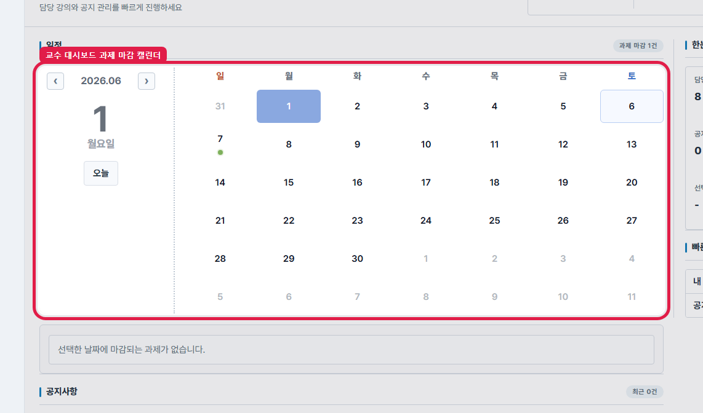
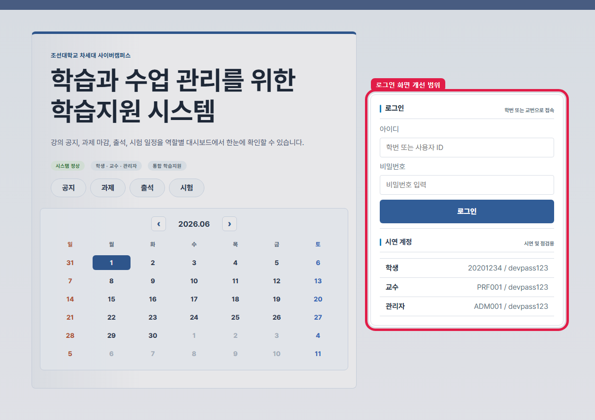
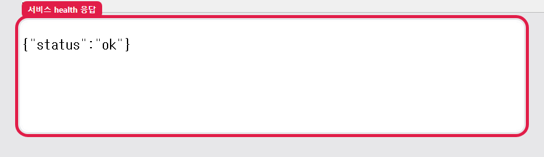
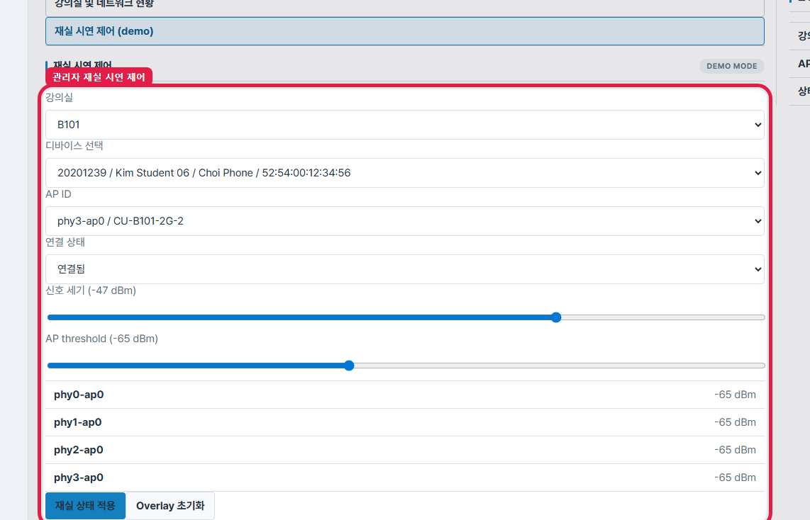
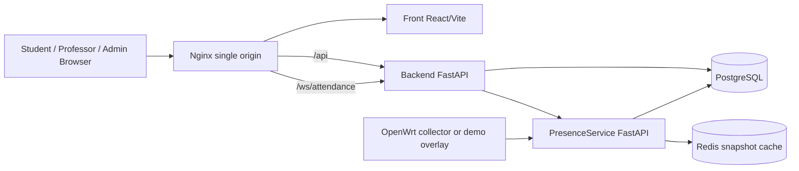
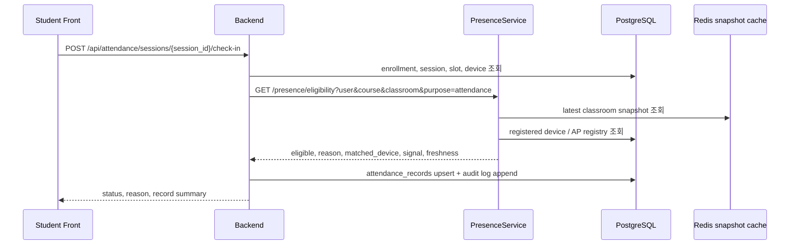
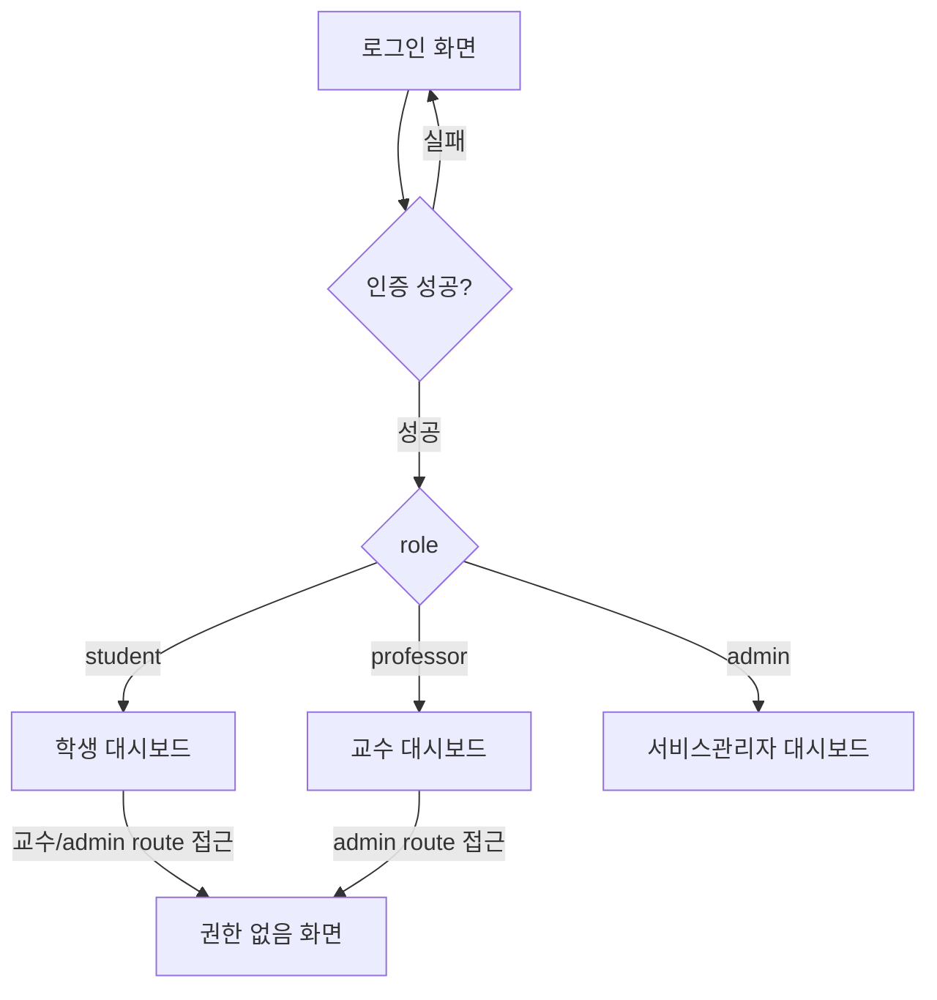
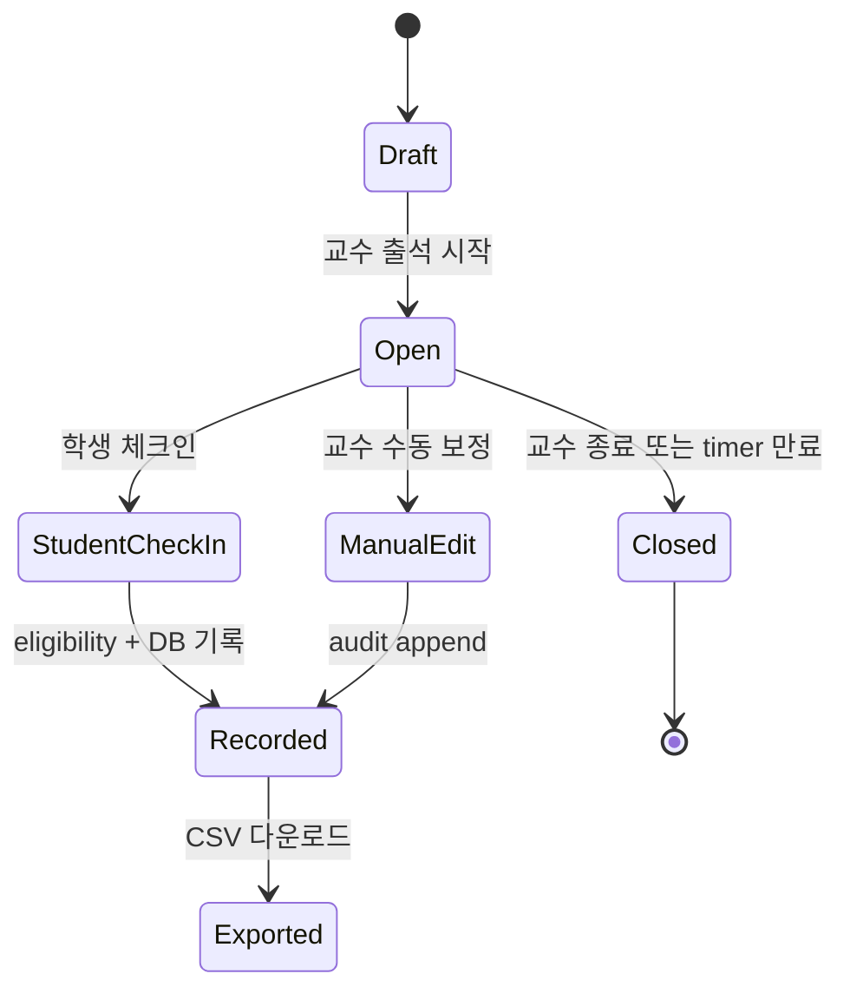

# 1. 이번 주 진행사항 요약

본 장은 2026-06-01 기준 `origin/main`에 병합된 변경만 정리한다. 세부 commit/PR/CI 목록은 부록성 검증 자료로 분리하고, 본문 1장은 실제 사용자가 확인할 수 있는 기능 단위 변화와 운영 화면 캡처 중심으로 축약했다.

- 기준 시각: 2026-06-01 02:21 KST
- 보고 기간: 2026-05-25 09:00 KST ~ 2026-06-01 02:21 KST
- main 기준: Front `393166e`, Service `34acf9f`, docs `4b39114`
- 운영 확인: `https://smart-class.org/health` 응답 `{"status":"ok"}`, live smoke 통과
- CI 확인: main branch workflow 성공 11건 확인

## 1.1 대시보드 과제 마감 캘린더 추가

학생 대시보드에 과제 마감 일정을 월간 캘린더로 확인하는 영역을 추가했다. 기존에는 과제 목록을 과목별 화면에서 따로 확인해야 했지만, 이번 변경 이후에는 대시보드 첫 화면이 날짜별 마감 과제와 선택일 과제 목록을 함께 표시한다.

사용자는 캘린더에서 마감일이 있는 날짜를 확인하고, 선택한 날짜의 과제 제목·과목·상태를 함께 확인한다. 이 변경은 Front #48과 docs #47이 `main`에 병합된 범위만 반영했다.

<figure class="screenshot"><figcaption>학생 대시보드에 추가된 과제 마감 캘린더</figcaption></figure>

## 1.2 교수 대시보드 캘린더 및 부분 실패 처리 보강

교수 대시보드에도 동일한 과제 마감 캘린더를 반영해, 강의별 과제 마감 현황을 한 화면에서 확인할 수 있게 했다. 교수 화면에서는 제출 수·마감 상태 같은 관리 관점의 정보를 함께 확인할 수 있도록 구성했다.

또한 일부 강의의 과제 API 조회가 실패해도 전체 캘린더가 비어 보이지 않도록 보강했다. 성공한 강의의 일정은 유지하고 실패한 강의만 경고로 분리해, 부분 장애가 전체 대시보드 사용성을 막지 않도록 수정했다. 이 보강은 Front #49와 E2E 테스트에 반영되어 있다.

<figure class="screenshot"><figcaption>교수 대시보드에서 확인한 과제 마감 캘린더</figcaption></figure>

## 1.3 로그인 화면 개선 범위 정리

로그인 화면의 인증 안내, 샘플 계정, 미니 일정 UI를 로그인 화면 전용 마크업 범위 안으로 정리했다. 이 수정의 목적은 로그인 화면 polish가 다른 화면의 인증 상태 표시, 라우팅 복구 UI, 대시보드 레이아웃에 영향을 주지 않도록 범위를 줄이는 것이다.

운영 화면 기준으로 로그인 폼과 안내 영역이 함께 렌더링되는 것을 확인했고, 해당 변경은 Front #50에 병합된 범위만 보고서에 반영했다.

<figure class="screenshot"><figcaption>로그인 화면 전용 범위로 정리된 인증 UI</figcaption></figure>

## 1.4 배포 이미지 및 서비스 manifest 고정

Front `0.6.2` 배포 이미지를 `sha-393166e` 태그와 digest로 빌드했고, Service `0.4.3` manifest가 해당 이미지를 참조하도록 고정했다. 즉 운영 서버에서 뜨는 프론트엔드가 이번 주 `main` 변경을 포함한 이미지인지 추적할 수 있는 상태가 되었다.

서비스 health 응답은 `{"status":"ok"}`로 확인되었다. HWP 본문에는 긴 digest 전체 대신 변경의 의미만 요약하고, manifest·release 근거는 검증 산출물에 남겼다.

<figure class="screenshot"><figcaption>운영 서버 health endpoint 응답</figcaption></figure>

## 1.5 관리자 재실 시연 제어 확인

관리자 화면의 재실 시연 제어는 이번 주 신규 기능은 아니지만, 최신 이미지와 운영 서버 기준으로 여전히 접근 가능한지 확인했다. 관리자 계정으로 로그인한 뒤 demo 탭의 강의실, 디바이스, AP, 신호 세기, threshold 제어 폼이 렌더링되는 것을 확인했다.

이 캡처는 전체 보고서의 기존 관리자 기능 설명을 유지하면서, 최신 배포 이미지에서도 시연 흐름이 깨지지 않았다는 운영 증거로 사용한다.

<figure class="screenshot"><figcaption>운영 서버에서 확인한 관리자 재실 시연 제어 화면</figcaption></figure>

## 1.6 검증 결과 및 남은 확인사항

이번 보고서에는 Front 정적 검사, production build, Playwright E2E, 운영 서버 smoke, GitHub Actions main workflow 결과를 반영했다. 핵심 사용자 흐름은 통과했으며, 캘린더 캡처는 SVG 후처리 대신 실제 DOM에 빨간 강조 박스를 삽입한 상태로 다시 저장했다.

남은 확인사항은 Service 로컬 pytest 일부가 Windows 실행 환경 때문에 실패한 점과 Front release-please manifest가 `0.6.1`로 남아 있고 `package.json`은 `0.6.2`인 점이다. 배포 manifest 자체는 Front `v0.6.2` digest를 고정하고 있으므로 이번 보고서의 운영 화면 근거와는 분리해 기록한다.

# 2. 서론

## 2.1 연구 배경

대학 LMS는 강의자료 배포, 공지, 과제, 시험, 출석, 성적 확인을 담당하는 핵심 학사 플랫폼이다. 그러나 많은 LMS는 사용자가 “로그인했다”는 사실과 “수업 공간에 실제로 있었다”는 사실을 강하게 연결하지 못한다. 특히 출석은 수업 운영의 핵심 데이터인데도, 교수 수기 입력이나 학생 자가 체크 버튼만으로 운영되면 대리출석, 원격 출석, 사후 이의 제기 대응 문제가 발생할 수 있다.

Smart Class는 기존 LMS를 단순히 복제하는 것이 아니라, LMS 기능과 재실성 판정을 결합하는 실험적 시스템이다. 사용자는 웹 UI에서 일반적인 LMS 기능을 사용하고, 출석이나 시험 접근처럼 물리적 참석성이 중요한 순간에는 등록 단말과 강의실 Wi-Fi 관측 정보를 함께 사용한다. 이 접근은 “계정 인증”과 “공간·단말 근거”를 분리해 기록하고, 문제가 생겼을 때 어느 조건이 실패했는지 reason code와 audit log로 추적할 수 있게 한다.

## 2.2 필요성

첫째, 출석 데이터는 성적·학습관리·수업 참여 분석에 사용되므로 신뢰성이 필요하다. 단순 클릭형 출석은 UX는 좋지만 대리출석을 방지하기 어렵다. 둘째, QR이나 위치 기반 방식은 단기 인증에 유용하지만 QR 공유, GPS 실내 정확도, 개인정보 문제를 가진다. 셋째, 교수자는 출석 세션을 열고 닫고, 학생별 상태를 확인·수정하고, CSV로 내보낼 수 있어야 한다. 넷째, 운영자는 강의실/AP/단말 매핑과 threshold를 관리하며, real snapshot과 demo overlay를 구분할 수 있어야 한다.

## 2.3 목적

본 프로젝트의 목적은 학생·교수·서비스관리자 세 역할을 지원하는 웹 기반 LMS 프로토타입을 구현하고, 등록 단말과 강의실 Wi-Fi 관측 정보를 결합한 재실성 기반 출석/시험 접근 제어를 로컬 테스트베드에서 검증하는 것이다. 구체적으로는 다음 목표를 둔다.

1. 학생은 강의, 공지, 학습자료, 과제, 성적/피드백, Q&A, 학습진도, 출석, 시험, 등록 단말을 한 UI에서 사용할 수 있어야 한다.
2. 교수는 강의 운영, 자료·공지·과제·시험 관리, 출석 세션 운영, 수동 보정, audit 확인, CSV export를 수행할 수 있어야 한다.
3. 서비스관리자는 사용자·강의실·AP·presence snapshot·threshold·demo overlay를 관리할 수 있어야 한다.
4. Backend와 PresenceService는 도메인 판단과 네트워크 재실성 판단을 분리하고, API/DB/test로 계약을 검증해야 한다.
5. 보고서는 완료 성과와 잔여·후속 과제를 명확히 분리해야 한다.

## 2.4 범위와 비범위

완료 범위는 로컬/테스트베드 MVP다. 본 보고서에서 완료 성과로 주장하는 것은 구현된 코드, 화면 캡처, ERD/SQL, API request/response, 테스트 파일/명령 근거가 있는 기능에 한정한다. 상용 운영 배포, 장기 교내 Wi-Fi 현장 검증, 학사시스템 정식 연동, 네이티브 모바일 앱 구현은 의도적으로 완료 주장에 포함하지 않는다. 이 항목들은 한계점과 개선 방향에서 다룬다.

# 3. 관련 연구 및 기술

## 3.1 기존 LMS와 출석 관리 방식

기존 LMS는 대체로 강의자료, 공지, 과제, 시험, 성적, 출석 관리 기능을 제공한다. 출석은 교수 수기, 학생 클릭, QR, 비콘, GPS, Wi-Fi 방식으로 운영된다. 각 방식은 구현 난이도, 클릭 수, 대리출석 방지 능력, 개인정보 위험이 다르다. 본 프로젝트는 웹 기반 LMS의 접근성을 유지하면서, 출석과 시험 접근에 필요한 순간에만 강의실 Wi-Fi 관측과 등록 단말 근거를 결합하는 방향을 선택했다.

## 3.2 QR/GPS/Wi-Fi/단말 기반 인증 비교

1. 교수 수기 출석
   - 장점: 운영자가 직접 확인한다.
   - 한계: 시간이 오래 걸리고 실시간성이 낮다.
   - Smart Class 반영: 교수 수동 보정과 audit log로 보완한다.

2. 학생 버튼 클릭
   - 장점: 구현과 사용 흐름이 단순하다.
   - 한계: 대리출석 방지 능력이 약하다.
   - Smart Class 반영: Wi-Fi 관측과 등록 단말 eligibility를 추가 조건으로 둔다.

3. QR 인증
   - 장점: 짧은 시간 안에 인증을 수행하기 쉽다.
   - 한계: QR 공유와 화면 캡처 위험이 있다.
   - Smart Class 반영: 현재 MVP 범위에서는 제외하고 후속 보조 인증 후보로 둔다.

4. GPS
   - 장점: 실외 위치 판단에 적합하다.
   - 한계: 실내 강의실 단위 정확도와 개인정보 이슈가 남는다.
   - Smart Class 반영: GPS보다 강의실 AP 기반 판단을 우선한다.

5. Wi-Fi 관측
   - 장점: 강의실 네트워크 근거를 사용한다.
   - 한계: 랜덤 MAC, AP 품질, snapshot freshness를 함께 처리해야 한다.
   - Smart Class 반영: PresenceService의 핵심 근거로 사용한다.

6. 등록 단말 인증
   - 장점: 사용자와 단말을 연결한다.
   - 한계: 단말 변경 정책이 필요하다.
   - Smart Class 반영: `registered_devices`와 collector snapshot을 매칭한다.

## 3.3 Smart Class의 차별성

Smart Class의 차별성은 LMS 기능, 도메인 권한, 출석 세션, 시험 접근, Wi-Fi presence evidence를 단일 서버에 섞지 않고 서비스 경계로 분리한 점이다. Backend는 “이 학생이 이 강의에 대해 이 시간에 출석/시험을 수행할 권리가 있는가”를 판단하고, PresenceService는 “등록 단말이 지정 강의실 네트워크에서 신선한 snapshot으로 관측되는가”를 판단한다. 이 분리는 네트워크 관측 실패와 학사 도메인 실패를 구분하고, demo overlay가 real collector 결과를 오염시키지 않도록 만든다.

## 3.4 기술 선택 근거

FastAPI는 Python 기반 API와 테스트 작성이 빠르고, WebSocket과 REST endpoint를 동시에 구성하기 쉽기 때문에 Backend와 PresenceService에 사용했다. React/Vite/TypeScript는 역할별 화면과 Playwright 기반 e2e 검증에 적합해 Front에 사용했다. PostgreSQL은 관계형 데이터 모델과 FK/audit/history 구조를 명확히 표현할 수 있어 DB에 사용했다. Docker Compose/Nginx는 로컬 통합 실행과 단일 origin routing을 구성하기 위해 Service repo에 배치했다.

# 4. 시스템 설계

## 4.1 전체 구조

Smart Class의 실행 구조는 다음과 같다.



Nginx는 단일 origin에서 정적 Front, `/api`, `/ws/attendance`, `/health`를 라우팅한다. Front는 사용자 입력과 화면 상태를 관리하고, Backend는 인증·권한·LMS·출석·시험 도메인 API를 제공한다. PresenceService는 collector snapshot과 demo overlay를 기반으로 eligibility를 계산한다. DB는 모든 장기 상태와 audit history를 저장한다.

## 4.2 서비스 책임과 데이터 흐름

| 서비스 | 주요 책임 | 저장/외부 의존 | 실패 시 영향과 완화 |
|---|---|---|---|
| Front | 역할별 UI, API 호출, e2e 사용자 흐름 | Browser state, API client | API 실패 banner와 route guard로 사용자에게 표시 |
| Backend | Auth/RBAC/LMS/Attendance/Exam API, WebSocket | PostgreSQL, PresenceService | timeout/fallback, audit log, CSV export, envelope error |
| PresenceService | snapshot ingest/cache, eligibility reason | Redis, PostgreSQL registry | snapshot freshness와 reason code로 실패를 명시 |
| DB | schema, seed, FK, audit/history | PostgreSQL | migration/init SQL과 ERD로 관계 검증 |
| Service | compose/nginx/image manifest | Docker, Nginx | manifest/compose contract test로 실행 구조 검증 |

## 4.3 핵심 알고리즘

### 4.3.1 인증 및 세션 복구 알고리즘

1. 사용자가 로그인 폼에 계정/비밀번호를 입력한다.
2. Backend `/api/auth/login`은 계정 상태와 password hash를 확인한다.
3. 성공 시 access token과 refresh session을 발급하고, role을 bootstrap 정보와 함께 반환한다.
4. Front는 role에 따라 학생/교수/관리자 대시보드로 이동한다.
5. access token 만료 시 refresh endpoint를 통해 세션을 갱신한다.
6. 권한이 맞지 않는 route 접근은 Front route guard와 Backend RBAC에서 모두 거부된다.

### 4.3.2 출석 eligibility 알고리즘



핵심은 Backend가 수강/시간표/출석 세션을 확인하고, PresenceService가 AP online, 등록 단말 MAC, RSSI threshold, snapshot freshness를 확인한 뒤, Backend가 두 결과를 결합해 최종 출석 상태를 기록한다는 점이다.

### 4.3.3 시험 workflow 알고리즘

1. 교수는 시험 draft를 만들고 문항/선택지를 구성한다.
2. 교수는 시험을 publish하여 학생에게 노출한다.
3. 학생은 시험 목록에서 “응시 시작”을 누른다.
4. Backend는 수강 여부, 시험 상태, 응시 가능 시간, 기존 제출 여부를 확인한다.
5. 학생은 각 문항의 선택지를 저장한다.
6. 미응답 문항이 있으면 제출 guard가 경고한다.
7. 제출 완료 후 교수는 제출 상태와 성적을 확인한다.

### 4.3.4 출석 audit 및 CSV export 알고리즘

교수 수동 보정은 단순 update가 아니라 audit log append로 처리한다. 출석 record의 현재 상태와 변경 이력을 분리해, 변경자·시각·사유를 audit log에 남긴다. CSV export는 교수 권한과 강의 소유권을 확인한 뒤 학생별 출석 통계와 raw record를 report export metadata와 함께 제공한다.


## 4.4 DB 설계와 ERD

DB는 사용자·강의·강의실·네트워크·출석·시험·과제·Q&A·파일 export를 하나의 PostgreSQL 모델로 연결한다. 전체 ERD는 세로 1쪽 overview로 먼저 제시하고, 이어서 전체 테이블 목록과 주요 테이블 구조를 분리해 세부 내용을 확인하도록 구성한다.

### 4.4.1 ERD-1 세로 1쪽 전체 overview

<figure class="figure diagram full-erd"><figcaption>ERD-1 portrait full ERD</figcaption></figure>

### 4.4.2 전체 테이블 목록과 역할

| 실제 테이블명 | 영역 | 역할 | 설명 | 컬럼 수 | FK 수 |
|---|---|---|---|---:|---:|
| `access_point_interfaces` | 재실성 | AP 인터페이스 매핑 | AP interface/BSSID와 classroom_networks의 1:1 매핑을 저장한다. | 7 | 2 |
| `access_points` | 재실성 | AP registry | OpenWrt collector 대상 AP와 관리 IP, token 상태를 저장한다. | 12 | 0 |
| `assignment_submission_attachments` | 과제 | 과제 첨부 | 과제 제출 첨부파일의 내부 storage key와 파일 메타데이터를 저장한다. | 11 | 1 |
| `assignment_submissions` | 과제 | 과제 제출 | 학생별 최신 제출 본문, 제출 시각, 점수, 피드백, 채점 상태를 저장한다. | 11 | 3 |
| `assignments` | 과제 | 과제 | 강의별 과제 제목, 설명, 공개/마감 시각, 만점을 저장한다. | 9 | 1 |
| `attendance_records` | 출석 | 학생 출석 결과 | 학생별 최종 출석 상태, 사유, 확정자, 확정 시각을 저장한다. | 10 | 3 |
| `attendance_session_slots` | 출석 | 출석 차시 | bundle 출석 세션 안의 실제 차시/slot 단위 정보를 저장한다. | 9 | 2 |
| `attendance_sessions` | 출석 | 출석 세션 | 교수가 연 출석 bundle/session의 강의·강의실·시간·상태를 저장한다. | 16 | 3 |
| `attendance_status_audit_logs` | 출석 | 출석 변경 이력 | 출석 상태 변경 전후, 변경 주체, 변경 사유, version을 남긴다. | 12 | 3 |
| `classroom_networks` | 재실성 | 강의실 네트워크 | 강의실별 SSID/AP 식별자와 RSSI threshold 등 재실성 판정 기준을 저장한다. | 8 | 1 |
| `classrooms` | 강의/공간 | 강의실 | 강의가 진행되는 물리 공간과 건물·층 정보를 저장한다. | 7 | 0 |
| `course_enrollments` | 강의/공간 | 수강 | 학생과 강의의 수강 관계를 저장하고 중복 수강 등록을 막는다. | 5 | 2 |
| `course_qna_posts` | Q&A | 강의 Q&A 답변/댓글 | Q&A thread 안의 질문·답변·댓글 본문과 작성자를 저장한다. | 6 | 2 |
| `course_qna_threads` | Q&A | 강의 Q&A thread | 학생 질문 thread의 제목, 본문, 상태를 저장한다. | 8 | 2 |
| `course_schedules` | 강의/공간 | 시간표 | 강의의 요일·시간·강의실 배정을 저장한다. | 7 | 2 |
| `courses` | 강의/공간 | 강의 | 강의 코드, 제목, 담당 교수 계정을 저장하는 강의 master 테이블이다. | 6 | 1 |
| `exam_answer_attachments` | 시험 | 시험 답안 첨부 | 파일형 답안 확장을 위한 학생 답안 첨부 메타데이터를 저장한다. | 11 | 1 |
| `exam_question_attachments` | 시험 | 문항 첨부 | 시험 문항·해설용 첨부파일의 object storage 메타데이터를 저장한다. | 12 | 1 |
| `exam_question_options` | 시험 | 시험 선택지 | 객관식/참거짓 문항의 선택지와 정답 여부를 저장한다. | 6 | 1 |
| `exam_questions` | 시험 | 시험 문항 | 시험별 문항 순서, 유형, 배점, 정답 텍스트, 해설을 저장한다. | 11 | 1 |
| `exam_submission_answers` | 시험 | 시험 답안 | 제출 attempt의 문항별 선택지/답안/채점 결과를 저장한다. | 11 | 4 |
| `exam_submissions` | 시험 | 시험 제출 | 학생별 시험 attempt, 시작·제출·만료 시각, 점수와 상태를 저장한다. | 12 | 2 |
| `exams` | 시험 | 시험 | 강의별 시험 master, 게시 상태, 기간, 제한시간, presence 요구 여부를 저장한다. | 17 | 1 |
| `learning_item_attachments` | 학습자료 | 학습자료 첨부 | 학습자료 파일의 object storage 메타데이터를 저장한다. | 11 | 1 |
| `learning_items` | 학습자료 | 학습자료 | 강의별 자료/영상/링크의 제목, 공개 여부, 정렬 순서를 저장한다. | 11 | 2 |
| `learning_progress` | 학습자료 | 학습진도 | 학생별 학습자료 진행률, 상태, 마지막 조회/완료 시각을 저장한다. | 8 | 2 |
| `notice_attachments` | 강의/LMS | 공지 첨부 | 공지에 연결된 첨부파일의 object storage 메타데이터를 저장한다. | 11 | 1 |
| `notices` | 강의/LMS | 공지 | 강의 공지 또는 전체 공지의 작성자, 제목, 본문을 저장한다. | 6 | 2 |
| `object_deletion_jobs` | 운영/파일 | Object 삭제 outbox | 메타데이터 삭제 후 실제 object 삭제를 durable job으로 추적한다. | 12 | 0 |
| `presence_eligibility_logs` | 재실성 | 재실성 판정 로그 | 출석·시험 접근 시 Wi-Fi/단말 판정 결과와 reason code, 근거 JSON을 남긴다. | 12 | 3 |
| `refresh_sessions` | 사용자/인증 | 인증 세션 | refresh token rotation, 만료, revoke, replay 감지 상태를 저장한다. | 10 | 1 |
| `registered_devices` | 재실성 | 등록 단말 | 사용자별 승인 단말 MAC 주소와 활성 상태를 저장한다. | 7 | 1 |
| `report_exports` | 운영/파일 | 보고서 export | 출석 CSV 등 생성 보고서 파일의 다운로드 메타데이터를 저장한다. | 16 | 2 |
| `users` | 사용자/인증 | 사용자/권한 | 학생·교수·관리자 계정과 역할, 로그인 식별자, 비밀번호 해시를 저장한다. | 9 | 0 |

### 4.4.3 주요 테이블 구조 Mermaid ERD

아래 ERD는 실제 SQL schema에서 읽은 컬럼, PK/FK/UK 표기를 기준으로 생성했다. 관계선보다 컬럼 구조 확인이 중요한 표는 테이블별 PNG로 분리하여 글자가 작아지지 않도록 했다. 첨부파일·삭제 job처럼 반복 구조가 있는 보조 테이블은 전체 목록 표와 다음 절의 실제 컬럼 요약에서 역할을 확인한다.


#### users 테이블 구조

학생·교수·관리자 계정과 역할, 로그인 식별자, 암호 해시를 저장한다.

<figure class="figure mermaid-db"><figcaption>users 테이블 구조</figcaption></figure>


#### courses 테이블 구조

강의 코드, 강의명, 담당 교수 사용자 FK를 저장한다.

<figure class="figure mermaid-db"><figcaption>courses 테이블 구조</figcaption></figure>


#### course_enrollments 테이블 구조

강의와 학생 사용자의 수강 관계와 상태를 저장한다.

<figure class="figure mermaid-db"><figcaption>course_enrollments 테이블 구조</figcaption></figure>


#### classrooms 테이블 구조

강의실 코드, 이름, 건물, 층 정보를 저장한다.

<figure class="figure mermaid-db"><figcaption>classrooms 테이블 구조</figcaption></figure>


#### classroom_networks 테이블 구조

강의실별 SSID/BSSID와 RSSI threshold 기준을 저장한다.

<figure class="figure mermaid-db"><figcaption>classroom_networks 테이블 구조</figcaption></figure>


#### access_points 테이블 구조

OpenWrt collector가 보고하는 AP registry 식별자와 라벨을 저장한다.

<figure class="figure mermaid-db"><figcaption>access_points 테이블 구조</figcaption></figure>


#### registered_devices 테이블 구조

사용자 등록 단말의 MAC hash, 표시 라벨, 활성 상태를 저장한다.

<figure class="figure mermaid-db"><figcaption>registered_devices 테이블 구조</figcaption></figure>


#### presence_eligibility_logs 테이블 구조

출석 가능성 판정 결과, RSSI/BSSID 근거, snapshot freshness를 저장한다.

<figure class="figure mermaid-db"><figcaption>presence_eligibility_logs 테이블 구조</figcaption></figure>


#### attendance_sessions 테이블 구조

교수가 연 출석 세션의 시간, course/classroom, bundle 정보를 저장한다.

<figure class="figure mermaid-db"><figcaption>attendance_sessions 테이블 구조</figcaption></figure>


#### attendance_records 테이블 구조

학생별 최종 출석 상태, 사유, 확정자, 확정 시각을 저장한다.

<figure class="figure mermaid-db"><figcaption>attendance_records 테이블 구조</figcaption></figure>


#### attendance_status_audit_logs 테이블 구조

출석 상태 변경 전후 값, 변경 주체, 사유, version을 남긴다.

<figure class="figure mermaid-db"><figcaption>attendance_status_audit_logs 테이블 구조</figcaption></figure>


#### exams 테이블 구조

시험 제목, 상태, 공개/응시 가능 시간, 제한 시간을 저장한다.

<figure class="figure mermaid-db"><figcaption>exams 테이블 구조</figcaption></figure>


#### exam_questions 테이블 구조

시험 문항, 배점, 순서, 정답 선택지 연결 기준을 저장한다.

<figure class="figure mermaid-db"><figcaption>exam_questions 테이블 구조</figcaption></figure>


#### exam_submissions 테이블 구조

학생별 시험 응시 attempt, 제출 시각, 점수, 상태를 저장한다.

<figure class="figure mermaid-db"><figcaption>exam_submissions 테이블 구조</figcaption></figure>


#### assignments 테이블 구조

과제 제목, 설명, 공개/마감 시각, 배점, 상태를 저장한다.

<figure class="figure mermaid-db"><figcaption>assignments 테이블 구조</figcaption></figure>


#### assignment_submissions 테이블 구조

학생별 과제 제출 본문, 제출 상태, 점수, 피드백을 저장한다.

<figure class="figure mermaid-db"><figcaption>assignment_submissions 테이블 구조</figcaption></figure>


#### learning_items 테이블 구조

학습자료 제목, 본문, 링크, 파일 첨부 기준을 저장한다.

<figure class="figure mermaid-db"><figcaption>learning_items 테이블 구조</figcaption></figure>


#### course_qna_threads 테이블 구조

강의별 Q&A thread, 작성자, 종료 여부를 저장한다.

<figure class="figure mermaid-db"><figcaption>course_qna_threads 테이블 구조</figcaption></figure>


## 4.5 DB schema 핵심 근거

DB 근거는 전체 DDL을 본문에 길게 재수록하지 않고, 평가자가 설계 의도를 확인하는 데 필요한 엔티티 묶음과 제약만 정리한다. 이 절의 테이블·컬럼 요약은 PostgreSQL init SQL을 파싱한 결과에서 생성하며, 수동으로 작성한 pseudo-DDL을 사용하지 않는다.

| 영역 | 핵심 테이블 | 설계 판단 |
|---|---|---|
| 사용자·강의 | `users`, `classrooms`, `courses`, `course_enrollments`, `course_schedules`, `notices` | 역할과 수강 관계를 FK로 고정하여 학생·교수 화면 권한의 기준 데이터를 만든다. |
| 재실성 | `classroom_networks`, `access_points`, `access_point_interfaces`, `registered_devices`, `presence_eligibility_logs` | 강의실/AP/등록 단말/판정 로그를 분리하여 단말 인증과 Wi-Fi snapshot 근거를 추적한다. |
| 출석 | `attendance_sessions`, `attendance_session_slots`, `attendance_records`, `attendance_status_audit_logs`, `report_exports` | bundle session, 차시별 slot, 학생별 record, 수동 보정 audit, CSV export 산출물을 별도 테이블로 둔다. |
| 시험 | `exams`, `exam_questions`, `exam_question_options`, `exam_submissions`, `exam_submission_answers` | 시험 게시 상태와 제출/답안을 분리하여 재시작, 임시 저장, 최종 제출을 구분한다. |
| 과제·LMS | `assignments`, `assignment_submissions`, `assignment_submission_attachments`, `course_qna_threads`, `course_qna_posts`, `learning_progress` | 과제 재제출·첨부 삭제, Q&A 종료 상태, 학습진도 기록을 selected LMS subset으로 구성한다. |
| 운영 메타데이터 | `object_deletion_jobs`, `report_exports` | 파일 다운로드 이력과 삭제 예약 job을 서비스 기능과 분리한다. |

### 4.5.1 출석·재실성 중심 실제 컬럼 요약

아래 표는 실제 SQL에서 읽은 컬럼명·타입·키 정보를 축약한 것이다. 전체 DDL은 `DB/postgres/init/001_schema.sql`, `015_object_storage_schema.sql`, `016_selected_lms_subset.sql`, `migrations/016_openwrt_collector_registry.sql`을 기준으로 한다.

| 테이블 | 역할 | 실제 컬럼 요약 | FK 컬럼 |
|---|---|---|---|
| `classroom_networks` | 강의실별 SSID/AP 식별자와 RSSI threshold 등 재실성 판정 기준을 저장한다. | `id` BIGSERIAL (PK), `classroom_id` BIGINT (FK), `ap_id` VARCHAR, `ssid` VARCHAR, `gateway_host` VARCHAR, `signal_threshold_dbm` INTEGER, `collection_mode` VARCHAR, `created_at` TIMESTAMPTZ | `classroom_id` |
| `access_points` | OpenWrt collector 대상 AP와 관리 IP, token 상태를 저장한다. | `id` BIGSERIAL (PK), `collector_ap_id` VARCHAR (UK), `label` VARCHAR, `management_ip` VARCHAR, `tailnet_ip` VARCHAR, `status` VARCHAR, `token_hash` VARCHAR, `token_version` INTEGER, `token_revoked_at` TIMESTAMPTZ, `last_rotated_at` TIMESTAMPTZ, `created_at` TIMESTAMPTZ, `updated_at` TIMESTAMPTZ | - |
| `access_point_interfaces` | AP interface/BSSID와 classroom_networks의 1:1 매핑을 저장한다. | `id` BIGSERIAL (PK), `access_point_id` BIGINT (FK), `interface_id` VARCHAR, `bssid` VARCHAR, `ssid` VARCHAR, `classroom_network_id` BIGINT (FK), `created_at` TIMESTAMPTZ | `access_point_id`, `classroom_network_id` |
| `registered_devices` | 사용자별 승인 단말 MAC 주소와 활성 상태를 저장한다. | `id` BIGSERIAL (PK), `user_id` BIGINT (FK), `label` VARCHAR, `mac_address` VARCHAR (UK), `status` VARCHAR, `created_at` TIMESTAMPTZ, `updated_at` TIMESTAMPTZ | `user_id` |
| `presence_eligibility_logs` | 출석·시험 접근 시 Wi-Fi/단말 판정 결과와 reason code, 근거 JSON을 남긴다. | `id` BIGSERIAL (PK), `student_user_id` BIGINT (FK), `course_id` BIGINT (FK), `classroom_id` BIGINT (FK), `purpose` VARCHAR, `eligible` BOOLEAN, `reason_code` VARCHAR, `matched_device_mac` VARCHAR, `evidence` JSONB, `observed_at` TIMESTAMPTZ, `snapshot_age_seconds` INTEGER, `created_at` TIMESTAMPTZ | `student_user_id`, `course_id`, `classroom_id` |
| `attendance_sessions` | 교수가 연 출석 bundle/session의 강의·강의실·시간·상태를 저장한다. | `id` BIGSERIAL (PK), `projection_key` VARCHAR, `course_id` BIGINT (FK), `classroom_id` BIGINT (FK), `session_date` DATE, `slot_start_at` TIME, `slot_end_at` TIME, `mode` VARCHAR, `status` VARCHAR, `opened_by_user_id` BIGINT (FK), `opened_at` TIMESTAMPTZ, `closed_at` TIMESTAMPTZ, `expires_at` TIMESTAMPTZ, `latest_version` INTEGER, `created_at` TIMESTAMPTZ, `updated_at` TIMESTAMPTZ | `course_id`, `classroom_id`, `opened_by_user_id` |
| `attendance_session_slots` | bundle 출석 세션 안의 실제 차시/slot 단위 정보를 저장한다. | `id` BIGSERIAL (PK), `attendance_session_id` BIGINT (FK), `projection_key` VARCHAR, `classroom_id` BIGINT (FK), `session_date` DATE, `slot_start_at` TIME, `slot_end_at` TIME, `slot_order` INTEGER, `created_at` TIMESTAMPTZ | `attendance_session_id`, `classroom_id` |
| `attendance_records` | 학생별 최종 출석 상태, 사유, 확정자, 확정 시각을 저장한다. | `id` BIGSERIAL (PK), `attendance_session_id` BIGINT (FK), `projection_key` VARCHAR, `student_user_id` BIGINT (FK), `final_status` VARCHAR, `attendance_reason` VARCHAR, `finalized_by_user_id` BIGINT (FK), `finalized_at` TIMESTAMPTZ, `created_at` TIMESTAMPTZ, `updated_at` TIMESTAMPTZ | `attendance_session_id`, `student_user_id`, `finalized_by_user_id` |
| `attendance_status_audit_logs` | 출석 상태 변경 전후, 변경 주체, 변경 사유, version을 남긴다. | `id` BIGSERIAL (PK), `attendance_session_id` BIGINT (FK), `projection_key` VARCHAR, `student_user_id` BIGINT (FK), `actor_user_id` BIGINT (FK), `actor_role` VARCHAR, `change_source` VARCHAR, `previous_status` VARCHAR, `new_status` VARCHAR, `reason` VARCHAR, `changed_at` TIMESTAMPTZ, `version` INTEGER | `attendance_session_id`, `student_user_id`, `actor_user_id` |
| `report_exports` | 출석 CSV 등 생성 보고서 파일의 다운로드 메타데이터를 저장한다. | `id` BIGSERIAL (PK), `course_id` BIGINT (FK), `requested_by_user_id` BIGINT (FK), `report_domain` VARCHAR, `export_format` VARCHAR, `original_filename` VARCHAR, `stored_filename` VARCHAR, `mime_type` VARCHAR, `file_size_bytes` BIGINT, `storage_provider` VARCHAR, `bucket_name` VARCHAR, `storage_key` VARCHAR, `checksum_sha256` VARCHAR, `status` VARCHAR, `generated_at` TIMESTAMPTZ, `created_at` TIMESTAMPTZ | `course_id`, `requested_by_user_id` |
| `object_deletion_jobs` | 메타데이터 삭제 후 실제 object 삭제를 durable job으로 추적한다. | `id` BIGSERIAL (PK), `storage_provider` VARCHAR, `bucket_name` VARCHAR, `storage_key` VARCHAR, `owner_domain` VARCHAR, `owner_id` BIGINT, `reason` VARCHAR, `status` VARCHAR, `attempt_count` INTEGER, `last_error` TEXT, `created_at` TIMESTAMPTZ, `completed_at` TIMESTAMPTZ | - |

### 4.5.2 무결성 기준

- 학생·교수 권한은 `users.role`, `course_enrollments`, 담당 교수 FK를 함께 확인한다.
- 출석 record는 session/slot/student 조합을 기준으로 중복 입력을 방지한다.
- 수동 보정은 record를 직접 덮어쓰는 데서 끝내지 않고 audit log를 남긴다.
- CSV export는 object storage 메타데이터를 거쳐 인증된 다운로드 경로로 제공한다.
- OpenWrt collector registry는 AP interface와 token을 분리하여 collector 갱신과 강의실 판정을 독립적으로 관리한다.

## 4.6 UML/sequence 흐름

### 4.6.1 사용자 역할별 route 흐름



### 4.6.2 출석 세션 운영 흐름



# 5. 구현

## 5.1 사용 기술과 개발 환경

| 계층 | 사용 기술 | 선택 이유 | 검증 방식 |
|---|---|---|---|
| Front | React, Vite, TypeScript, Playwright | 역할별 SPA와 e2e 흐름 검증 | lint/build/e2e spec |
| Backend | FastAPI, SQLAlchemy, pytest, WebSocket | REST+WebSocket 도메인 API와 테스트 작성 | pytest, endpoint contract test |
| PresenceService | FastAPI, Redis, pytest | snapshot/cache/eligibility 분리 | service/registry pytest |
| DB | PostgreSQL, SQL init/migration | 관계형 도메인·audit log 표현 | schema SQL, ERD, DB tests |
| Service | Docker Compose, Nginx, release manifest | 로컬/이미지 실행 구조 관리 | compose config, manifest test |
| 문서 | Markdown, Mermaid, 화면 캡처 | 보고서/부록 증거화 | diff-check, link audit |

## 5.2 코드 구조

```text
smart-class/
├── Front/                 # React/Vite UI, API client, Playwright e2e
├── Backend/               # FastAPI LMS/Auth/Attendance/Exam API
├── PresenceService/       # Wi-Fi snapshot, collector, eligibility API
├── DB/                    # PostgreSQL init/migration/test SQL
├── Service/               # Docker Compose, Nginx, image/release manifest
├── docs/                  # 최종보고서, 부록, 캡처/ERD assets
├── CodexKit/              # 보조 runtime/tooling repo
└── DocsQuartz/            # 문서 사이트 보조 repo
```

구현상 중요한 구조적 결정은 다음과 같다.

- 인증·권한·학사 도메인 판단은 Backend가 소유한다.
- Wi-Fi snapshot과 등록 단말 기반 eligibility reason은 PresenceService가 소유한다.
- DB는 출석 상태의 현재값과 변경 이력(audit)을 분리한다.
- Front는 API envelope를 공통 처리하고, 역할별 route guard로 UX 수준의 권한 오류를 먼저 보여준다.
- Service repo는 실행 구조를 코드와 분리하여 compose/nginx/release manifest를 관리한다.

## 5.3 UI 사용 흐름과 화면 증거

이 절은 “어디를 눌러야 하는지”를 평가자가 바로 따라갈 수 있도록 정확한 클릭 흐름과 주요 영역 화면을 함께 둔다. 각 그림 제목 자체가 캡션 역할을 하며, 주요 영역는 설명 대상 UI 요소를 표시한다.

### 5.3.1 UI 클릭 흐름 전체표

| 흐름 | 정확한 클릭/입력 경로 | 화면에서 확인할 것 | 관련 그림 |
|---|---|---|---|
| 공통 로그인 | 브라우저에서 `/login` 또는 `/` 접속 → 아이디 입력칸 클릭 → `20201239`, `PRF002`, `ADM001` 중 하나 입력 → 비밀번호 `devpass123` 입력 → `로그인` 버튼 클릭 | 역할별 dashboard로 이동하고 상단 사용자 정보와 강의/관리 카드가 보인다. | Fig. 1, 4, 5, 6 |
| 학생 단말 관리 | 학생 로그인 → 상단/프로필 진입 → `/profile` → 단말 MAC 입력 영역 또는 등록 단말 목록 확인 → 추가/삭제 버튼 사용 | 등록 단말 목록이 출석/시험 eligibility의 기초 근거가 된다. | Fig. 7 |
| 학생 강의·공지 확인 | 학생 로그인 → 대시보드 강의 카드 `Capstone Design A` 클릭 → 강의 홈 → `공지` 탭 클릭 → 공지 row 클릭 | 강의 홈, 공지 목록, 공지 상세가 순서대로 표시된다. | Fig. 8, 10, 11 |
| 학생 과제 제출/피드백 확인 | 학생 로그인 → 강의 카드 클릭 → `과제` 탭 클릭 → 과제 카드의 `상세 보기` 클릭 → 제출 본문/첨부 영역 확인 → `/lms` 탭에서 성적·피드백 확인 | 과제 상태, 제출 본문, 채점 점수/피드백이 이어진다. | Fig. 12, 13, 14 |
| 학생 학습 진도/Q&A | 학생 로그인 → 강의 상세 → `LMS` 탭 클릭 → `학습 진도율` 입력 후 저장 → `질문게시판·문의` 입력/상태 확인 | 진도율과 Q&A thread 상태가 저장/표시된다. | Fig. 15, 16 |
| 학생 스마트 출석 | 학생 로그인 → 강의 상세 → `출석` 탭 클릭 → eligibility 카드 확인 → 교수가 연 smart session 카드에서 `출석` 버튼 클릭 | registered device/AP/RSSI 근거가 만족되면 출석 결과 카드와 학기 matrix에 반영된다. | Fig. 17, 18, 19, 20 |
| 학생 시험 응시 | 학생 로그인 → 강의 상세 → `시험` 탭 클릭 → 시험 카드 클릭/응시 시작 → 객관식 보기 클릭 → 저장 상태 확인 → 제출 버튼 클릭 | 미응답이면 warning이 나오고, 제출 완료 시 결과 카드가 표시된다. | Fig. 21, 22, 23, 24, 25 |
| 교수 공지/자료 관리 | 교수 로그인 → 담당 강의 카드 클릭 → `공지` 또는 `강의 운영` 탭 클릭 → 제목/본문 입력 → 저장 버튼 클릭 | 교수용 공지 목록과 작성 form이 표시된다. | Fig. 26, 27, 28, 29 |
| 교수 과제/성적/Q&A 관리 | 교수 로그인 → 강의 상세 → `과제` 탭 클릭 → 과제 등록/제출 현황 확인 → 학생 제출 선택 → 점수/피드백 입력 후 저장 → `LMS` 탭에서 성적/진도/Q&A 확인 | 과제 등록, 제출 검토, 채점, 성적/진도/Q&A 응답 흐름이 보인다. | Fig. 30, 31, 32, 33, 34, 35 |
| 교수 시험 운영 | 교수 로그인 → 강의 상세 → `시험` 탭 클릭 → 시험 작성/상세 이동 → 게시 버튼 클릭 → 필요 시 종료 버튼 클릭 | 시험 상태 pill, 문제 목록, 게시/종료 결과가 표시된다. | Fig. 36, 37, 38, 39 |
| 교수 출석 운영 | 교수 로그인 → 강의 상세 → `출석` 탭 클릭 → timeline에서 차시 선택 → 출석 열기 modal에서 일반/스마트/휴강 선택 → timer/roster 이동 → 학생 상태 radio와 사유 입력 후 저장 → 이력 확인 | bundle session, timer, roster, slot exception, 저장 결과, immutable audit history가 표시된다. | Fig. 40, 41, 42, 43, 44, 45, 46, 47 |
| 서비스관리자 네트워크/재실성 운영 | 관리자 로그인 → dashboard → 사용자/강의실/네트워크 탭 이동 → AP mapping/station/threshold 확인 → demo overlay control에서 값을 바꾼 뒤 적용/초기화 클릭 | 강의실/AP 매핑, observed station, demo overlay 적용/초기화 결과, real/demo snapshot 분리가 보인다. | Fig. 48, 49-55 |

### 5.3.2 전체 화면 캡처 및 주요 영역 갤러리

모든 그림은 원본 PNG와 주요 영역을 표시한 화면 캡처를 함께 둔다. 보고서 본문에서 특정 기능을 설명할 때는 이 부록의 그림 번호를 그대로 사용한다.

#### Fig. 1 — 로그인 화면과 서비스 제목


<figure class="figure screenshot"><figcaption>Fig. 1 — 로그인 화면과 서비스 제목</figcaption></figure>

#### Fig. 2 — 로그인 실패 안내 배너


<figure class="figure screenshot"><figcaption>Fig. 2 — 로그인 실패 안내 배너</figcaption></figure>

#### Fig. 3 — 권한 없는 경로 접근 안내


<figure class="figure screenshot"><figcaption>Fig. 3 — 권한 없는 경로 접근 안내</figcaption></figure>

#### Fig. 4 — 학생 대시보드의 강의 카드와 계정 요약


<figure class="figure screenshot"><figcaption>Fig. 4 — 학생 대시보드의 강의 카드와 계정 요약</figcaption></figure>

#### Fig. 5 — 교수 대시보드의 담당 강의 카드


<figure class="figure screenshot"><figcaption>Fig. 5 — 교수 대시보드의 담당 강의 카드</figcaption></figure>

#### Fig. 6 / Fig. 48 — 관리자 사용자 목록과 역할 컬럼


<figure class="figure screenshot"><figcaption>Fig. 6 / Fig. 48 — 관리자 사용자 목록과 역할 컬럼</figcaption></figure>

#### Fig. 7 — 학생 등록 단말 목록과 관리 버튼


<figure class="figure screenshot"><figcaption>Fig. 7 — 학생 등록 단말 목록과 관리 버튼</figcaption></figure>

#### Fig. 8 — 학생 강의 홈 헤더와 탭 구조


<figure class="figure screenshot"><figcaption>Fig. 8 — 학생 강의 홈 헤더와 탭 구조</figcaption></figure>

#### Fig. 9 — 학습자료 카드와 다운로드 영역


<figure class="figure screenshot"><figcaption>Fig. 9 — 학습자료 카드와 다운로드 영역</figcaption></figure>

#### Fig. 10 — 공지 목록 행과 상세 이동


<figure class="figure screenshot"><figcaption>Fig. 10 — 공지 목록 행과 상세 이동</figcaption></figure>

#### Fig. 11 — 공지 제목·본문·작성 메타데이터


<figure class="figure screenshot"><figcaption>Fig. 11 — 공지 제목·본문·작성 메타데이터</figcaption></figure>

#### Fig. 12 — 과제 카드의 제출 상태와 상세 이동


<figure class="figure screenshot"><figcaption>Fig. 12 — 과제 카드의 제출 상태와 상세 이동</figcaption></figure>

#### Fig. 13 — 과제 제출 본문, 첨부 영역, 피드백


<figure class="figure screenshot"><figcaption>Fig. 13 — 과제 제출 본문, 첨부 영역, 피드백</figcaption></figure>

#### Fig. 14 — 성적과 피드백 요약 카드


<figure class="figure screenshot"><figcaption>Fig. 14 — 성적과 피드백 요약 카드</figcaption></figure>

#### Fig. 15 — 학습 진도 입력과 저장 동작


<figure class="figure screenshot"><figcaption>Fig. 15 — 학습 진도 입력과 저장 동작</figcaption></figure>

#### Fig. 16 — Q&A 작성 폼과 thread 상태


<figure class="figure screenshot"><figcaption>Fig. 16 — Q&amp;A 작성 폼과 thread 상태</figcaption></figure>

#### Fig. 17 / Fig. 20 — 출석 가능 여부 카드와 학기 출석표


<figure class="figure screenshot"><figcaption>Fig. 17 / Fig. 20 — 출석 가능 여부 카드와 학기 출석표</figcaption></figure>

#### Fig. 18 — 출석 가능 판정 결과와 근거 카드


<figure class="figure screenshot"><figcaption>Fig. 18 — 출석 가능 판정 결과와 근거 카드</figcaption></figure>

#### Fig. 19 — 묶음 출석 체크인 결과 카드


<figure class="figure screenshot"><figcaption>Fig. 19 — 묶음 출석 체크인 결과 카드</figcaption></figure>

#### Fig. 21 — 학생 시험 목록의 상태와 정책


<figure class="figure screenshot"><figcaption>Fig. 21 — 학생 시험 목록의 상태와 정책</figcaption></figure>

#### Fig. 22 — 시험 응시 화면의 문항·선택지·타이머


<figure class="figure screenshot"><figcaption>Fig. 22 — 시험 응시 화면의 문항·선택지·타이머</figcaption></figure>

#### Fig. 23 — 선택한 답안과 저장 상태


<figure class="figure screenshot"><figcaption>Fig. 23 — 선택한 답안과 저장 상태</figcaption></figure>

#### Fig. 24 — 미응답 문항 제출 방지 안내


<figure class="figure screenshot"><figcaption>Fig. 24 — 미응답 문항 제출 방지 안내</figcaption></figure>

#### Fig. 25 — 시험 제출 완료 결과


<figure class="figure screenshot"><figcaption>Fig. 25 — 시험 제출 완료 결과</figcaption></figure>

#### Fig. P2 — 교수 프로필 요약


<figure class="figure screenshot"><figcaption>Fig. P2 — 교수 프로필 요약</figcaption></figure>

#### Fig. 26 — 교수 강의 홈과 운영 탭


<figure class="figure screenshot"><figcaption>Fig. 26 — 교수 강의 홈과 운영 탭</figcaption></figure>

#### Fig. 27 — 교수 학습자료 업로드·생성 controls


<figure class="figure screenshot"><figcaption>Fig. 27 — 교수 학습자료 업로드·생성 controls</figcaption></figure>

#### Fig. 28 — 교수 공지 목록


<figure class="figure screenshot"><figcaption>Fig. 28 — 교수 공지 목록</figcaption></figure>

#### Fig. 29 — 교수 공지 작성 폼과 저장 동작


<figure class="figure screenshot"><figcaption>Fig. 29 — 교수 공지 작성 폼과 저장 동작</figcaption></figure>

#### Fig. 30 — 과제 생성과 과제 목록 관리 영역


<figure class="figure screenshot"><figcaption>Fig. 30 — 과제 생성과 과제 목록 관리 영역</figcaption></figure>

#### Fig. 31 — 제출자 목록과 선택 학생 제출 상세


<figure class="figure screenshot"><figcaption>Fig. 31 — 제출자 목록과 선택 학생 제출 상세</figcaption></figure>

#### Fig. 32 — 점수·상태·피드백 채점 controls


<figure class="figure screenshot"><figcaption>Fig. 32 — 점수·상태·피드백 채점 controls</figcaption></figure>

#### Fig. 33 — 학생별 성적 행과 평균 비율


<figure class="figure screenshot"><figcaption>Fig. 33 — 학생별 성적 행과 평균 비율</figcaption></figure>

#### Fig. 34 — 학습자료별 학생 진도 표


<figure class="figure screenshot"><figcaption>Fig. 34 — 학습자료별 학생 진도 표</figcaption></figure>

#### Fig. 35 — Q&A 답변 입력, 종료 여부, 저장 동작


<figure class="figure screenshot"><figcaption>Fig. 35 — Q&amp;A 답변 입력, 종료 여부, 저장 동작</figcaption></figure>

#### Fig. 36 — 시험 초안과 목록 관리 카드


<figure class="figure screenshot"><figcaption>Fig. 36 — 시험 초안과 목록 관리 카드</figcaption></figure>

#### Fig. 37 — 시험 정책과 문항 목록


<figure class="figure screenshot"><figcaption>Fig. 37 — 시험 정책과 문항 목록</figcaption></figure>

#### Fig. 38 — 시험 게시 후 상태 결과


<figure class="figure screenshot"><figcaption>Fig. 38 — 시험 게시 후 상태 결과</figcaption></figure>

#### Fig. 39 — 시험 종료 후 상태 결과


<figure class="figure screenshot"><figcaption>Fig. 39 — 시험 종료 후 상태 결과</figcaption></figure>

#### Fig. 40 — 주차별 출석 timeline


<figure class="figure screenshot"><figcaption>Fig. 40 — 주차별 출석 timeline</figcaption></figure>

#### Fig. 41 — 출석 시작 modal의 운영 모드 선택


<figure class="figure screenshot"><figcaption>Fig. 41 — 출석 시작 modal의 운영 모드 선택</figcaption></figure>

#### Fig. 42 — 스마트 출석 timer와 종료 버튼


<figure class="figure screenshot"><figcaption>Fig. 42 — 스마트 출석 timer와 종료 버튼</figcaption></figure>

#### Fig. 43 — 학생 출석 상태 표와 사유 입력


<figure class="figure screenshot"><figcaption>Fig. 43 — 학생 출석 상태 표와 사유 입력</figcaption></figure>

#### Fig. 44 — 차시별 출석 roster controls


<figure class="figure screenshot"><figcaption>Fig. 44 — 차시별 출석 roster controls</figcaption></figure>

#### Fig. 45 — 출석 저장 성공과 갱신된 상태 행


<figure class="figure screenshot"><figcaption>Fig. 45 — 출석 저장 성공과 갱신된 상태 행</figcaption></figure>

#### Fig. 46 — 학생별 출석 통계 표와 CSV 버튼


<figure class="figure screenshot"><figcaption>Fig. 46 — 학생별 출석 통계 표와 CSV 버튼</figcaption></figure>

#### Fig. 47 — 변경 불가능한 출석 감사 이력


<figure class="figure screenshot"><figcaption>Fig. 47 — 변경 불가능한 출석 감사 이력</figcaption></figure>

#### Fig. 49 / Fig. 50 / Fig. 51 — 강의실·AP 매핑, 관측 단말, 임계값 관리


<figure class="figure screenshot"><figcaption>Fig. 49 / Fig. 50 / Fig. 51 — 강의실·AP 매핑, 관측 단말, 임계값 관리</figcaption></figure>

#### Fig. 52 — 재실성 demo source와 overlay controls


<figure class="figure screenshot"><figcaption>Fig. 52 — 재실성 demo source와 overlay controls</figcaption></figure>

#### Fig. 53 — 적용된 demo overlay 단말 상태


<figure class="figure screenshot"><figcaption>Fig. 53 — 적용된 demo overlay 단말 상태</figcaption></figure>

#### Fig. 54 — demo 초기화 결과와 기준 상태 복원


<figure class="figure screenshot"><figcaption>Fig. 54 — demo 초기화 결과와 기준 상태 복원</figcaption></figure>

#### Fig. 55 — real snapshot과 demo snapshot 구분


<figure class="figure screenshot"><figcaption>Fig. 55 — real snapshot과 demo snapshot 구분</figcaption></figure>

#### Fig. 56 — OpenWrt 라우터 등록 UI 미구현 범위

현재 Front main에는 전용 router registration/token UI가 없다. 이 기능은 Backend AP registry endpoints, DB `access_points/access_point_interfaces`, Service OpenWrt collector script로 근거를 대체하며, 운영 UI는 향후 과제로 분리한다.

## 5.4 API request/response 근거

아래 API 예시는 인증, 출석 eligibility/check-in, 교수 CSV export, 시험, selected LMS, Presence collector snapshot ingest의 대표 흐름이다. 본문에 request/response를 직접 둬서 endpoint 이름만 보고 추가 산출물을 열 필요가 없도록 했다.

### 5.4.1 API request/response 예시

### 5.4.2 대표 request/response 예시

아래 JSON 응답의 datetime 값은 API 직렬화 형식을 보여주기 위해 ISO 8601 offset 예시를 사용한다.

#### 5.4.2.1 인증 로그인

**Request**

```http
POST /api/auth/login
Content-Type: application/json

{
  "login_id": "20201239",
  "password": "devpass123"
}
```

**Response**

```json
{
  "success": true,
  "data": {
    "access_token": "<jwt>",
    "token_type": "bearer",
    "expires_at": "2026-05-22T02:30:00+09:00",
    "user": {
      "id": 1,
      "login_id": "20201239",
      "role": "student",
      "name": "Demo Student"
    },
    "route_access": {
      "dashboard": true,
      "student_courses": true
    },
    "refresh_expires_at": "2026-05-29T02:00:00+09:00"
  },
  "message": "ok",
  "meta": {
    "refresh_cookie_name": "smart_class_refresh",
    "access_cookie_name": "smart_class_access",
    "legacy_dev_token_enabled": false
  },
  "access_token": "<jwt>",
  "user": {
    "id": 1,
    "login_id": "20201239",
    "role": "student",
    "name": "Demo Student"
  }
}
```

근거: `Backend/app/main.py:920`, `Backend/tests/test_presence_admin_and_auth.py:590`.

#### 5.4.2.2 출석 eligibility

**Request**

```http
POST /api/attendance/eligibility
Authorization: Bearer <student-access-token>
Content-Type: application/json

{
  "student_id": "20201239",
  "course_code": "CSE116"
}
```

**Response**

```json
{
  "success": true,
  "data": {
    "eligible": true,
    "reason_code": "OK",
    "matched_device_mac": "AA:BB:CC:DD:EE:FF",
    "observed_at": "2026-05-22T00:49:00+09:00",
    "snapshot_age_seconds": 4,
    "evidence": {
      "source": "demo-overlay",
      "ap_id": "b101-ap-1",
      "signal_dbm": -51,
      "threshold_dbm": -65
    }
  },
  "message": "ok",
  "meta": {}
}
```

근거: `Backend/app/main.py:2030`, `PresenceService/app/main.py:88`, `Backend/tests/test_presence_admin_and_auth.py:906`.

#### 5.4.2.3 교수 출석 CSV export

**Request**

```http
POST /api/professors/PRF002/courses/CSE116/attendance/report-exports
Authorization: Bearer <professor-access-token>
Content-Type: application/json

{
  "export_type": "attendance_summary_csv"
}
```

**Response**

```json
{
  "success": true,
  "data": {
    "id": 42,
    "original_filename": "attendance-summary-CSE116-20260522004900.csv",
    "mime_type": "text/csv; charset=utf-8",
    "file_size_bytes": 1234,
    "uploaded_at": "2026-05-22T00:49:00+09:00",
    "storage_provider": "local",
    "bucket_name": "smart-class",
    "export_type": "attendance_csv",
    "course_code": "CSE116",
    "status": "ready",
    "generated_at": "2026-05-22T00:49:00+09:00"
  },
  "message": "ok",
  "meta": {}
}
```

근거: `Backend/app/main.py:2093`, `:2106`, `:2117`, weekly Backend commit `36e8524`, Front commit `73f5e09`.

#### 5.4.2.4 학생 시험 시작 및 답안 저장

##### 시험 시작

**Request**

```http
POST /api/students/20201239/courses/CSE116/exams/1/start
Authorization: Bearer <student-access-token>
```

**Response**

```json
{
  "success": true,
  "data": {
    "submission_id": 1001,
    "attempt_no": 1,
    "status": "in_progress",
    "started_at": "2026-05-22T02:00:00+09:00",
    "expires_at": "2026-05-22T02:30:00+09:00",
    "idempotent": false
  },
  "message": "ok",
  "meta": {}
}
```

##### 답안 저장

**Request**

```http
PUT /api/students/20201239/courses/CSE116/exams/1/submissions/1001/answers/10
Authorization: Bearer <student-access-token>
Content-Type: application/json

{
  "selected_option_id": 44
}
```

**Response**

```json
{
  "success": true,
  "data": {
    "submission_id": 1001,
    "question_id": 10,
    "selected_option_id": 44,
    "answer_text": null,
    "answered_at": "2026-05-22T02:03:00+09:00"
  },
  "message": "ok",
  "meta": {}
}
```

근거: `Backend/app/main.py:1494`, `:1708`, `:1712`, `Backend/tests/test_exam_contract_alignment.py:261`, `Front/tests/e2e/exam-workflow.spec.ts:244`.

#### 5.4.2.5 selected LMS: Q&A / learning progress / grade feedback

##### Q&A 질문 등록

**Request**

```http
POST /api/students/20201239/courses/CSE116/qna
Authorization: Bearer <student-access-token>
Content-Type: application/json

{
  "title": "과제 제출 형식 문의",
  "body": "첨부파일 형식 제한이 있나요?"
}
```

**Response**

```json
{
  "success": true,
  "data": {
    "id": 15,
    "student_id": "20201239",
    "student_name": "Demo Student",
    "title": "과제 제출 형식 문의",
    "body": "첨부파일 형식 제한이 있나요?",
    "status": "open",
    "created_at": "2026-05-22T02:04:00+09:00",
    "updated_at": "2026-05-22T02:04:00+09:00",
    "posts": [
      {
        "id": 31,
        "author_id": "20201239",
        "author_name": "Demo Student",
        "author_role": "student",
        "body": "첨부파일 형식 제한이 있나요?",
        "post_type": "question",
        "created_at": "2026-05-22T02:04:00+09:00"
      }
    ]
  },
  "message": "ok",
  "meta": {}
}
```

##### 학습 진도 저장

**Request**

```http
PUT /api/students/20201239/courses/CSE116/learning-items/7/progress
Authorization: Bearer <student-access-token>
Content-Type: application/json

{
  "progress_percent": 80
}
```

**Response**

```json
{
  "success": true,
  "data": {
    "learning_item_id": 7,
    "learning_item_title": "1주차 요구사항 분석",
    "title": "1주차 요구사항 분석",
    "kind": "material",
    "student_id": "20201239",
    "student_name": "Demo Student",
    "progress_percent": 80,
    "status": "in_progress",
    "last_viewed_at": "2026-05-22T02:04:00+09:00",
    "completed_at": null,
    "updated_at": "2026-05-22T02:04:00+09:00"
  },
  "message": "ok",
  "meta": {}
}
```

##### 성적·피드백 조회

**Request**

```http
GET /api/students/20201239/courses/CSE116/grades
Authorization: Bearer <student-access-token>
```

**Response**

```json
{
  "success": true,
  "data": {
    "course_code": "CSE116",
    "student_id": "20201239",
    "student_name": "Demo Student",
    "overall_percent": 92,
    "items": [
      {
        "type": "assignment",
        "item_type": "assignment",
        "assignment_id": 3,
        "item_id": 3,
        "title": "요구사항 분석 보고서",
        "score": 92,
        "max_score": 100,
        "percent": 92,
        "feedback": "요구사항 분석이 구체적입니다.",
        "grading_status": "published"
      }
    ],
    "assignments": [
      {
        "type": "assignment",
        "item_type": "assignment",
        "assignment_id": 3,
        "item_id": 3,
        "title": "요구사항 분석 보고서",
        "score": 92,
        "percent": 92,
        "max_score": 100,
        "grading_status": "published",
        "feedback": "요구사항 분석이 구체적입니다."
      }
    ],
    "exams": []
  },
  "message": "ok",
  "meta": {}
}
```

근거: `Backend/app/main.py:1282`, `:1315`, `:1384`, `Backend/app/lms_selected.py:143`, `:235`, `:308`, `Backend/tests/test_lms_selected_subset.py:123`, `:172`, `:200`.

#### 5.4.2.6 PresenceService collector snapshot ingest

**Request**

```http
POST /collector/aps/b101-ap-1/snapshot
X-Collector-Token: <collector-token>
Content-Type: application/json

{
  "classroom_id": "B101",
  "interfaces": [
    {
      "interface_id": "wlan0",
      "stations": [
        {"mac": "AA:BB:CC:DD:EE:FF", "signal_dbm": -51, "connected": true}
      ]
    }
  ]
}
```

**Response**

```json
{
  "accepted": true,
  "collector_ap_id": "b101-ap-1",
  "stored_interfaces": 1,
  "stored_stations": 1
}
```

근거: `PresenceService/app/main.py:64`, `PresenceService/tests/test_service.py:296`, `DB/postgres/migrations/016_openwrt_collector_registry.sql`.


## 5.5 코드 구현 핵심 근거

코드 근거는 전체 source를 재수록하지 않고, 기능 판단에 필요한 로직과 source 위치만 남긴다. 세부 구현은 각 repository의 main branch source와 테스트 파일을 기준으로 확인한다.

### 5.5.1 Front API wrapper와 세션 유지

Source: `Front/src/api.ts:743-955`

```ts
async function request(path, options = {}) {
  const response = await fetch(API_BASE + path, withSession(options));
  if (response.status !== 401 || isAuthEndpoint(path)) return parse(response);

  await refreshSession();
  const retry = await fetch(API_BASE + path, withSession(options));
  return parse(retry);
}
```

핵심은 API 호출 실패를 화면별로 흩어 처리하지 않고 wrapper에서 401 refresh/retry, credential 포함, 다운로드 URL 생성 규칙을 일관화한 점이다. 출석 WebSocket URL도 같은 backend base 계산을 사용한다.

### 5.5.2 과제·시험·출석 client 경로

Source: `Front/src/api.ts:968-1150`, `Front/src/router.ts:1-140`

```ts
students.assignments.submit(courseCode, assignmentId, {
  content,
  files,
  remove_attachment_ids,
});

students.exams.saveAnswer(courseCode, examId, submissionId, questionId, optionId);
professors.attendance.download(courseCode, sessionId, "summary" | "full");
```

학생 과제 재제출은 기존 첨부 유지·삭제·추가를 하나의 contract로 다룬다. 시험은 시작, 답안 저장, 최종 제출을 분리하고, 출석 CSV는 교수 권한 경로와 다운로드 object URL 정리를 함께 수행한다.

### 5.5.3 Backend 출석 check-in과 audit

Source: `Backend/app/attendance.py:718-850`, `Backend/app/attendance.py:1607-1815`, `Backend/app/main.py:2030-2367`

```py
eligibility = presence_client.evaluate(student_id, course_id, classroom_id)
if smart_mode and not eligibility.eligible:
    raise AttendanceDenied(reason_code=eligibility.reason_code)

record = upsert_attendance_record(session_id, slot_id, student_id, status="present")
write_presence_log(eligibility)
publish_roster_update(session_id, record)
```

출석 hot path는 외부 PresenceService 대기와 durable DB write를 분리한다. 교수 수동 보정은 `attendance_status_audit_logs`를 남기고, WebSocket publish 실패가 출석 저장 자체를 되돌리지 않도록 경계를 둔다.

### 5.5.4 Backend CSV export

Source: `Backend/app/services.py:2007-2115`, `Backend/tests/test_attendance_realtime.py`

```py
rows = build_attendance_rows(course_id, session_id, variant)
csv_bytes = encode_utf8_bom(rows)
export = store_report_export(owner_id=professor_id, export_type=variant, payload=csv_bytes)
return signed_download_response(export)
```

요약본과 전체본은 같은 report-export 저장 경로를 재사용한다. 공결 합산, 상태 라벨, variant filename, 비담당 교수 접근 거부는 테스트로 고정되어 있다.

### 5.5.5 시험 제출 service

Source: `Backend/app/main.py:1469-1715`, `Backend/app/services.py:1378-1605`

```py
submission = start_or_resume_exam(student_id, exam_id)
save_answer(submission_id, question_id, selected_option_id)
result = submit_exam(submission_id, submitted_at=now())
```

시험 workflow는 목록 조회, 시작/재개, 답안 저장, 최종 제출을 분리한다. 객관식 채점은 제출 시점에 수행하고, 이미 제출된 답안은 추가 수정되지 않도록 상태를 닫는다.

### 5.5.6 PresenceService eligibility

Source: `PresenceService/app/main.py:36-129`, `PresenceService/app/service.py:86-170`, `PresenceService/app/service.py:548-640`

```py
snapshot = cache.latest(classroom_id)
device = registry.find_registered_device(user_id, observed_mac)
eligible = (
    snapshot.is_fresh()
    and device.is_registered
    and snapshot.rssi >= classroom.rssi_threshold
)
return EligibilityResult(eligible=eligible, reason_code=reason_code)
```

PresenceService는 collector snapshot freshness, 등록 단말, RSSI threshold를 함께 판단한다. demo overlay는 실제 collector snapshot과 구분되어 관리자 화면 검증에만 사용된다.

## 5.6 기능별 구현 상세

### 5.6.1 인증/세션/권한

인증 기능은 로그인, refresh, bootstrap, logout으로 구성된다. Front는 로그인 성공 후 role별 dashboard로 이동하고, Backend는 토큰 검증과 role guard를 endpoint마다 적용한다. 권한 오류는 UI에서도 denied 화면으로 표시되며, Backend에서도 403 계열 envelope로 막는다. 이중 방어 구조는 UI 우회 접근과 API 직접 호출을 모두 고려한 것이다.

### 5.6.2 학생 LMS 기능

학생은 dashboard에서 강의 카드와 계정 요약을 확인하고, 강의 홈으로 이동해 공지, 학습자료, 과제, 성적/피드백, 학습진도, Q&A, 출석, 시험을 사용할 수 있다. 과제 제출과 Q&A, 학습진도는 selected LMS subset으로 구현되어 있으며, 교수 화면과 같은 DB record를 공유한다.

### 5.6.3 교수 LMS 및 평가 기능

교수는 담당 강의 홈에서 자료와 공지를 관리하고, 과제 생성, 제출물 검토, 점수/피드백 저장, 성적 요약 조회, 학습진도 확인, Q&A 답변을 수행한다. 시험 기능은 draft 생성, 문항/선택지 구성, publish, close 흐름으로 구성된다. 출석 기능은 timeline, smart attendance timer, roster, slot roster, 수동 보정, audit history, CSV export를 제공한다.

### 5.6.4 서비스관리자 및 Presence 운영 기능

서비스관리자는 사용자/역할, 강의실/AP 매핑, threshold, snapshot, demo overlay를 관리한다. 특히 real snapshot과 demo overlay를 UI에서 구분해 보여주어 시연용 데이터가 실제 collector 결과처럼 과장되지 않게 했다. OpenWrt router registration/token UI는 현재 범위에서 N/A로 표시하고, Backend registry endpoint와 DB migration/Service collector script 근거로 구현 경계를 설명한다.

### 5.6.5 출석 및 시험의 재실성 결합

출석은 Backend attendance session과 PresenceService eligibility를 결합한다. 시험 접근도 수강/시험 상태와 eligibility policy를 함께 고려할 수 있도록 endpoint와 service layer를 분리했다. 이 설계는 재실성 판정 로직을 특정 UI에 묶지 않고, 출석·시험 등 여러 도메인에서 재사용할 수 있게 한다.

# 6. 실험 및 결과

## 6.1 테스트 방법

| 대상 | 대표 검증 | 목적 |
|---|---|---|
| Front | `npm --prefix Front run lint`, `npm --prefix Front run build`, Playwright e2e (`auth-routing`, `exam-workflow`, `selected-lms-subset`) | 화면 route, role guard, 시험/selected LMS 사용자 흐름 검증 |
| Backend | `PYTHONPATH=. pytest -q`, `test_presence_admin_and_auth.py`, `test_lms_selected_subset.py`, `test_attendance_realtime.py`, `test_exam_contract_alignment.py` | 인증, 출석, LMS, 시험 API 계약 검증 |
| PresenceService | `PYTHONPATH=. pytest -q`, `test_service.py`, `test_registry.py` | collector/cache/eligibility/registry 동작 검증 |
| DB | schema/init/migration SQL, object storage trigger tests | FK, audit/history, metadata schema 확인 |
| Service | compose/nginx/manifest tests | 로컬/이미지 실행 구조와 release manifest 확인 |
| 보고서 | `git -C docs diff --check`, link audit, marker scan | 문서 산출물 형식과 자급자족성 검증 |

## 6.2 기능 검증 결과

| 기능 | 결과 | 직접 근거 |
|---|---|---|
| 로그인/권한 | 로컬 MVP 완료 | Fig. 1-6, Backend auth endpoints, route guard/e2e |
| 학생 강의/LMS | 로컬 MVP 완료 | Fig. 8-16, selected LMS API/DB/code excerpt |
| 과제/성적/Q&A/학습진도 | 로컬 MVP 완료 | Fig. 12-16, 30-35, API examples, selected LMS DB schema |
| 출석 | 로컬 MVP 완료 | Fig. 17-20, 40-47, attendance ERD/API/code/audit |
| 시험 | 로컬 MVP 완료 | Fig. 21-25, 36-39, exam ERD/API/code/e2e |
| PresenceService | 로컬 MVP 완료 | Fig. 49-55, ERD-4, PresenceService code/test evidence |
| Service/CI-CD | 부분 완료 | compose/manifest/test 근거. 단, 상용 배포 완료로 주장하지 않음 |

## 6.3 성능·운영성 평가

이번 주 PR 기준 Backend #48(`feat/fix/db-pool-exhaustion-demo`)에는 PresenceService 지연 상황에서 one-worker Backend가 DB connection을 오래 점유하거나 realtime socket 연결이 막히는 문제를 완화하는 commit 3개가 포함되었다. 이는 성능 수치를 대규모 부하 테스트로 제시하는 단계는 아니지만, 출석 bootstrap 경로에서 timeout과 resource starvation이 실제 운영성 이슈가 될 수 있음을 발견하고 개선한 과정이다. 따라서 본 보고서의 성능 평가는 “대규모 운영 성능 보장”이 아니라 “로컬 MVP에서 확인된 병목 위험을 식별하고 완화한 근거”로 표현한다.

## 6.4 한계점

- 장기 교내 Wi-Fi 현장 검증: 실제 강의실에서 여러 주 동안 AP별 RSSI, roaming, snapshot freshness, 랜덤 MAC 정책을 수집·분석하지 못했다.
- 상용 운영 배포: compose/image/release manifest는 있으나, 운영 서버 provenance와 장기 모니터링 근거는 없다.
- 학사시스템 정식 연동: 현재 seed/test 사용자와 LMS subset 중심이며, 실제 SIS/SSO와의 계약은 후속 과제다.
- 네이티브 모바일 앱: 웹 기반 MVP이며, push notification, 백그라운드 Wi-Fi scan, 모바일 단말 등록 UX는 후속 과제다.
- 시험 범위: 객관식/참거짓 중심이며, 서술형/파일형/부정행위 대응은 추가 설계가 필요하다.
- 개인정보/보안 정책: MAC/단말 정보와 presence log는 운영 정책, 보관 기간, 익명화/가명화, 사용자 동의 절차가 필요하다.

## 6.5 검증 및 품질 게이트 근거

### 6.5.1 실행/검증 명령

```text
git -C docs diff --check
completion-marker audit: unresolved placeholder and missing-evidence phrase scan
asset reference audit: screenshot checklist + diagram inventory
API request/response pair count audit
two-file report/appendix alignment audit
```

### 6.5.2 현재 산출물 수량

- Screenshot PNG: 52
- 화면 근거 이미지: 52
- ERD SVG: 16
- ERD set: ERD-1 full + ERD-2~ERD-8 partial/N/A boundary

### 6.5.3 최종 품질 원칙

- 완료 주장에는 화면, API/코드, DB/ERD, 테스트/실행 근거 중 가능한 근거를 함께 둔다.
- 운영 배포, 장기 현장 검증, SIS 연동, 네이티브 모바일 앱은 한계/후속 과제로만 표현한다.
- 보고서와 부록은 외부 보조 산출물 없이도 읽히는 형태를 유지한다.

# 7. 결론

## 7.1 성과

Smart Class는 단순 LMS 화면 구현을 넘어, 출석과 시험 접근에 필요한 재실성 판단을 별도 서비스로 분리하고 이를 Backend 도메인 판단과 결합했다. 학생·교수·서비스관리자 역할별 UI, Backend API, PresenceService eligibility, PostgreSQL ERD/SQL, Docker/Nginx 실행 구조, 테스트 근거가 서로 연결되어 있다. 특히 출석 workflow는 교수 세션 운영, 학생 self check-in, 수동 보정, audit history, CSV export까지 end-to-end로 설명 가능한 수준에 도달했고, selected LMS의 과제 수정/첨부 삭제와 Q&A 종료 상태도 API·UI·테스트 근거로 보강되었다.

## 7.2 문제 해결 과정

프로젝트 수행 중 가장 중요한 문제는 “네트워크 presence evidence와 학사 도메인 판단을 어디에서 결합할 것인가”였다. 이를 Backend와 PresenceService 경계로 분리하여 해결했다. 또 attendance bootstrap 과정에서 PresenceService 지연이 Backend resource starvation으로 이어질 수 있는 문제가 확인되어, realtime socket 연결성과 DB pool 점유를 완화하는 방향으로 수정했다. 과제 제출에서는 기존 첨부 유지·삭제·추가와 텍스트-only 수정이 함께 필요하다는 문제가 드러나 `remove_attachment_ids` contract와 Backend/Front 흐름을 맞췄고, Q&A는 닫힌 thread에 추가 답변이 남지 않도록 상태 전이를 일관화했다. 문서화 단계에서는 기존 보고서가 여러 보조 산출물을 계속 열어야 이해되는 문제가 있어, 본문과 부록 두 파일 안에 화면·ERD·코드·SQL·API·검증 근거를 직접 넣는 구조로 개선했다.

## 7.3 개선 방향

향후 개선은 네 방향이다. 첫째, 실제 강의실 OpenWrt/AP 환경에서 장기 수집을 수행해 threshold와 false positive/false negative를 정량화한다. 둘째, 학사시스템 SSO/SIS와 연동하여 사용자·수강·시간표 데이터를 운영 계약으로 가져온다. 셋째, 모바일 앱 또는 PWA를 통해 단말 등록, 알림, 시험/출석 UX를 개선한다. 넷째, 운영 배포 pipeline, observability, 개인정보 보관 정책, 장애 대응 runbook을 보강한다.

# 8. 참고문헌

## 8.1 프로젝트 산출물

[1] Smart Class Front repository, `Front`, main HEAD `a2b1b8f`, 2026-05-22 기준.
[2] Smart Class Backend repository, `Backend`, main HEAD `9e8ba35`, 2026-05-22 기준.
[3] Smart Class PresenceService repository, `PresenceService`, main HEAD `bffda67`, 2026-05-22 기준.
[4] Smart Class DB repository, `DB`, main HEAD `621d712`, 2026-05-22 기준.
[5] Smart Class Service repository, `Service`, main HEAD `290820f`, 2026-05-22 기준.
[6] Smart Class final appendix, `docs/08-reports/99-combined-report-appendix.md`, 2026-05-22 기준.

## 8.2 기술 문서

[7] FastAPI documentation, REST endpoint and WebSocket design reference.
[8] React documentation, component-based UI implementation reference.
[9] Vite documentation, frontend build/dev server reference.
[10] PostgreSQL documentation, relational schema, constraint, transaction reference.
[11] Docker Compose documentation, multi-container local runtime reference.
[12] Nginx documentation, reverse proxy and static asset routing reference.

## 8.3 코드/테스트 출처

[13] `Backend/tests/test_presence_admin_and_auth.py` — 인증, 관리자, presence 관련 contract test.
[14] `Backend/tests/test_lms_selected_subset.py` — selected LMS subset API test.
[15] `Backend/tests/test_attendance_realtime.py` — 출석 WebSocket/session/record/audit test.
[16] `Backend/tests/test_exam_contract_alignment.py` — 시험 API contract alignment test.
[17] `PresenceService/tests/test_service.py` — collector/cache/eligibility test.
[18] `PresenceService/tests/test_registry.py` — collector registry test.
[19] `Front/tests/e2e/auth-routing.spec.ts`, `exam-workflow.spec.ts`, `selected-lms-subset.spec.ts` — 주요 UI e2e 흐름 test.
[20] `Service/tests/test_release_manifest_contract.py`, `test_workspace_release_readiness.py` — release/runtime manifest contract test.

# 9. 부록 안내

## 9.1 두 파일 산출물 관계

이 파일(`99-combined-report.md`)은 최종보고서 본문이며, 설명에 필요한 화면·ERD·API·코드·SQL을 직접 포함한다. `99-combined-report-appendix.md`는 같은 근거를 증거 원장 형태로 정렬한 두 번째 문서 산출물이다. 화면/ERD asset은 두 문서에서 바로 표시되도록 연결된 증거 자료이며, 과거 보고서 조각이나 보조 문서 산출물은 최종 독자가 이해를 위해 열 필요가 없다.

## 9.2 부록 사용법

부록은 다음 용도로 사용한다.

- 화면 번호별 주요 화면 설명
- API request/response 예시 빠른 검색
- 코드/DB excerpt 위치 확인
- repo baseline, 검증 caveat, 한계/비범위 재확인
